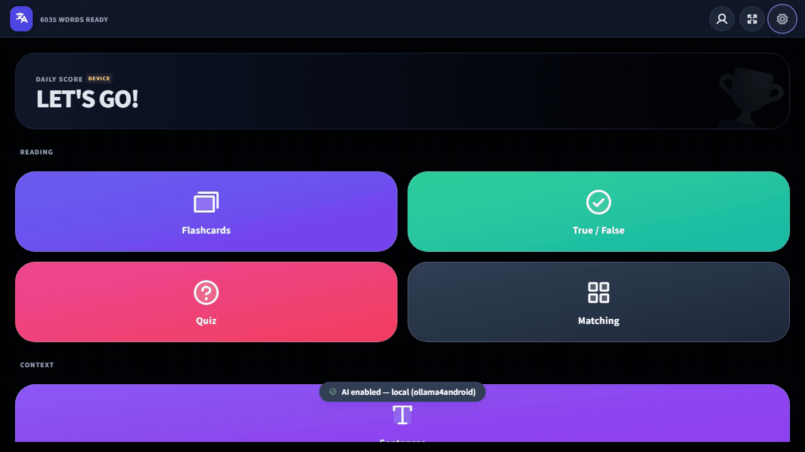
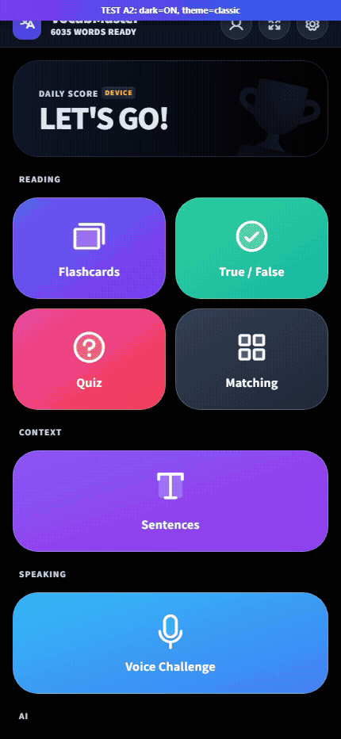

# VocabMaster

**VocabMaster** is a personal-use PWA language learning app built with Vanilla JavaScript, Tailwind CSS v3, and Firebase. It features seven game modes (including AI-powered Story Mode and Grammar Gym), granular per-mode settings, context-aware audio, LLM integration via Ollama (local + cloud), native Android TTS support, and a smooth render pipeline — all in a single-page app optimized for mobile.

---

## Screenshots

<div align="center">
<table>
  <tr>
    <td align="center"><br/>Desktop</td>
    <td align="center"><br/>Mobile</td>
  </tr>
</table>
</div>

## Current Status (v1185)

- **Mock data completely removed**: 9 static vocab data files, `vocabulary-collections.js`, `collection-bar.js`, `createMockData()`, `parseCSV()`, `ollama_config.js` all deleted. RTDB is the sole data source.
- **LLM pipeline refactored**: 7 modular files under `public/js/llm/` — service, validator, schemas, prompts, roles, cache, init. Concurrent queue (max 2), critic validation, compact prompts, manual AbortController.
- **Story Mode overhaul**: Critic-validated generation, 2-choice Q&A with translation fields, RTDB restructuring (`stories/{compositeVocabId}/{lang}`), stale generation guard, purely random word picking.
- **Grammar Gym**: `afterRender()` on all `update()` paths, cache threshold 6 (matches schema `minItems: 6`), choices limited to `maxItems: 2`, no letter circles/helper text/icon bullets.
- **Auth fixes**: `waitForAuth()` resolved flag + 1.5s timeout before anonymous fallback. Native auth `.then(resetBtn)` removed (was overwriting photoURL).
- **TTS fixes**: `app.audio.cancel()` on Story destroy/navigation. `raw` parameter for story narration (bypasses `sanitizeText`).
- **Android TTS root cause fixed**: Script loading race condition — `native_tts.js` now loads before `services.js` so `NativeTTSBridge` is defined when `AudioService` constructor runs. R8 obfuscation ruled out as cause.
- **Admin**: Email-based check (`kevinkicho@gmail.com`). Delete story button in header (not footer).
- **SW cache version**: v1185.
- **Tag filter**: 24 tag values (N5–N1, HSK1–HSK6, A1–C1, TOPIK1–TOPIK5, common, uncommon, rare) available as client-side filter chips on the home screen. No new vocab planned — current 6035 entries cover all tags.

---

| Mode | Description |
| :--- | :--- |
| **Flashcards** | Flip cards with configurable front/back languages (up to 4 back fields). Auto-play audio on flip. |
| **Quiz** | Multiple-choice with 4 answer buttons. Flippable question card reveals example sentences. |
| **True / False** | Decide if a word matches its translation. Flippable example sentences with audio. |
| **Matching** | Grid-based pair matching with responsive tiling. Adaptive layout scoring for portrait/landscape. |
| **Sentences** | Fill-in-the-blank cloze with smart masking — handles conjugations, multi-word phrases, and CJK. |
| **Voice** | Speech recognition challenges via Web Speech API. Pronunciation matching with fuzzy comparison. |
| **Story Mode** | AI-generated stories using your vocab words with TTS read-aloud, comprehension questions, and RTDB caching for instant replay. |
| **Grammar Gym** | AI-generated grammar exercises (fill-in-the-blank, multiple-choice, error correction, etc.) with RTDB caching, TTS interactions, and per-vocab generation. |

---

## AI / LLM Integration

VocabMaster integrates with [Ollama](https://ollama.com) for AI-powered features:

### Story Mode
- Selects 4 random vocab words, prompts the LLM to generate a short story in the target language
- **Comprehension questions** — 2 multiple-choice questions with translation fields, parsed from LLM output
- **TTS read-aloud** — Speaker button reads the story via TTS; `raw` parameter bypasses `sanitizeText()`
- **RTDB caching** — Generated stories save to `stories/{compositeVocabId}/{lang}` so all users benefit from cached content
- **Stale generation guard** — `_generationId` prevents old async results from overwriting new ones
- **Regenerate** (sparkle) reuses same 4 words; **Surprise** (dice) picks random new words

### Grammar Gym
- AI-generated exercises targeting specific grammar patterns for the current vocab word
- 6-12 exercises per generation (aim for 8), covering 12 type variants
- **RTDB caching** — Exercises saved to `grammar_exercises/{vocabId}/{langCode}/{token}`
- **TTS interactions** — Clickable vocab, sentence examples, and answer choices with TTS playback
- **Two-tap answer** — First tap plays TTS, second tap submits

### Architecture
- **7 modular LLM files** under `public/js/llm/` — service, validator, schemas, prompts, roles, cache, init
- **Concurrent queue** — Max 2 parallel requests, queue cap at 50
- **Critic validation** — Compact critic prompt (~500 tokens), skipped for simple schemas (cloze, grammar explanation)
- **Token budgets** — Story: 1024, Grammar: 2048, Others: 384 (with 1.5x retry multiplier)
- **HTTP transport** — Capacitor HttpProxy with native `fetch()` fallback; manual `AbortController` for timeout
- **IndexedDB caching** — Cloze responses cached to avoid redundant generation

### Android App

An Android WebView wrapper (`android/`) provides native Android TTS support and bypasses Chrome's HTTPS-only restriction for localhost, enabling communication with [Ollama4Android](https://github.com/kevinkicho/Ollama4Android) running on the same device.

- **Native TTS bridge** — `TTSBridge.kt` wraps Android's `TextToSpeech` API, exposing 393+ system voices (Google TTS, Samsung TTS, etc.) via `@JavascriptInterface`
- **Native Google Sign-In** — `NativeAuthJSInterface` with Firebase Auth + Google Sign-In SDKs
- **LLM bridge** — Kotlin `@JavascriptInterface` ↔ `evaluateJavascript()` bridge with promise-based async pattern
- **Port discovery** — User enters the port shown in Ollama4Android; saved to localStorage for reconnection

Build and install the Android wrapper from the `android/` directory:

```bash
cd android && ./gradlew assembleDebug
adb install app/build/outputs/apk/debug/app-debug.apk
```

---

## Key Features

- **14 languages supported** — Japanese, Korean, English, Chinese, Spanish, Portuguese, Italian, French, German, Russian (+ Furigana, Romaji, Pinyin, Transliteration visual columns)
- **Per-mode settings** — Each game mode has independent controls for language pairs, audio behavior, randomization, and example display
- **Native Android TTS** — Dedicated Android WebView wrapper with `TTSBridge` providing 393+ system voices via native `TextToSpeech` API
- **Voice selection** — Per-language TTS voice picker in Settings, with instant preview playback
- **Context-aware audio** — `playSmartAudio()` detects visible content (word vs. example sentence) and plays the appropriate audio
- **Auto-play on correct** — Quiz, TF, Voice, and Sentences modes play audio on correct answer with configurable `audioWait`
- **Render pipeline** — Container hidden during updates, text fitted via binary search, then smooth 0.3s fade-in reveal
- **Dynamic text fitting** — `fitSmart()` derives max font size from `min(containerWidth, containerHeight)` and binary-searches both axes
- **Responsive match grid** — `calcLayout()` scores all valid col/row combinations by cell aspect ratio, area, and orientation preference
- **Analytics** — Per-word accuracy tracking, daily score history, weekly/monthly charts, most-missed-words dashboard
- **Themes** — 5 color themes (Classic, Sakura, Ocean, Coffee, Cyber) + dark mode + font family/style/weight controls
- **Celebrations** — 13 confetti effects (emoji-shaped particles via canvas-confetti) with per-effect enable/disable
- **Presets** — One-click "I know X, I want to learn Y" presets that configure all game modes at once
- **Offline PWA** — Service worker with stale-while-revalidate caching, flag icon prefetch, and per-asset error handling
- **Firebase backend** — Auth (anonymous + Google), Realtime Database for scores, vocab data, and shared AI-generated stories
- **Hanzi tooltips** — Long-press/hover CJK characters for dictionary lookup with traditional, simplified, pinyin, Korean, and English fields

---

## File Structure

| File | Purpose |
| :--- | :--- |
| `public/index.html` | Single-page shell — settings modal, theme grid, game containers, script loading |
| `public/js/main.js` | App controller — init, auth listener, routing, home dashboard |
| `public/js/config.js` | `LANG_CONFIG` array, `LANG_MAP` (O(1) lookups), `GET_DEFAULTS()`, flag icon helper |
| `public/js/store.js` | `saveSettings()` reads all UI controls into `prefs`, `applyTheme()`, localStorage persistence |
| `public/js/ui.js` | Dynamic UI — `header()`, `audioBar()`, `loadSettings()`, theme/font/preset/celeb renderers |
| `public/js/services.js` | `AudioService` (TTS), `TextFitter` (`fit` + `fitSmart`), `CelebrationService` (confetti) |
| `public/js/analytics.js` | Per-word accuracy tracking, session recording, weekly/monthly stats, most-missed-words |
| `public/js/android_bridge.js` | Promise-based JS wrapper for Android `@JavascriptInterface` with streaming `onToken` support |
| `public/js/native_tts.js` | `NativeTTSBridge` — promise-based JS wrapper for native Android TTS (getVoices, speak, preview, stop) |
| `public/js/native_auth.js` | JS bridge for native Google Sign-In via Android WebView |
| `public/js/capacitor_tts_bridge.js` | Capacitor TTS bridge for Android |
| `public/js/game_core.js` | `GameMode` base class — nav, keyboard, scoring, `waitAndNav`, `autoPlay`, `handleInput`, DOM caching |
| `public/js/game_flashcard.js` | Flip card with 1–4 back panels, speed control, context-aware flip audio |
| `public/js/game_quiz.js` | 4-choice quiz, flippable question card, correct-answer audio, double-click mode |
| `public/js/game_tf.js` | True/False with random distractor swapping, correct-answer audio, visual feedback |
| `public/js/game_match.js` | Grid matching — adaptive `calcLayout()`, pair restore, hint highlighting |
| `public/js/game_sentences.js` | Cloze generator with variant/token/conjugation matching, LLM-assisted blanks, translation hint |
| `public/js/game_voice.js` | Web Speech recognition, locale mapping, correct-answer playback, visual feedback |
| `public/js/game_story.js` | AI Story Mode — word selection, streaming card UI, question parsing, RTDB cache, prefetch, TTS |
| `public/js/game_story_generator.js` | Story generation orchestration — `startStory()`, `_generateStory()`, stale guard, AI offline handling |
| `public/js/game_story_cache.js` | Story RTDB cache — save, load, delete with composite key sorting |
| `public/js/game_story_ui.js` | Story UI — question display, nav footer, highlights, translation toggle, TTS, admin controls |
| `public/js/game_grammar.js` | Grammar Gym — AI-generated grammar exercises with TTS, RTDB cache, per-vocab generation |
| `public/js/llm/llm_service.js` | LLM HTTP transport — concurrent queue (max 2), Capacitor proxy + native fetch, manual AbortController |
| `public/js/llm/llm_validator.js` | `generateWithCritic()` — critic validation, `generateValidated()` — retry on schema failure |
| `public/js/llm/llm_schemas.js` | JSON schemas for all LLM outputs (story, grammar, cloze, quiz, etc.) |
| `public/js/llm/llm_prompts.js` | Prompt builders for story, grammar, cloze, and other features |
| `public/js/llm/llm_roles.js` | Feature role methods — `findClozeMatch`, `generateStory`, `getGrammarExercise`, etc. |
| `public/js/llm/llm_cache.js` | IndexedDB cache for LLM cloze responses |
| `public/js/llm/llm_init.js` | Re-exports and global assignments for LLM modules |
| `public/js/data.js` | RTDB read/write, score recording, stats — no CSV/mock data fallback |
| `public/js/auth.js` | Firebase Auth (anonymous + Google sign-in) with `waitForAuth()` resolved flag |
| `public/js/notes.js` | Admin note editing, Hanzi character tooltips with long-press support |
| `public/js/presets.js` | Language pair presets that bulk-configure all game mode settings |
| `public/js/firebase.js` | Firebase compat SDK v11 initialization |
| `public/js/learning_loop.js` | Adaptive learning loop with session logging and prompt adjustments |
| `public/js/adaptive.js` | Word difficulty scoring and review selection |
| `public/js/preferences_registry.js` | Central preference schema and defaults |
| `public/js/settings_html.js` | Settings HTML templates |
| `public/js/ui_settings.js` | Settings UI renderers and event handlers |
| `public/js/ui_stats.js` | Stats dashboard renderers (weekly chart, heatmap, accuracy, words, activity) |
| `public/js/ui_llm.js` | LLM status UI in settings |
| `public/js/ui_modals.js` | Modal management utilities |
| `public/sw.js` | Service worker — versioned cache v1185, stale-while-revalidate, per-asset error handling |
| `public/style.css` | Custom CSS — fit-target/fit-smart opacity transitions, app-view reveal, Hanzi tooltips |
| `public/favicon.svg` | Indigo rounded-square "V" icon |
| `android/` | Android Studio WebView wrapper project with native TTS bridge and native auth |

---

## Tech Stack

- **Frontend:** Vanilla JS (ES6+ classes), Tailwind CSS v3 (static build), Phosphor Icons
- **Backend:** Firebase Hosting, Auth, Realtime Database (compat SDK v11)
- **AI:** Ollama (local via ollama4android + cloud), model-agnostic — Gemma, Qwen, DeepSeek, Mistral, etc.
- **Android:** Kotlin WebView wrapper with native TTS (`TextToSpeech` API), native Google Sign-In, and `@JavascriptInterface` bridge for LLM
- **Audio:** Web Speech Synthesis API (TTS), Web Speech Recognition API (voice mode)
- **Animations:** canvas-confetti, CSS transitions
- **Charts:** Chart.js (stats dashboard)
- **Fonts:** Google Fonts — Nunito, Noto Sans JP, Noto Sans KR

---

## Firebase RTDB Structure

```
/dictionary          — Shared vocab entries (indexed on id, e, k, s, t)
/users/{uid}         — Per-user scores, prefs, analytics, debug logs
/stories/{compositeVocabId}/{lang} — Shared AI-generated stories (story, questions, vocabIds, ts)
/grammar_exercises/{vocabId}/{langCode}/{token} — Shared AI-generated grammar exercises
/vocab               — Vocab lists/collections
```

---

## Deployment

This app is designed for personal use. Deploy locally with Firebase:

```bash
npm run build
firebase deploy --only hosting
```

Or serve locally for development:

```bash
npx serve public
```

The Android wrapper (`android/`) loads from local assets by default. To use a local server instead, edit `MainActivity.kt` and change `APP_URL` to your local address.

---

## Test Structure

```
test/
├── e2e/         # Playwright browser specs
├── unit/        # Vitest unit tests
├── audit/       # Standalone audit scripts (run with `npm run audit`)
└── tools/       # One-off scripts (check_critical, ocr, etc.)
```

The `test/` folder is gitignored — generate it locally by following the layout above. Playwright config points to `test/e2e/`; unit tests run from `test/unit/`.

## Firebase Android Setup (gitignored)

`android/app/google-services.json` is **not** committed (contains API keys). For local builds, copy `android/app/google-services.json.example` and fill in your Firebase project credentials.

---

## Documentation for Agents & Continuity

See the `docs/` folder for living plans:
- `docs/architecture.md` — Full architecture reference (LLM pipeline, critic, data loading, story mode, grammar gym, audio, error states, admin, connection health, conventions)
- `docs/current-status-and-roadmap.md`
- `docs/medium-term-roadmap.md`
- `docs/development.md`
- `docs/lessons-learned.md`
- `docs/web-ai-parity-proxy-implementation.md`
- `docs/audio-tts-architecture.md`
- `docs/codebase-modularization.md`
- `docs/telemetry-feedback.md`

## Related Projects

- **[Ollama4Android](https://github.com/kevinkicho/Ollama4Android)** — Android app that runs Ollama locally on-device (or proxies to cloud models), providing the LLM backend for VocabMaster's AI features.
