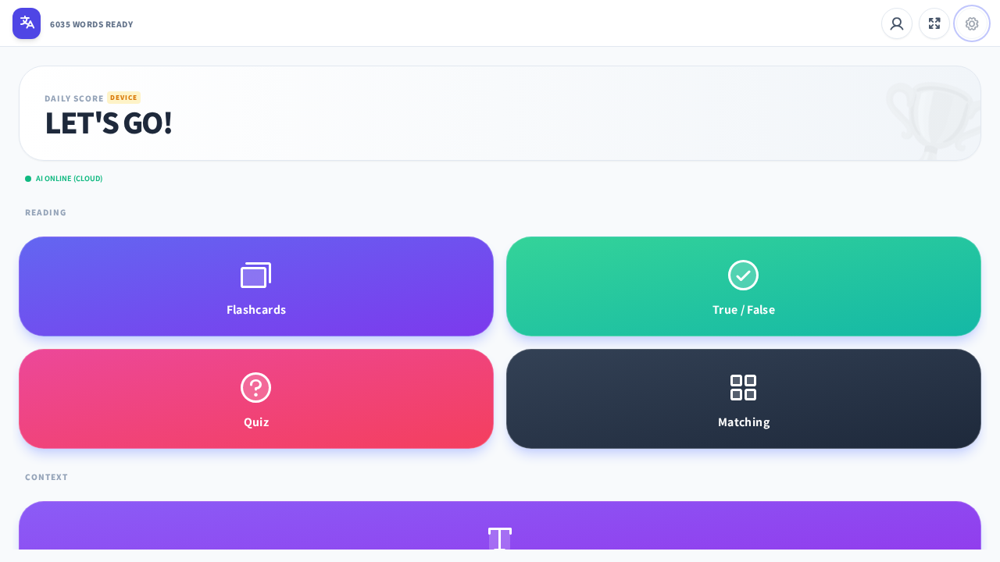
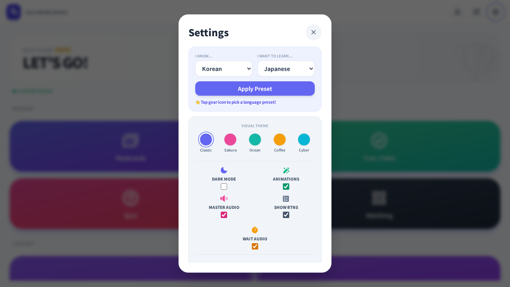

# VocabMaster

**VocabMaster** is a personal-use PWA language learning app built with Vanilla JavaScript, Tailwind CSS v3, and Firebase. It features seven game modes (including AI-powered Story Mode, Grammar Gym, and Chat Practice), granular per-mode settings, context-aware audio, LLM integration via Ollama (local APK + cloud proxy), native Android TTS support, and a smooth render pipeline — all in a single-page app optimized for mobile.

---

## Screenshots

<div align="center">
<table>
  <tr>
    <td align="center"><br/>Home</td>
    <td align="center"><br/>Settings Preset</td>
  </tr>
</table>
</div>

---

## Current Status (v1185)

- **Mock data completely removed**: 9 static vocab data files, `vocabulary-collections.js`, `collection-bar.js`, `createMockData()`, `parseCSV()` all deleted. RTDB is the sole data source.
- **LLM pipeline refactored**: 7 modular files under `public/js/llm/` — service, validator, schemas, prompts, roles, cache, init. Concurrent queue (max 2), critic validation, compact prompts, manual AbortController.
- **explainLang feature**: All 11 AI prompt builders accept a `knownLang` parameter — explanations, scenarios, translations, and feedback are no longer hardcoded to English. The explanation language is derived from the user's preset source ("I know...") selection (`presetSource`). Grammar Gym cache uses the path `grammar_exercises/{vocabId}/{langCode}/{explainLang}/{token}` for direct indexed lookup — the app queries `grammar_exercises/{vid}/{lang}/{prefLang}/` with `limitToLast(1)`, no client-side filtering needed.
- **Grammar Gym pregeneration**: `scripts/pregenerate-grammar.js` bulk-generates exercises via Ollama (cloud proxy or local), saves to RTDB. Supports `--explain-lang`, `--cloud`, `--vocab-range` flags. Progressive validation accepts 2→4 choices (A/B/C/D). Auto-refreshes Firebase auth token on 401.
- **Story Mode overhaul**: Critic-validated generation, 2-choice Q&A with translation fields, RTDB restructuring (`stories/{compositeVocabId}/{lang}`), stale generation guard, purely random word picking.
- **Chat Practice**: Rolling message window (`_pruneMessages()`) keeps raw history bounded at 12 messages, older exchanges condensed into memory summaries. Animated "Thinking" indicator with pulsing label + bouncing dots.
- **Auth fixes**: `waitForAuth()` resolved flag + 1.5s timeout before anonymous fallback. Native auth `.then(resetBtn)` removed (was overwriting photoURL).
- **Android TTS**: Cross-engine voice detection via per-engine `TextToSpeech` enumeration (`buildEngineVoiceMap()`). Voice objects include `displayName` with locale name + quality badge. Provider labels use per-engine enumeration (primary) with name heuristic fallback.
- **APK asset sync**: `android/app/src/main/assets/` is a separate copy of `public/`. Use `scripts/sync-assets.sh` to sync before APK builds. `ollama_config.js` in APK assets is overwritten with `OLLAMA_USE_CLOUD = false`.
- **SW cache version**: v1185.

---

## AI / LLM Integration

VocabMaster integrates with [Ollama](https://ollama.com) for AI-powered features, routing through a Cloud Run proxy for the web app or directly to local `ollama4android` for the APK.

### Story Mode
- Selects 4 random vocab words, prompts the LLM to generate a short story in the target language
- **Comprehension questions** — 2 multiple-choice questions with translation fields, parsed from LLM output
- **TTS read-aloud** — Speaker button reads the story via TTS; `raw` parameter bypasses `sanitizeText()`
- **RTDB caching** — Generated stories save to `stories/{compositeVocabId}/{lang}` so all users benefit from cached content
- **Stale generation guard** — `_generationId` prevents old async results from overwriting new ones
- **Regenerate** (sparkle) reuses same 4 words; **Surprise** (dice) picks random new words

### Grammar Gym
- AI-generated exercises targeting specific grammar patterns for the current vocab word
- 6-12 exercises per generation (aim for 8), covering 12 type variants
- **RTDB caching** — Exercises saved to `grammar_exercises/{vocabId}/{langCode}/{explainLang}/{token}` with direct indexed lookup by explainLang
- **TTS interactions** — Clickable vocab, sentence examples, and answer choices with TTS playback
- **Two-tap answer** — First tap plays TTS, second tap submits
- **Progressive choices** — Schema accepts 2-4 choices (A/B/C/D) — accommodates model hallucinations gracefully

### Chat Practice
- AI conversation partner that maintains a rolling message history (max 6 turns) + memory summaries to keep prompts compact across long conversations
- **Rolling window** — Raw messages pruned after maxHistory*2 (12); old exchanges condensed into `memories[]` summaries
- **Scenario-aware first message** — Generates a greeting in the target language based on the selected scenario (daily life, travel, business, etc.)
- **Animated indicator** — Pulsing "Thinking" label + 3 bouncing dots during generation
- **Markdown rendering** — AI bubbles render markdown (snarkdown) with TTS playback on the first bubble; tap-to-TTS on subsequent bubbles
- **Speech-to-text input** — Mic button uses `webkitSpeechRecognition` with locale mapping per target language
- **Exam-level awareness** — Extracts level from vocab tags or `chatLevel` pref; clickable level badge in header (JLPT N5–N1 + CEFR A1–C2 popover) controls AI output difficulty

### Architecture
- **7 modular LLM files** under `public/js/llm/` — service, validator, schemas, prompts, roles, cache, init
- **Concurrent queue** — Max 2 parallel requests, queue cap at 50
- **Critic validation** — Compact critic prompt (~500 tokens), skipped for simple schemas (cloze, grammar explanation)
- **Token budgets** — Story: 1024, Grammar: 2048, Others: 384 (with 1.5x retry multiplier)
- **HTTP transport** — Capacitor HttpProxy with native `fetch()` fallback; manual `AbortController` for timeout
- **IndexedDB caching** — Cloze responses cached to avoid redundant generation
- **Explanation language (`explainLang`)** — All 11 prompt builders accept a `knownLang` parameter instead of hardcoding English. The value is derived from `app.store.prefs.presetSource` (the preset "I know..." language). Cached Grammar Gym entries use `explainLang` as a path segment for direct indexed lookup.

### Deployment: Cloud Proxy (Web AI Parity)

**This is active production code, not dead code.** The web app (Firebase Hosting) uses a Cloud Run proxy to reach Ollama cloud models, since browsers can't directly call `http://127.0.0.1:11434` (CORS) or the Ollama Cloud API directly. The Android APK uses a local `ollama4android` server instead. Both paths are essential and maintained.

**How it works:**
- `public/js/ollama_config.js` (gitignored) sets `window.OLLAMA_USE_CLOUD = true` for the web build. This makes `LLMService` route all requests through the Cloud Run proxy URL instead of `127.0.0.1:11434`.
- In the APK, `ollama_config.js` is overwritten with `OLLAMA_USE_CLOUD = false` and `useCloud` is forced `false` in the service code.
- The proxy (`functions/src/index.ts`, deployed as a Firebase Cloud Function) forwards requests to the Ollama Cloud API (`https://api.ollama.com`) with the API key stored server-side in Firebase config.
- The default proxy URL is baked into `llm_service.js` constructor: `https://ollama-proxy-1020976660084.us-central1.run.app`.
- The model for cloud mode is `gemma4:31b-cloud`. For local mode, the first non-`*-cloud` model from `/api/tags` is selected.

**Key files:**
- `public/js/ollama_config.js` (gitignored) — `OLLAMA_USE_CLOUD`, `OLLAMA_ENDPOINT`, `OLLAMA_API_KEY`
- `public/js/llm/llm_service.js` — transport layer, `autoDetect`, `_ping`, `_getLocalCandidates`
- `functions/src/index.ts` — Cloud Run proxy (deployed via `firebase deploy --only functions`)
- `docs/web-ai-parity-proxy-implementation.md` — full design + deployment notes
- `scripts/sync-assets.sh` — syncs `public/` → APK assets before build

### Android App

An Android WebView wrapper (`android/`) provides native Android TTS support and bypasses Chrome's HTTPS-only restriction for localhost, enabling communication with [Ollama4Android](https://github.com/kevinkicho/Ollama4Android) running on the same device.

- **Native TTS bridge** — `TTSBridge.kt` wraps Android's `TextToSpeech` API, exposing 393+ system voices (Google TTS, Samsung TTS, etc.) via `@JavascriptInterface`. Per-engine enumeration (`buildEngineVoiceMap()`) accurately labels voices by provider.
- **Native Google Sign-In** — `NativeAuthJSInterface` with Firebase Auth + Google Sign-In SDKs
- **LLM bridge** — Kotlin `@JavascriptInterface` ↔ `evaluateJavascript()` bridge with promise-based async pattern
- **AI model detection** — `autoDetect()` picks first non-`*-cloud` model from local Ollama; `_ping()` triggers `autoDetect()` on connectivity restore

Build and install the Android wrapper from the `android/` directory:

```bash
scripts/sync-assets.sh        # first: sync web assets to APK assets
cd android && ./gradlew assembleDebug
adb install app/build/outputs/apk/debug/app-debug.apk
```

---

## Key Features

- **14 languages supported** — Japanese, Korean, English, Chinese, Spanish, Portuguese, Italian, French, German, Russian (+ Furigana, Romaji, Pinyin, Transliteration visual columns)
- **Per-mode settings** — Each game mode has independent controls for language pairs, audio behavior, randomization, and example display
- **Native Android TTS** — Dedicated Android WebView wrapper with `TTSBridge` providing 393+ system voices via native `TextToSpeech` API. Cross-engine voice enumeration accurately labels providers (Google, Samsung, Local, Network).
- **Voice selection** — Per-language TTS voice picker in Settings, with instant preview playback. Voices display locale name + quality badge. In APK mode, picker replaced by info box directing to system TTS settings.
- **Context-aware audio** — `playSmartAudio()` detects visible content (word vs. example sentence) and plays the appropriate audio
- **Auto-play on correct** — Quiz, TF, Voice, and Sentences modes play audio on correct answer with configurable `audioWait`
- **Render pipeline** — Container hidden during updates, text fitted via binary search, then smooth 0.3s fade-in reveal
- **Dynamic text fitting** — `fitSmart()` derives max font size from `min(containerWidth, containerHeight)` and binary-searches both axes
- **Responsive match grid** — `calcLayout()` scores all valid col/row combinations by cell aspect ratio, area, and orientation preference
- **Analytics** — Per-word accuracy tracking, daily score history, weekly/monthly charts, most-missed-words dashboard
- **Themes** — 5 color themes (Classic, Sakura, Ocean, Coffee, Cyber) + dark mode + font family/style/weight controls
- **Celebrations** — 13 confetti effects (emoji-shaped particles via canvas-confetti) with per-effect enable/disable
- **Presets** — One-click "I know X, I want to learn Y" presets that configure all game modes at once. The preset source also determines the AI explanation language (`explainLang`).
- **Offline PWA** — Service worker with stale-while-revalidate caching, flag icon prefetch, and per-asset error handling
- **Firebase backend** — Auth (anonymous + Google), Realtime Database for scores, vocab data, and shared AI-generated content
- **AI Status Indicator** — Home screen shows green/amber/rose dot + "AI Online (cloud/local/remote · model)" reflecting actual endpoint
- **Hanzi tooltips** — Long-press/hover CJK characters for dictionary lookup with traditional, simplified, pinyin, Korean, and English fields

---

## File Structure

| File | Purpose |
| :--- | :--- |
| `public/index.html` | Single-page shell — settings modal, theme grid, game containers, script loading |
| `public/js/main.js` | App controller — init, auth listener, routing, home dashboard |
| `public/js/config.js` | `LANG_CONFIG` array, `LANG_MAP` (O(1) lookups), `GET_DEFAULTS()`, flag icon helper |
| `public/js/store.js` | `saveSettings()` reads all UI controls into `prefs`, `applyTheme()`, localStorage persistence |
| `public/js/ui.js` | Dynamic UI — `header()`, `audioBar()`, `loadSettings()`, theme/font/preset/celeb renderers |
| `public/js/ui_home.js` | Home screen filters — level filter chips, tag filter chips (JLPT/HSK/CEFR/TOPIK/Frequency) |
| `public/js/ui_tooltips.js` | Hanzi character tooltip — dictionary lookup, cursor/touch positioning, auto-close |
| `public/js/ui_settings.js` | Extracted settings rendering — loads all per-mode settings from registry |
| `public/js/ui_llm.js` | LLM settings UI, AI status rendering, learning-loop analysis, voice selector override |
| `public/js/ui_stats.js` | Stats modal — weekly chart, accuracy, words, activity tabs |
| `public/js/services.js` | `AudioService` (TTS), `TextFitter` (`fit` + `fitSmart`), `CelebrationService` (confetti) |
| `public/js/analytics.js` | Per-word accuracy tracking, session recording, weekly/monthly stats, most-missed-words |
| `public/js/android_bridge.js` | Promise-based JS wrapper for Android `@JavascriptInterface` with streaming `onToken` support |
| `public/js/native_tts.js` | `NativeTTSBridge` — promise-based JS wrapper for native Android TTS (getVoices, speak, preview, stop) |
| `public/js/native_auth.js` | JS bridge for native Google Sign-In via Android WebView |
| `public/js/capacitor_tts_bridge.js` | Dead-end Capacitor TTS plugin wrapper (not used) |
| `public/js/game_core.js` | `GameMode` base class — nav, keyboard, scoring, `waitAndNav`, `autoPlay`, `handleInput`, DOM caching |
| `public/js/game_flashcard.js` | Flip cards with configurable front/back languages (up to 4 back fields). Auto-play audio on flip. |
| `public/js/game_quiz.js` | Multiple-choice with 4 answer buttons. Flippable question card reveals example sentences. |
| `public/js/game_tf.js` | True / False — decide if a word matches its translation. Flippable example sentences with audio. |
| `public/js/game_match.js` | Grid-based pair matching with responsive tiling. Adaptive layout scoring for portrait/landscape. |
| `public/js/game_sentences.js` | Fill-in-the-blank cloze with smart masking — handles conjugations, multi-word phrases, and CJK. AI cloze generation via LLM. |
| `public/js/game_voice.js` | Speech recognition challenges via Web Speech API. Pronunciation matching with fuzzy comparison. |
| `public/js/game_story.js` | Story mode entry — picks words, orchestrates cache/generation flow |
| `public/js/game_story_generator.js` | Story generation via LLM — caching, prefetching, generation coordination |
| `public/js/game_story_cache.js` | RTDB story cache with prefetch and background generation |
| `public/js/game_story_ui.js` | Story mode UI — story display, Q&A, level badges |
| `public/js/game_grammar.js` | Grammar Gym — AI-generated grammar exercises, two-tap answer, TTS |
| `public/js/game_chat.js` | Chat Practice — AI conversation, rolling memory, STT input, TTS, markdown rendering |
| `public/js/llm/llm_service.js` | Core LLM service — queue, transport, generate, ping, autoDetect, cloud/local routing |
| `public/js/llm/llm_validator.js` | Schema validation, JSON extraction, critic pipeline, retry logic |
| `public/js/llm/llm_schemas.js` | JSON Schema definitions for all 12 response types |
| `public/js/llm/llm_prompts.js` | All 11 prompt builder functions (support `knownLang` parameter) |
| `public/js/llm/llm_roles.js` | Feature methods — findClozeMatch, generateStory, getGrammarExercise, etc. |
| `public/js/llm/llm_cache.js` | IndexedDB + in-memory cache for cloze matches |
| `public/js/llm/llm_init.js` | No-op re-exports |
| `public/js/learning_loop.js` | Adaptive learning — analyzes session patterns, suggests prompt adjustments |
| `public/js/presets.js` | Preset system — applies "I know X, I want to learn Y" across all modes |
| `public/js/preferences_registry.js` | Centralized preference schema with DOM bindings, sections, types |
| `public/js/data.js` | Firebase RTDB read/write, vocab list loading, score and story persistence |
| `public/js/store.js` | Preference persistence — reads/writes localStorage prefs, syncs with Firebase |
| `public/js/auth.js` | Firebase Auth — email, Google, anonymous sign-in, waitForAuth |
| `public/js/analytics.js` | Accuracy tracking, sessions, daily/weekly statistics, most-missed words |
| `public/js/notes.js` | Student notes, dictation entry, RTDB persistence |
| `public/js/escape.js` | Shared escape/html utility (loaded first for cross-script visibility) |
| `public/js/config.js` | LANG_CONFIG, LANG_MAP, CEFR_LEVELS, GET_DEFAULTS |
| `public/js/firebase.js` | Firebase initialization — apiKey, authDomain, databaseURL |
| `public/js/ollama_config.js` | (gitignored) OLLAMA_USE_CLOUD flag. APK assets overwrite to `false`. |
| `scripts/pregenerate-grammar.js` | Bulk Grammar Gym generator — Ollama (cloud/local), RTDB write, --explain-lang |
| `scripts/sync-assets.sh` | Syncs `public/` → `android/app/src/main/assets/` for APK builds |
| `android/.../TTSBridge.kt` | Native TTS bridge — per-engine voice enumeration, cross-engine voice selection |
| `android/.../MainActivity.kt` | WebView setup, JS interface injection |
| `functions/src/index.ts` | Cloud Run proxy for Ollama Cloud API |
| `database.rules.json` | RTDB security rules — grammar_exercises now has `$explainLang` path level |

---

## Architecture Docs

- `docs/architecture.md` — Full AI pipeline, flow diagrams, schema reference
- `docs/audio-tts-architecture.md` — TTS provider detection, per-engine enumeration, displayName
- `docs/development.md` — Pre-generation script reference, CI/CD, build notes
- `AGENTS.md` — Critical rules: cross-script scope, auth states, native TTS, explainLang, APK asset sync
