# VocabMaster

**VocabMaster** is a personal-use PWA language learning app built with Vanilla JavaScript, Tailwind CSS v3, and Firebase. It features seven game modes (including AI-powered Story Mode), granular per-mode settings, context-aware audio, LLM integration via Ollama, native Android TTS support, and a smooth render pipeline — all in a single-page app optimized for mobile.

---

## Screenshots

### Mobile
<table>
  <tr>
    <td align="center">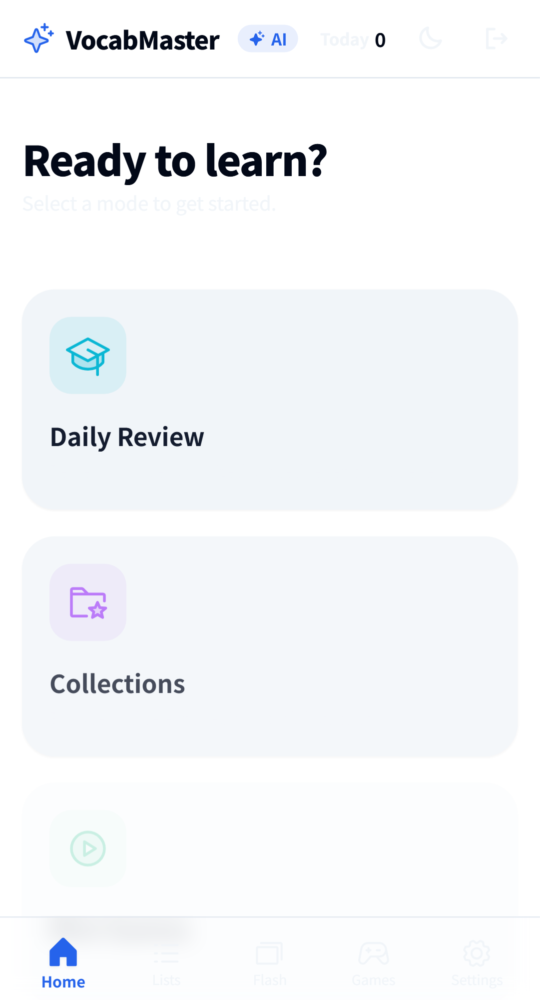<br/>Home</td>
    <td align="center">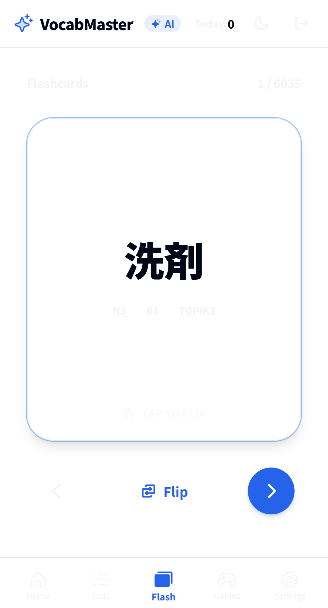<br/>Flashcard (Front)</td>
    <td align="center">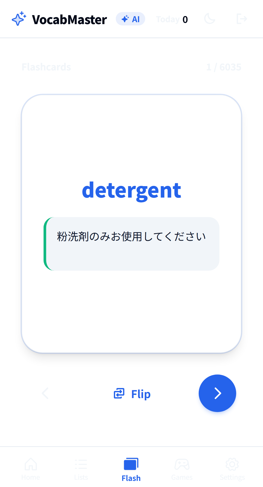<br/>Flashcard (Back)</td>
  </tr>
  <tr>
    <td align="center">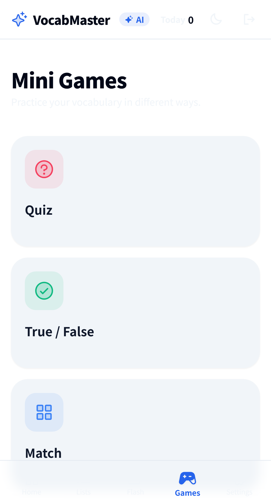<br/>Games Menu</td>
    <td align="center">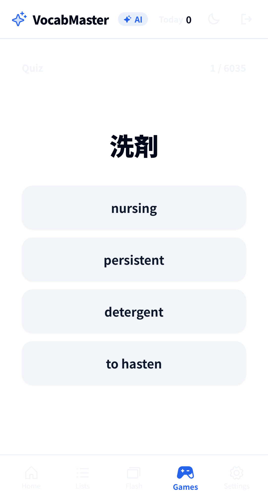<br/>Quiz Mode</td>
    <td align="center">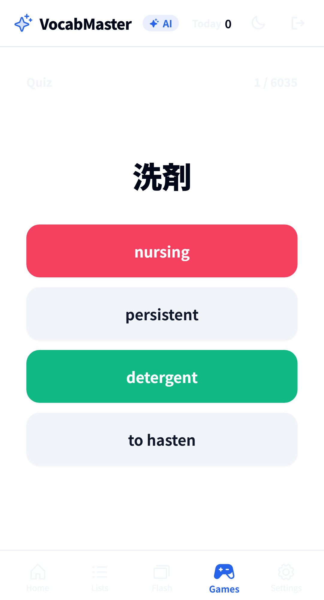<br/>Quiz (Answered)</td>
  </tr>
</table>

### Desktop
<table>
  <tr>
    <td align="center">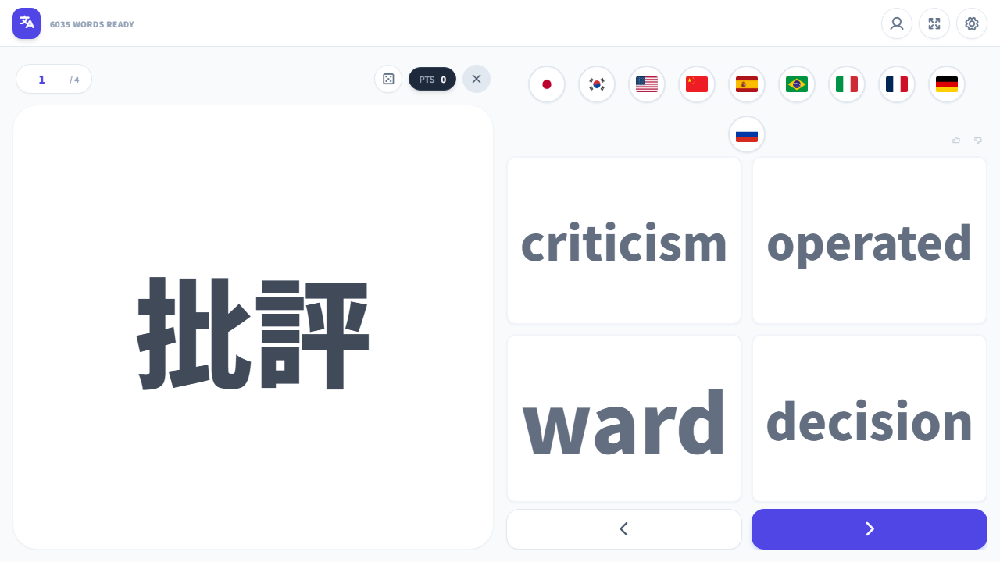<br/>Desktop Flow (Spanish)</td>
    <td align="center">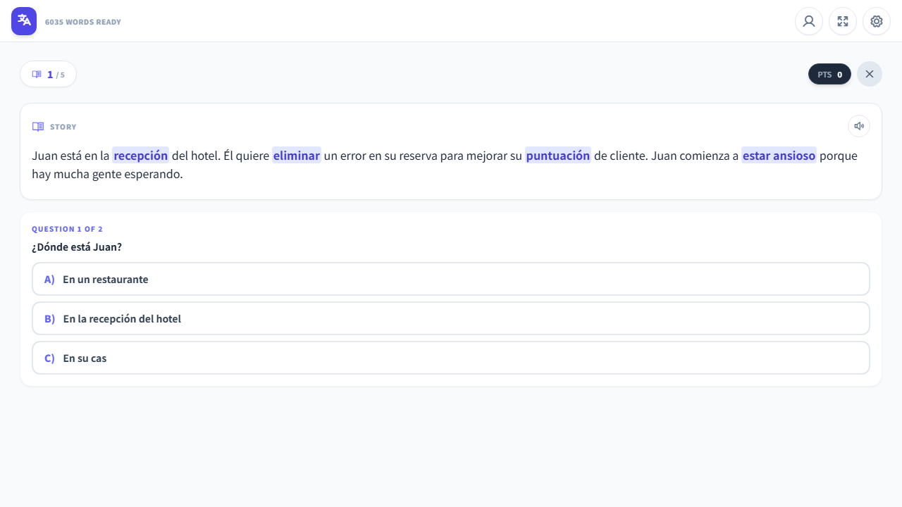<br/>AI Story Mode (Spanish)</td>
  </tr>
  <tr>
    <td align="center">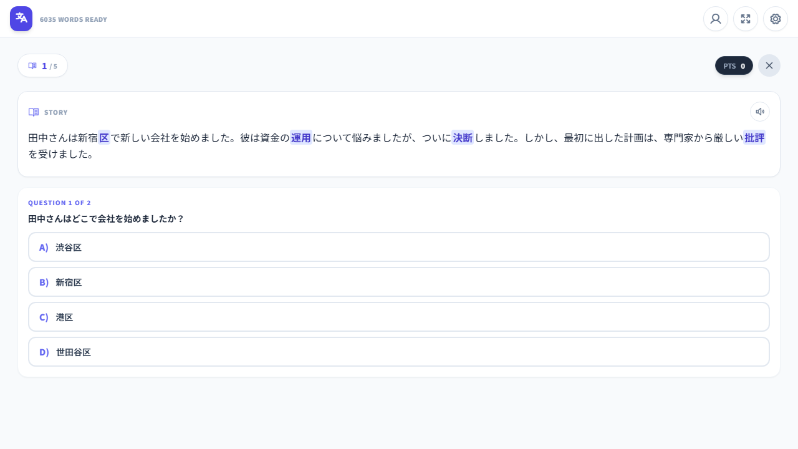<br/>AI Story Mode (Japanese)</td>
    <td align="center">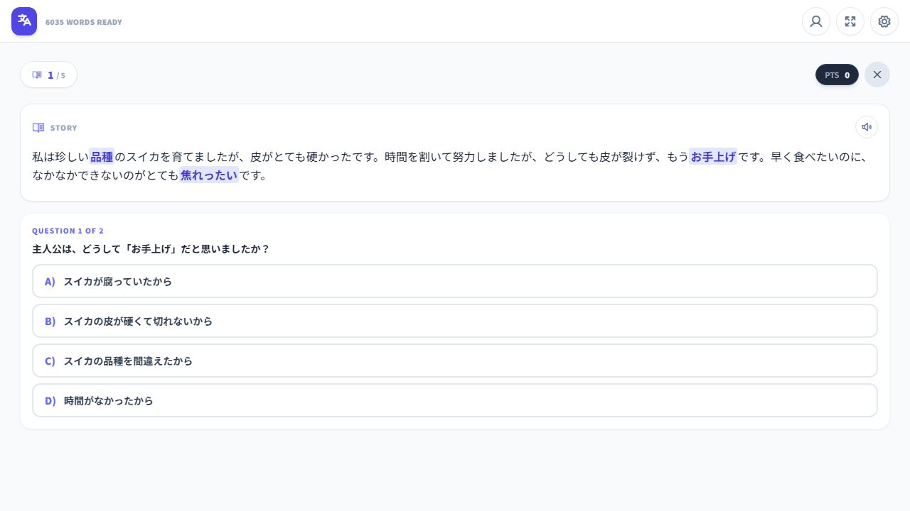<br/>AI Story Mode (Chinese)</td>
  </tr>
  <tr>
    <td align="center">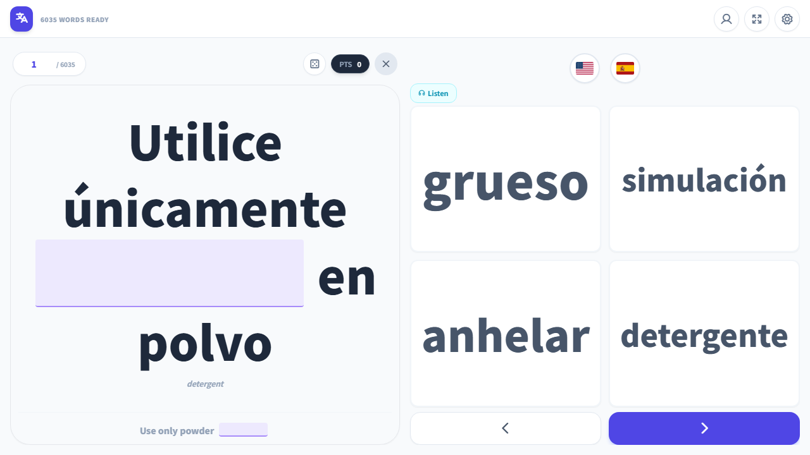<br/>AI Cloze (Spanish)</td>
    <td align="center">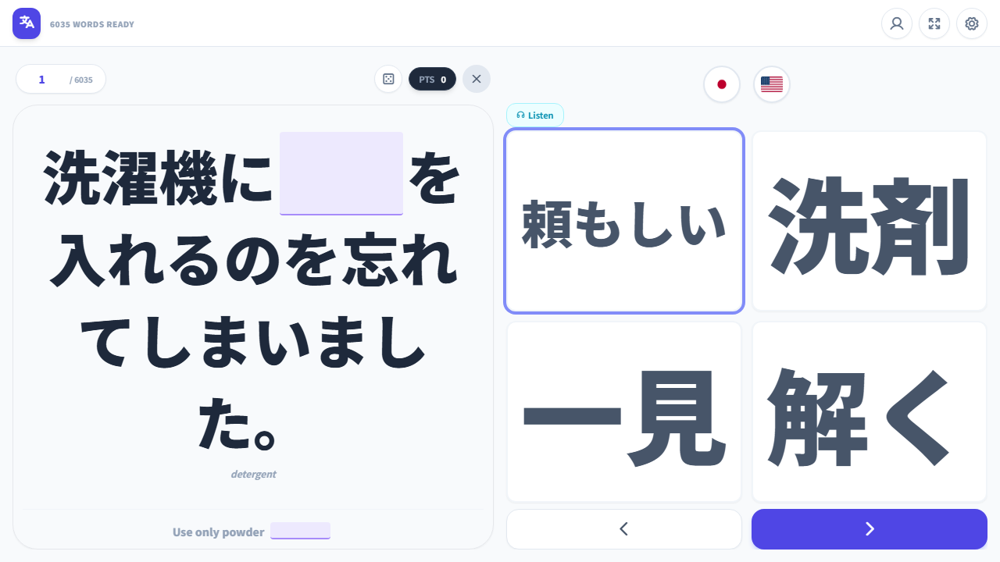<br/>AI Cloze (Japanese)</td>
  </tr>
  <tr>
    <td align="center">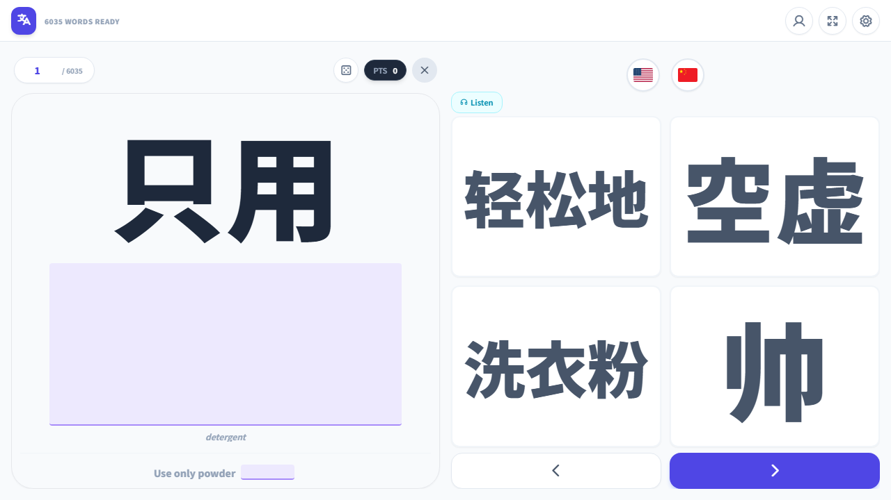<br/>AI Cloze (Chinese)</td>
  </tr>
</table>

### AI Activities (Story Mode & Grammar Gym)
<table>
  <tr>
    <td align="center"><br/>Story Mode (Answered)</td>
    <td align="center"><br/>Grammar Gym (French)</td>
    <td align="center"><br/>Grammar Gym (Output)</td>
  </tr>
</table>

## Current Status (v1195)
- **Phase C Complete**: Full support for Collections (JLPT N5-N1, HSK levels, Spanish A1-C1). Tiers are now dynamically selectable and natively scope practice modes.
- **Review Queue Added**: Adaptive learning loop prioritizes missed words across all modes.
- **LLM/Ollama Backend**: Improved caching, robust error handling, rate-limiting fixes, and seamless integration with `ollama4android`.
- **Bug Fixes & Refactors**: Cleaned up the project structure, migrated orphaned scripts to `/scripts`, optimized loading times, improved dark mode responsiveness, and addressed N1-N15 UX bugs.

---

| Mode | Description |
| :--- | :--- |
| **Flashcards** | Flip cards with configurable front/back languages (up to 4 back fields). Auto-play audio on flip. |
| **Quiz** | Multiple-choice with 4 answer buttons. Flippable question card reveals example sentences. |
| **True / False** | Decide if a word matches its translation. Flippable example sentences with audio. |
| **Matching** | Grid-based pair matching with responsive tiling. Adaptive layout scoring for portrait/landscape. |
| **Sentences** | Fill-in-the-blank cloze with smart masking — handles conjugations, multi-word phrases, and CJK. |
| **Voice** | Speech recognition challenges via Web Speech API. Pronunciation matching with fuzzy comparison. |
| **Story Mode** | AI-generated stories using your vocab words with real-time streaming display, TTS read-aloud, comprehension questions, and RTDB caching for instant replay. |

---

## AI / LLM Integration

VocabMaster integrates with [Ollama](https://ollama.com) for AI-powered features:

### Story Mode
- Selects vocab words (weighted by struggle analytics), prompts the LLM to generate a short story in the target language
- **Streaming UI** — Tokens stream directly into the final story card (no raw text → replace flash)
- **Session progress** — 5 stories per session with progress indicator (1/5) in the header
- **TTS read-aloud** — Speaker button reads the story via Web Speech API; auto-read setting (on by default)
- **Comprehension questions** — 2 multiple-choice questions parsed from LLM output after each story
- **Background prefetch** — Next story generates while you answer the current one
- **RTDB caching** — Generated stories save to a shared top-level `/stories` node in Firebase so all users benefit from cached content
- **Smart serving** — Transparently serves prefetched > RTDB cached > fresh AI-generated stories

### Smart Cloze
- LLM-assisted blank placement for the Sentences game, identifying conjugated word forms in CJK languages
- Two-phase: regex first (instant), LLM fallback (async) when regex finds no match

### Architecture
- **Direct HTTP** — Communicates with Ollama via `fetch()` + `ReadableStream` for NDJSON streaming, bypassing the Android bridge for speed
- **Android bridge fallback** — Falls back to native `@JavascriptInterface` bridge if direct HTTP fails
- **Model-agnostic** — Auto-detects whatever models are available via `/api/tags` (Gemma, Qwen, DeepSeek, Mistral, GLM, etc.)
- **Cloud model support** — ollama4android transparently proxies cloud models (e.g. `mistral-large-3:675b-cloud`, `glm-5.1:cloud`) through the same Ollama-compatible API
- **Request serialization** — All LLM calls are queued to avoid overwhelming single-threaded inference on mobile
- **IndexedDB caching** — LLM cloze responses are cached to avoid redundant generation

### Android App

An Android WebView wrapper (`android/`) provides native Android TTS support and bypasses Chrome's HTTPS-only restriction for localhost, enabling communication with [Ollama4Android](https://github.com/kevinkicho/Ollama4Android) running on the same device.

- **Native TTS bridge** — `TTSBridge.kt` wraps Android's `TextToSpeech` API, exposing 393+ system voices (Google TTS, Samsung TTS, etc.) via `@JavascriptInterface`. Voice selection and preview are handled natively, bypassing Chrome's limited Web Speech API voice set.
- **JS bridge** — `native_tts.js` provides a promise-based `NativeTTSBridge` matching the `AndroidBridge` pattern, with `getVoices()`, `speak()`, `previewVoice()`, and `stop()`.
- **Auto-detection** — `AudioService` detects the native bridge at startup and uses it instead of the Web Speech API for all TTS.
- **LLM bridge** — Kotlin `@JavascriptInterface` ↔ `evaluateJavascript()` bridge with promise-based async pattern
- **Streaming support** — Token-by-token streaming from Ollama via native HTTP, pushed to JS via `onToken` callbacks
- **Port discovery** — User enters the port shown in Ollama4Android; saved to localStorage for reconnection

Build and install the Android wrapper from the `android/` directory:

```bash
cd android && ./gradlew assembleDebug
adb install app/build/outputs/apk/debug/app-debug.apk
```

---

## Key Features

- **14 languages supported** — Japanese, Korean, English, Chinese, Spanish, Portuguese, Italian, French, German, Russian (+ Furigana, Romaji, Pinyin, Transliteration visual columns)
- **Per-mode settings** — Each game mode has independent controls for language pairs, audio behavior, randomization, and example display
- **Native Android TTS** — Dedicated Android WebView wrapper with `TTSBridge` providing 393+ system voices (Google & Samsung) via native `TextToSpeech` API, bypassing Chrome's limited voice set
- **Voice selection** — Per-language TTS voice picker in Settings, with instant preview playback; provider grouping (Google/Samsung/Local) when available
- **Context-aware audio** — `playSmartAudio()` detects visible content (word vs. example sentence) and plays the appropriate audio
- **Auto-play on correct** — Quiz, TF, Voice, and Sentences modes play audio on correct answer with configurable `audioWait`
- **Render pipeline** — Container hidden during updates, text fitted via binary search, then smooth 0.3s fade-in reveal
- **Dynamic text fitting** — `fitSmart()` derives max font size from `min(containerWidth, containerHeight)` and binary-searches both axes
- **Responsive match grid** — `calcLayout()` scores all valid col/row combinations by cell aspect ratio, area, and orientation preference
- **Analytics** — Per-word accuracy tracking, daily score history, weekly/monthly charts, most-missed-words dashboard
- **Themes** — 5 color themes (Classic, Sakura, Ocean, Coffee, Cyber) + dark mode + font family/style/weight controls
- **Celebrations** — 13 confetti effects (emoji-shaped particles via canvas-confetti) with per-effect enable/disable
- **Presets** — One-click "I know X, I want to learn Y" presets that configure all game modes at once
- **Offline PWA** — Service worker with stale-while-revalidate caching, flag icon prefetch, and per-asset error handling
- **Firebase backend** — Auth (anonymous + Google), Realtime Database for scores, vocab data, and shared AI-generated stories
- **Hanzi tooltips** — Long-press/hover CJK characters for dictionary lookup with traditional, simplified, pinyin, Korean, and English fields

---

## File Structure

| File | Purpose |
| :--- | :--- |
| `public/index.html` | Single-page shell — settings modal, theme grid, game containers, script loading |
| `public/js/main.js` | App controller — init, auth listener, routing, home dashboard with conditional AI section |
| `public/js/config.js` | `LANG_CONFIG` array, `LANG_MAP` (O(1) lookups), `GET_DEFAULTS()`, flag icon helper |
| `public/js/store.js` | `saveSettings()` reads all UI controls into `prefs`, `applyTheme()`, localStorage persistence |
| `public/js/ui.js` | Dynamic UI — `header()`, `audioBar()`, `loadSettings()`, theme/font/preset/celeb renderers |
| `public/js/services.js` | `AudioService` (TTS), `TextFitter` (`fit` + `fitSmart`), `CelebrationService` (confetti) |
| `public/js/analytics.js` | Per-word accuracy tracking, session recording, weekly/monthly stats, most-missed-words |
| `public/js/llm.js` | `LLMService` — Direct HTTP streaming, Ollama connection, model auto-detect, cloze matching, bridge fallback |
| `public/js/android_bridge.js` | Promise-based JS wrapper for Android `@JavascriptInterface` with streaming `onToken` support |
| `public/js/native_tts.js` | `NativeTTSBridge` — promise-based JS wrapper for native Android TTS (getVoices, speak, preview, stop) |
| `public/js/game_core.js` | `GameMode` base class — nav, keyboard, scoring, `waitAndNav`, `autoPlay`, `handleInput`, DOM caching |
| `public/js/game_flashcard.js` | Flip card with 1–4 back panels, speed control, context-aware flip audio |
| `public/js/game_quiz.js` | 4-choice quiz, flippable question card, correct-answer audio, double-click mode |
| `public/js/game_tf.js` | True/False with random distractor swapping, correct-answer audio, visual feedback |
| `public/js/game_match.js` | Grid matching — adaptive `calcLayout()`, pair restore, hint highlighting |
| `public/js/game_sentences.js` | Cloze generator with variant/token/conjugation matching, LLM-assisted blanks, translation hint |
| `public/js/game_voice.js` | Web Speech recognition, locale mapping, correct-answer playback, visual feedback |
| `public/js/game_story.js` | AI Story Mode — word selection, streaming card UI, question parsing, RTDB cache, prefetch, TTS |
| `public/js/data.js` | CSV parsing, Firebase RTDB read/write, score recording, stats |
| `public/js/auth.js` | Firebase Auth (anonymous + Google sign-in) |
| `public/js/notes.js` | Admin note editing, Hanzi character tooltips with long-press support |
| `public/js/presets.js` | Language pair presets that bulk-configure all game mode settings |
| `public/js/firebase.js` | Firebase compat SDK v11 initialization |
| `public/sw.js` | Service worker — versioned cache, stale-while-revalidate, per-asset error handling |
| `public/style.css` | Custom CSS — fit-target/fit-smart opacity transitions, app-view reveal, Hanzi tooltips |
| `public/favicon.svg` | Indigo rounded-square "V" icon |
| `android/` | Android Studio WebView wrapper project with native TTS bridge |

---

## Tech Stack

- **Frontend:** Vanilla JS (ES6+ classes), Tailwind CSS v3 (static build), Phosphor Icons
- **Backend:** Firebase Hosting, Auth, Realtime Database (compat SDK v11)
- **AI:** Ollama (local + cloud via ollama4android proxy), model-agnostic — Gemma, Qwen, DeepSeek, Mistral, GLM, etc.
- **Android:** Kotlin WebView wrapper with native TTS (`TextToSpeech` API) and `@JavascriptInterface` bridge for LLM
- **Audio:** Web Speech Synthesis API (TTS), Web Speech Recognition API (voice mode)
- **Animations:** canvas-confetti, CSS transitions
- **Charts:** Chart.js (stats dashboard)
- **Fonts:** Google Fonts — Nunito, Noto Sans JP, Noto Sans KR

---

## Firebase RTDB Structure

```
/dictionary     — Shared vocab entries (indexed on id, e, k, s, t)
/users/{uid}    — Per-user scores, prefs, analytics
/stories        — Shared AI-generated stories (indexed on lang, ts)
/vocab          — Vocab lists/collections
```

---

## Deployment

This app is designed for personal use. Deploy locally with Firebase:

```bash
npm run build
firebase deploy --only hosting
```

Or serve locally for development:

```bash
npx serve public
```

The Android wrapper (`android/`) loads from Firebase hosting by default. To use a local server instead, edit `MainActivity.kt` and change `APP_URL` to your local address (e.g. `http://10.0.2.2:5000` for Android emulator, or your machine's LAN IP for a physical device).

---

## Test Structure

```
test/
├── e2e/         # Playwright browser specs
├── unit/        # Vitest unit tests
├── audit/       # Standalone audit scripts (run with `npm run audit`)
└── tools/       # One-off scripts (check_critical, ocr, etc.)
```

The `test/` folder is gitignored — generate it locally by following the layout above. Playwright config points to `test/e2e/`; unit tests run from `test/unit/`.

## Firebase Android Setup (gitignored)

`android/app/google-services.json` is **not** committed (contains API keys). For local builds, copy `android/app/google-services.json.example` and fill in your Firebase project credentials.

---

## Documentation for Agents & Continuity

See the `docs/` folder for living plans:
- `docs/current-status-and-roadmap.md`
- `docs/medium-term-roadmap.md` (collections, review queue, Story + higher tiers)
- `docs/web-ai-parity-proxy-implementation.md`
- `docs/development.md`
- `docs/architecture.md`
- `docs/lessons-learned.md`

## Related Projects

- **[Ollama4Android](https://github.com/kevinkicho/Ollama4Android)** — Android app that runs Ollama locally on-device (or proxies to cloud models), providing the LLM backend for VocabMaster's AI features.
