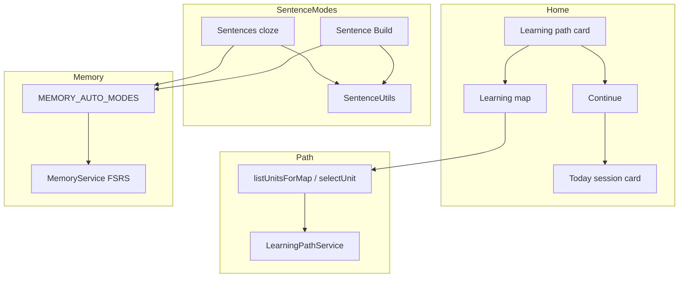

# VocabMaster: Learning Map Home UX · Sentences Cloze Reliability · Sentence Build · CJK Chunking

| Field | Value |
|-------|--------|
| **Title** | Learning Map + Continue Home UX · Sentences Cloze Blank Reliability · Sentence Build Activity · CJK Word Chopping |
| **Author** | VocabMaster design (AI-assisted) |
| **Date** | 2026-07-17 |
| **Status** | **Implemented on main (v1)** — core of Parts A–D shipped in `19a1300` and related path/FAB work |
| **Revision** | 3 |
| **Audience** | Engineers maintaining path home UX, Sentences mode, Sentence Build, and shared `SentenceUtils` |
| **Branch policy** | **main only** — incremental, reviewable commits/PRs; preserve Today + memory + path |
| **Related** | `docs/memory-engine-daily-session.md`, `docs/tiered-learning-ai-engagement-fab-chat.md`, `docs/architecture.md` §3.4–3.5, `AGENTS.md` |
| **Primary code** | `public/js/sentence_utils.js`, `public/js/game_sentences.js`, `public/js/game_sentence_build.js`, `public/js/learning_path.js`, `public/js/main.js`, `public/js/analytics.js`, `public/js/settings_html.js` (path radios markup), `public/js/ui_settings.js` (path settings sync), `public/js/daily_session.js` (Today compose / multi-attempt — F6), `tests/unit/sentence_utils.test.js`, `public/index.html` |
| **Key commit** | `19a1300` — *feat: learning map UX, sentences cloze fix, Sentence Build activity* |

### Revision history

| Rev | Date | Notes |
|-----|------|-------|
| 1 | 2026-07-17 | Formal design of shipped v1 + follow-up backlog (offline blank index, data quality, map polish, E2E) |
| 2 | 2026-07-17 | Review fixes: soft-unlock wording consistency; F6 Daily Session multi-attempt checklist; map `placementStatus` side effect; `settings_html.js` anchors; euro morph / `ru` caveat; F1 baseline artifact requirement |
| 3 | 2026-07-17 | Re-review polish: Alternatives soft-unlock decision wording; Part C `buildPlan` truth table (drop false dictation compose claim) |

---

## Product Thesis

> **Guided practice should feel like a place you continue, not a mode you configure — and every sentence activity must hide the headword reliably, even when the example uses kana, conjugation, or multi-gloss surfaces.**

VocabMaster already ships FSRS memory, Daily Session (Today), and a tiered Learning Path. This design documents four coherent improvements that close product and reliability gaps:

| Part | Name | One-liner |
|------|------|-----------|
| **A** | Learning map + Continue | Replace awkward free/guided home chips with **Learning map** (unit navigation) and **Continue** (resume / start Today / opt into guided) |
| **B** | Cloze blank reliability | Headword often ≠ surface form in examples; shared blank-finding makes Sentences mask correctly |
| **C** | Sentence Build | New reorder-blocks activity: known-language prompt → build target-language sentence |
| **D** | CJK chunking | Research-backed block splitting without shipping MeCab/Jieba in the client |



---

## Background & Motivation

### Code truth (pre-`19a1300` pain → post-ship)

| Area | Before | After (v1 on main) |
|------|--------|---------------------|
| Home path chips | “Switch to free” / “Practice all filtered” on primary path card — power-user controls as primary CTAs | **Learning map** + **Continue** (or “Continue path” / “Continue with guided”); free/guided + `freePlayScope` live in **Settings → Learning path** (markup: `settings_html.js`; sync: `ui_settings.js`) |
| Unit navigation | Path profile + unit slices existed; no dedicated map UI | `openLearningMap()` sheet; `listUnitsForMap()`; `selectUnit(index)` |
| Sentences cloze | Exact headword match against `*_ex` only | `SentenceUtils.findBlankSpan` / `generateCloze` via readings, multi-gloss, JA stems |
| Bottom pane (Sentences) | Tiny / bottom-left aligned blank text | Dedicated `#sn-bottom-text` with center + `fit-smart` |
| Sentence reordering | Not a mode | `SentenceBuild` (`sentence_build`) under Context on home grid |
| Memory allowlist | No `sentence_build` | `'sentence_build'` in `MEMORY_AUTO_MODES` |
| Shared algorithms | Scattered / none | `public/js/sentence_utils.js` → `window.SentenceUtils` |

### Pain points (product + evidence)

1. **Home path felt like settings, not navigation.** Chips for free scope and free mode competed with Today; learners needed a unit map and a single “keep going” action.
2. **Cloze blanks often missing (2026-07-16 screenshot).** Japanese main example could show the full sentence without a blank (e.g. `ここはとても静かです。`) while answer choices still offered multi-gloss forms (`静か・閑か・寂か`). English bottom line sometimes showed a blank but was poorly aligned/tiny.
3. **Measured match failure on tier-1 Japanese data.** Exact headword match in `ja_ex` was only ~**3.8%** in a one-off 2026-07-16 measurement (method not yet checked into the repo — **F1** must re-publish exact-only baseline + post-utils rate as a dated artifact so this figure is reproducible). Headword is often **kanji** while the example uses **kana reading** (`部屋` vs `へや`), or the example is **conjugated** (`言う` → `いいました`), or the headword field is **multi-gloss** with `・` / `/` separators.
4. **No productive production skill for word order.** Cloze tests recognition of a blank; learners also need to **assemble** target-language word order from a known-language prompt — especially for SOV languages (JA) and particle-heavy structure.
5. **CJK has no spaces.** Naive `split(/\s+/)` yields one giant block for Japanese/Chinese examples, making any reorder game unusable without a segmenter strategy.

### Why document now

- Core of A–D is **implemented on main** (`19a1300` and path/FAB lineage `ce45007` → `af7812e`).
- Follow-ups (offline blank index, furigana cleanup, map polish, E2E) need a single engineer-ready contract so they do not regress v1 invariants.
- Dual-asset APK sync, multi-script `window.*` rules, and memory allowlist must stay explicit for every PR that touches these surfaces.

---

## Goals & Non-Goals

### Goals

1. **Home path UX:** Primary path actions are **Learning map** and **Continue**; free/guided and free-play scope remain power-user Settings.
2. **Unit map:** Current tier units with progress %, soft unlock, select unit, placement entry, continue into Today.
3. **Cloze reliability:** Shared blank finder using headword + secondary fields + multi-gloss + light JA conjugation; mask HTML for one span; robust bottom pane layout.
4. **Sentence Build:** Mode key `sentence_build`; known-lang example as prompt; target-lang blocks to reorder; Undo / Clear / Check; FSRS via `MEMORY_AUTO_MODES`.
5. **CJK chunking:** `Intl.Segmenter` primary; pedagogical JA particle merge; vocab anchor; 2–8 block balance; fallback without npm segmenters.
6. **Cross-script safety:** Export via `window.SentenceUtils`, `window.SentenceBuild`, `window.LearningPathService` (see AGENTS.md).
7. **Tests:** Unit coverage for blank find + chunk reconstruction (`tests/unit/sentence_utils.test.js`).
8. **APK parity:** Any `public/` UI change synced to `android/app/src/main/assets/` on ship PRs.

### Non-Goals (v1 — do not expand scope into these without a new design)

- Shipping **Jieba / MeCab / TinySegmenter / kuromoji** in the browser or APK WebView.
- Server-side FSRS or server-side blank computation as a hard dependency for offline play.
- Separate **explainLang** preference (always `presetSource` → `_getExplainLang()`).
- Putting Ollama / proxy API keys in client config.
- Hard gates that lock prior units forever (path uses **soft unlock**).
- Full multi-tier map with animated world graph (follow-up polish only).
- Replacing Sentences AI-free cloze with mandatory LLM generation.
- Curated per-row block lists in RTDB as **required** for Sentence Build v1 (optional later).

---

## Proposed Design

### Part A — Learning path home UX (Learning map + Continue)

#### Intended product behavior

**Home path card** (`main.js` → `_homePathAndTodayHtml()`):

| Element | Behavior |
|---------|----------|
| Title | “Learning path” |
| Progress line | `pathProgressLabel()` — e.g. free label or `N5 · Unit 2 · Daily life · 40 words` |
| Mode subtitle | `Guided path` or `Free practice` · target lang code |
| Progress bar | Only when `pathMode === 'guided'`; width = `unitProgressPercent()` |
| Coach tip | `#home-coach-tip` filled async by `TutorMoments.coachTipOfDay()` when available |
| **Learning map** | Always shown; opens unit map sheet (`openLearningMap`) |
| **Continue** (resumable Today) | If `dailySession.hasResumableSession()` → `dailySession.continue()` |
| **Continue path** | Guided + not resumable → `dailySession.start()` |
| **Continue with guided** | Free mode → `setPathMode('guided')`, `ensureUnit(0)`, `goHome(false)` |

**Today card** (separate indigo gradient block, memory engine on): still owns Start session / Continue / Start new with due·new counts from `selectTodayItems` when path-aware.

**Settings → Learning path:**

| Concern | File | Role |
|---------|------|------|
| Radio markup + `onchange` handlers | `public/js/settings_html.js` | DOM for `name="path-mode"` (`free` \| `guided`) and `name="free-play-scope"` (`unit` \| `filtered`); calls `setPathMode` / `setFreePlayScope` |
| Sync visual state / status line | `public/js/ui_settings.js` → `_syncPathSettings()` | Reads profile; checks radios; updates `#path-settings-status` from `pathProgressLabel()` |

Power users change free/guided and free-play scope **here**, not via home chips.

#### Learning map sheet (`openLearningMap`)

1. If path not ready → toast and return.
2. If `pathMode !== 'guided'` → auto opt-in: `setPathMode('guided')` + `ensureUnit(0)`.
3. Build unit list via `listUnitsForMap()`.
4. Modal dialog (`role="dialog"`, `aria-label="Learning map"`, z-index `70`):
   - Header: tier + framework; close button `aria-label="Close"`
   - Scrollable unit rows
   - Footer: **Continue** (Today resume/start), **Placement** (`startPlacement`)
5. Unit row tap → `selectUnit(index)` → close → `goHome(false)`.
6. Locked units: `disabled` + `opacity-50` + “Locked” label (soft unlock rules below).
7. Backdrop click on `#learning-map-backdrop` closes; dialog panel clicks do not.

##### Map opt-in side effects (`setPathMode('guided')`)

Opening the map from free mode (and the home “Continue with guided” button) call `LearningPathService.setPathMode('guided')`, which:

| Field | Effect |
|-------|--------|
| `pathMode` | Set to `'guided'` |
| `placementStatus` | If currently `'skipped'`, flipped to **`'pending'`** (`learning_path.js`) |
| Unit | Caller typically also `ensureUnit(0)` so a unit snapshot exists |

**v1 product truth:** This placement flip is **live behavior**, not accidental. No code path auto-launches Placement solely because status is `'pending'` — impact is latent on profile shape / future gates / Settings status. Engineers must not assume map open only touches `pathMode` + unit 0.

**Not a v1 code change requirement:** If product later wants “map browsing without placement pending,” that is an explicit follow-up (call a no-placement guided entry or clear `pending` when skipping). Until then, document and preserve the side effect.

#### Unlock rules (`listUnitsForMap`)

- Units for **current tier only** (`p.currentTier`).
- Word list: `filterListByTagsStrict(list, [tier])`, sorted by numeric `id`, sliced by `unitSize` (default **40**).
- Display cap: **max 12 units** in the map UI (even if tier has more slices).
- For each unit index `i`:
  - `ensureUnit(i, { makeCurrent: false })` so snapshots exist without stealing current unit.
  - Progress via `unitProgressPercent(unit)` (memory cards with `reps > 0` or state `review`/`relearning`).
  - **Soft unlock (source of truth):** unit `i` is **unlocked iff** `i ≤ currentUnitIndex + 1` (equivalently locked iff `i > currentUnitIndex + 1`). That means **all earlier units + current + at most one look-ahead** are playable (e.g. current index 5 → units 0–6 unlocked). Unit 0 is always unlocked when current is 0. **No mastery gate.**
- Restores `currentUnitId` after the scan so map open does not change active unit accidentally.

#### `selectUnit(unitIndex)`

- `ensureUnit(unitIndex, { makeCurrent: true })`
- Forces `pathMode = 'guided'`
- Persists local + RTDB flush

#### Data model (path — already defined)

Profile at:

- localStorage: `vm_learning_path_v1`
- RTDB: `users/{uid}/learningPath`

Relevant fields:

```text
schemaVersion, pathMode ('free'|'guided'), framework, currentTier,
currentUnitId, knownLang, targetLang, placementStatus,
freePlayScope ('unit'|'filtered'), unitSize, units: {
  [unitId]: {
    unitId, tier, index, wordIds[], theme, themeTitle, themeTags[],
    unlockedAt, completedAt, progress
  }
}, legacyLevelFilter, updatedAt
```

Unit id format: `{tier}_u{index}` e.g. `N5_u0`.

Themes cycle from `UNIT_THEME_CATALOG` (10 hand-curated themes).

#### Accessibility (v1 + polish)

| Requirement | v1 status |
|-------------|-----------|
| Dialog role + aria-label | Shipped |
| Close button aria-label | Shipped |
| Disabled locked units | Shipped (`disabled`) |
| Focus trap / initial focus / Escape key | **Follow-up** |
| `aria-current` on active unit | **Follow-up** |
| Progress bar `aria-valuenow` | **Follow-up** (visual-only today) |

#### Acceptance criteria (Part A)

- [x] Home path card shows Learning map + Continue family; no free-scope chips on home.
- [x] Settings still expose path mode + freePlayScope (markup `settings_html.js`, sync `ui_settings.js`).
- [x] Opening map from free mode opts into guided and shows units; also may set `placementStatus` skipped → pending (documented side effect).
- [x] Selecting a unit updates current unit and home label.
- [x] Soft unlock: unit `i` unlocked iff `i ≤ currentUnitIndex + 1` (all earlier + current + one look-ahead; no mastery gate).
- [x] Placement and Continue footer actions work from the sheet.
- [ ] Focus trap / Escape (follow-up).

---

### Part B — Sentences mode cloze blank reliability

#### Problem formalization

Given vocab item `item` and language key `langKey` (e.g. `ja`), example string `item[exKey]` often does **not** contain exact `item[langKey]`. Blanking must find a **surface span** in the example that pedagogically corresponds to the headword.

Failure modes observed:

| Failure | Example | Effect |
|---------|---------|--------|
| Kanji headword, kana example | `部屋` vs `…へやは…` | No exact match |
| Dictionary form, conjugated example | `言う` / `いう` vs `…いいました` | No exact match without stems |
| Multi-gloss headword | `静か・閑か・寂か` | Full string never appears; need split |
| Parenthetical notes | `word (note)` | Need strip before match |
| Euro morphology | `run` vs `running` | Need suffix-tolerant match |
| No usable candidate | empty `*_ex` / unrelated sentence | Fall back to full unmasked sentence (honest failure) |

#### Shared API (`window.SentenceUtils`)

File: `public/js/sentence_utils.js`  
Loaded from `public/index.html` **before** `game_sentences.js` / `game_sentence_build.js`.

| Export | Role |
|--------|------|
| `normalizeText(str)` | Unescape `\'`/`\"`/HTML quotes; trim |
| `blankCandidates(item, langKey)` | Longest-first unique match strings |
| `findBlankSpan(sentence, item, langKey)` | `{ start, end, matched } \| null` |
| `generateCloze(raw, itemOrTarget, langCode, createMaskFn?)` | `{ html, audio, matched, span }` |
| `japaneseConjugationForms(base)` | Light N5-ish surface forms |
| `chunkSentence` / `shuffleBlocks` | Part D / C |

#### Candidate generation (`blankCandidates`)

1. Raw `item[langKey]`.
2. Strip parentheticals `(…)` / `（…）` and add both stripped + raw.
3. Split multi-sense on `[;|／/·・]+`; for euro languages also split on spaces for tokens length ≥ 3.
4. Secondary fields by language:
   - `ja`: `ja_furi`, `ja_roma`
   - `zh`: `zh_pin`
   - `ko`: `ko_roma`
   - `ru`: `ru_tr`
5. JA: run `japaneseConjugationForms` on furigana/kana reading and on headword if different.
6. Deduplicate; **sort longest first** (prefer full form over short substrings).

#### Span search (`findBlankSpan`)

```
function findBlankSpan(sentence, item, langKey):
  sentence = normalizeText(sentence)
  cands = blankCandidates(item, langKey)

  // Pass 1 — exact (or euro morphology for Latin-script euro langs)
  for c in cands:
    if euro(langKey):  // en, es, fr, de, it, pt, ru
      // RegExp(escape(c) + '[\w\u00C0-\u024F]*', 'i') — NO 'u' flag
      // \w is ASCII word chars; \u00C0-\u024F covers Latin Extended
      // → inflection extension works for Latin scripts (run→running, parler→parlerai-ish prefix)
      // → Russian (Cyrillic): \w does NOT match Cyrillic; morph extension is effectively exact-only
      //   (still benefits from blankCandidates + ru_tr secondary field)
      match that regex; if match: return span
    else:
      idx = sentence.indexOf(c)
      if found: return span

  // Pass 2 — CJK only: longest substring of any candidate (≥2 chars) present in sentence
  best = null
  for c in cands:
    for each substring sub of c with len >= 2 (longest first):
      if sub in sentence and longer than best: best = span
  return best or null
```

**Euro morphology caveat (v1):** Coverage is **Latin-script primarily**. `isEuroLang` includes `ru`, but without the unicode `u` flag / Cyrillic class, Russian inflection tails do not extend — matching falls back to exact candidate strings (including `ru_tr` pieces). Stronger Cyrillic morphology is **F4**, not a silent claim of full euro parity.

**Invariant:** At most **one** blank span per call (first/best match). Multi-blank cloze is out of scope.

#### Cloze HTML (`generateCloze`)

- Accept full item object (preferred) or bare target string (legacy).
- On miss: return escaped full sentence, `matched: null` (UI still playable; no fake blank).
- On hit: `before + mask(mid) + after`; audio string uses `' ... '` for the blank.
- Default mask: violet underline blank (`main-blank`), `text-transparent`, min-width, stores word in `data-word`.

#### Sentences wiring (`game_sentences.js`)

- `generateCloze` delegates to `SentenceUtils` when present.
- Top pane `#sn-text`: target-language cloze (`sentencesQ` + example key from `LANG_MAP`).
- Bottom pane `#sn-bottom-text` (centered, `fit-smart`):
  - Modes: `sentence_masked` | `sentence_full` | `word_masked` | `word_full` | `none` via prefs.
  - `sentence_masked` re-runs `generateCloze` against **bottom language** headword/example.
- Layout: `grid-rows-[7fr_3fr]`; both panes `flex items-center justify-center`.

#### Offline blank precomputation (future — not v1)

Optional RTDB enrichment per word / language:

```text
vocab/{id}/blanks/{langKey} = {
  exKey: 'ja_ex',
  start: number,
  end: number,
  matched: string,
  method: 'exact'|'reading'|'conj'|'substring'|'manual',
  updatedAt: number
}
```

Client would prefer precomputed span when present, else fall back to runtime `findBlankSpan`.  
Batch job sketch: Node script scan `/vocab`, write blanks; flag low-confidence rows for human review.

#### Data-quality cleanup (future)

- Furigana fields that are wrong, empty, or full-width/half-width inconsistent poison both cloze and chunking.
- Multi-gloss rows with rare kanji variants should keep primary sense first.
- Batch report: % of `*_ex` with successful blank per language/tier; export mismatch CSV.

#### Acceptance criteria (Part B)

- [x] `部屋` / `へや` example blanks `へや` (unit test).
- [x] Conjugated `いいました` from `言う`/`いう` finds span length ≥ 2 (unit test).
- [x] `generateCloze` emits `main-blank` and `audio` with `...` when matched.
- [x] Bottom text uses dedicated centered `#sn-bottom-text` + fitter.
- [ ] Offline RTDB blank index (follow-up).
- [ ] Match-rate dashboard / batch metric published regularly (follow-up).

---

### Part C — Sentence Build activity

#### Product definition

| Field | Value |
|-------|--------|
| Mode key | `sentence_build` |
| Home placement | Context section — “Sentence Build” (`ph-rows`, pink gradient) |
| Class | `SentenceBuild extends GameMode` |
| File | `public/js/game_sentence_build.js` → `window.SentenceBuild` |
| Launch | Home button; `launchGameMode('sentence_build')` |
| Memory | In `MEMORY_AUTO_MODES` (`analytics.js`) |
| AI dependency | **None** (data examples only) |

#### Interaction model

1. **Prompt:** known-language example (`presetSource` / `sentencesBottomLang` fallback) via `*_ex`; else gloss `item[knownLang]`.
2. **Target:** target-language example (`presetTarget` / `sentencesQ` fallback) chunked into ordered blocks.
3. **Pool:** shuffled blocks as tappable chips.
4. **Built tray:** ordered chips the learner assembled; tap a built chip to return it to the pool.
5. **Controls:** Undo (pop built → pool), Clear (all built → pool), Check (grade).
6. **Grade:**
   - Normalize by removing whitespace: built join === correct blocks join **or** full target sentence.
   - Also accept exact block-array equality.
7. **Correct:** `score(12)`, celebration, emerald tray, TTS of full target sentence, `waitAndNav`.
8. **Incorrect:** `miss()`, rose flash, after ~1.2s show correct order in tray and **allow retry** (`_done = false`).
9. **Skip empty:** if no usable target example, advance list with loop guard.

#### UI structure

```
#sb-header
#sb-prompt-box > #sb-prompt.fit-smart   // known-lang question
#sb-built                                // dashed indigo tray
#sb-pool                                 // flex-wrap chips
#sb-undo | #sb-clear | #sb-check
#sb-audio
#sb-nav
```

Style constraints (AGENTS.md): custom palette colors without `/opacity` modifiers on indigo/slate/neutral; use `dark:bg-neutral-900` etc.

#### Session / daily plan (v1 free-play only; Today = F6)

| Path | Status on main |
|------|----------------|
| Free play (home grid) | **Shipped** — full retry UX |
| Daily Session default `buildPlan` | **Does not** emit `sentence_build`. Emits only `flash` / `quiz` / `tf` / optional `story` (when `includeAiBlock` + `aiBlock === 'story'`). Pref `includeDictation` exists on session defaults but is **not** applied in `buildPlan` (dictation is constructable/labeled, not composed — same “wire later” pattern as `sentence_build`) |
| `_constructMode` | **No** explicit `sentence_build` branch — falls through to `app.launchGameMode` (works, fragile) |
| `SESSION_MODE_LABELS` | **No** `sentence_build` entry (chrome would show raw key) |
| `MULTI_ATTEMPT_MODES` | Only `{ quiz: true, dictation: true }` — **not** `sentence_build` |

**Why multi-attempt matters:** Sentence Build’s free-play product model is **miss → reveal correct order → allow retry** (`_done = false` after ~1.2s). Under Daily Session, `attachController` wraps `miss`/`score` → `onGraded`. Modes **not** in `MULTI_ATTEMPT_MODES` treat the first incorrect Check as a **terminal** Again + resolve + reinsert, while the UI still lets the learner re-Check — step completion and FSRS desync.

**Free-play FSRS double-grade (known):** Each `miss()` and later successful `score()` can both call `recordAttempt` → memory review via `MEMORY_AUTO_MODES`. Open Question #2 / F6 decide whether free-play should be first-grade-only.

Cross-reference: multi-attempt deferral semantics live in `public/js/daily_session.js` (`MULTI_ATTEMPT_MODES`, `onGraded`) and are described for Quiz/Dictation in `docs/memory-engine-daily-session.md` (step completion / grading contract). F6 must mirror that pattern for `sentence_build` **or** drop silent retry under session control.

#### Acceptance criteria (Part C)

- [x] Mode launches from home; reconstructs sentence from blocks.
- [x] Prompt uses known language example/gloss.
- [x] Undo/Clear/Check behave as specified; incorrect allows retry after reveal (free-play).
- [x] `sentence_build` in `MEMORY_AUTO_MODES`.
- [x] Script tag in `index.html`; global `window.SentenceBuild`.
- [ ] Playwright E2E happy path (follow-up F8).
- [ ] Daily Session integration (follow-up **F6** — full checklist in PR Plan; not “just add a weight”).

---

### Part D — CJK / no-space word chopping for blocks

#### Design pipeline (`chunkSentence`)

```
chunkSentence(sentence, langCode, opts={ item, maxBlocks=8, minBlocks=2 }):
  sentence = normalizeText(sentence)

  // 1) Primary: Intl.Segmenter word granularity
  if Intl.Segmenter available:
    parts = segment(sentence, localeFor(langCode), granularity: 'word')
    drop pure whitespace

  // 2) Fallback if empty / error
  if !parts: parts = fallbackChunk(sentence, langCode)
    // euro with spaces: split on spaces + punctuation
    // CJK: script-run regex; long CJK runs → 2-char groups

  // 3) mergePunctuation — attach 。、！？ etc. to previous

  // 4) JA pedagogical merge — particles/copula/endings onto previous content word
  if langCode === 'ja': mergeJapaneseParticles(parts)

  // 5) Vocab anchor — force headword/reading surface as one block via findBlankSpan
  if opts.item: fuseVocabAnchor(parts, item, langCode)

  // 6) balanceBlocks — merge shortest neighbors if > maxBlocks;
  //    split longest if < minBlocks and length ≥ 4

  return non-empty parts
```

#### Japanese particle / ending set (v1)

Frozen map includes:  
`は が を に で と も へ や の から まで より ね よ か な わ さ`  
plus endings: `です ます でした ました ません ない た て`  
and single-char particle regex fallback.

**Pedagogy intent:** learners reorder **content chunks** closer to phrase units, not isolated particles as free-floating chips.

#### Vocab anchor (`fuseVocabAnchor`)

1. Join current parts → `findBlankSpan(joined, item, langCode)`.
2. If span found: re-chunk `before` and `after` (Segmenter preferred), insert `mid` as **single** block.
3. Guarantees the study word is not split mid-kanji/kana across chips.

#### Shuffle (`shuffleBlocks`)

Fisher–Yates with up to 8 retries to avoid identity permutation when length ≥ 2.

#### Explicit non-goals for client v1

| Approach | Why not in client v1 |
|----------|----------------------|
| Jieba / nodejieba | Heavy; Node-oriented; packaging cost for SPA/APK |
| MeCab / kuromoji full dict | Large dictionary payloads; WebView memory |
| TinySegmenter | Lighter but still extra dep + quality tradeoffs; Segmenter Baseline 2024 covers modern WebView |
| Pure character n-grams only | Bad pedagogy (splits words randomly); kept only as **fallback** 2-char groups |
| Manual RTDB blocks for all rows | Unscalable as hard requirement; optional enrichment later |

#### Browser / WebView note

`Intl.Segmenter` is **Baseline 2024**. Android WebView and modern Chromium support word granularity for `ja`/`zh`/`ko` locales used in `localeFor()`. Fallback path keeps APK usable on older engines.

#### Acceptance criteria (Part D)

- [x] JA sentence yields 3–8 blocks; join without spaces reconstructs original (unit test).
- [x] Vocab surface appears as a contiguous block when blank span found.
- [x] English space-splits into multiple blocks.
- [x] No npm segmenter dependency.
- [ ] Stronger KO/ZH particle/measure-word merge heuristics (follow-up tuning).
- [ ] Optional curated blocks for hard rows in RTDB (follow-up).

---

## Data Model / RTDB

### User path (existing)

```
users/{uid}/learningPath   // LearningPathService profile (see Part A)
users/{uid}/dailySessions/{yyyy-mm-dd}
users/{uid}/memory/...     // FSRS cards (see memory design)
users/{uid}/analytics/...  // includes mode counters for sentence_build
```

### Vocab (read-only for v1 client algorithms)

```
vocab/{id}/{lang}          // headword
vocab/{id}/{lang}_ex       // example sentence
vocab/{id}/ja_furi, ja_roma, zh_pin, ko_roma, ru_tr
```

### Proposed future fields (follow-up only)

```
vocab/{id}/blanks/{langKey}     // precomputed cloze span
vocab/{id}/buildBlocks/{langKey} // optional curated string[] for Sentence Build
```

No client writes to `/vocab` from these modes.

---

## UI Surfaces

| Surface | File / id | Notes |
|---------|-----------|-------|
| Home path card | `main.js` `_homePathAndTodayHtml` | Learning map + Continue family |
| Today card | same | Due/new counts; Start/Continue |
| Learning map sheet | `#learning-map-root` | Unit list + Placement + Continue |
| Settings Learning path (markup) | `settings_html.js` | Radios `path-mode`, `free-play-scope`; placement button |
| Settings Learning path (sync) | `ui_settings.js` `_syncPathSettings` | Reflect profile into radios + status text |
| Sentences | `#sn-text`, `#sn-bottom-text` | Cloze + secondary display |
| Sentence Build | `#sb-*` | Prompt, tray, pool, actions |
| Home Context grid | Sentence Build button | Next to Sentences |
| Daily Session controller | `daily_session.js` | F6: compose, labels, multi-attempt (not wired for `sentence_build` in v1) |

Script load order (`public/index.html` excerpt):

```html
<script src="js/learning_path.js?v=…" defer></script>
<script src="js/sentence_utils.js?v=…" defer></script>
…
<script src="js/game_sentences.js?v=…" defer></script>
<script src="js/game_sentence_build.js?v=…" defer></script>
```

`sentence_utils.js` **must** load before game modes that call it. Cross-script access always via `window.SentenceUtils` / `window.SentenceBuild` (never bare `const` from another tag).

---

## Algorithms (reference pseudocode)

### Blank find (summary)

See Part B. Critical order: **exact / Latin-script euro morph → CJK longest substring ≥ 2**. Longest candidates first reduces accidental short false positives (e.g. single kana). Russian is in the euro set but morph tails are exact-only until F4 (Cyrillic class / unicode property escapes).

### Light JA conjugation (summary)

From base ending:

- **る** (ichidan-ish): stem, ます/ました/ません/て/た/ない/…  
- **Godan** maps for うくぐすつぬぶむる rows → ます forms, ない, ば, て/た  
- **い** adjectives: く/くて/かった/くない/ければ  

Not a full conjugator — optimized for N5 example coverage.

### Chunk balance

- While `len > maxBlocks`: merge adjacent pair with minimal combined length.
- While `len < minBlocks` and some block length ≥ 4: split longest at midpoint.

---

## Alternatives Considered

| Alternative | Pros | Cons | Decision |
|-------------|------|------|----------|
| Keep free/guided chips on home | Discoverable | Clutters primary CTA; “settings as home” | **Rejected** — Settings only |
| Hard unit locks (must 100% mastery) | Strong curriculum feel | Friction; conflicts with dual-universe due | **Soft unlock** (`i ≤ cur+1`; all prior + current + one look-ahead) |
| LLM-generated cloze only | Handles hard morphology | Latency, offline fail, cost | **Rejected for core Sentences**; data-first + utils |
| Exact headword-only blank | Simple | ~3.8% JA tier1 hit rate | **Rejected** |
| Client MeCab/Jieba | Better segmentation | Size, maintenance, APK cost | **Rejected for v1** |
| Space-only Sentence Build | Simple | Unusable for JA/ZH | **Rejected** |
| Drag-and-drop only (no tap chips) | “Premium” feel | Touch a11y harder; more code | **Tap chips v1**; DnD optional later |
| Separate explain language pref | Flexibility | Violates product rule; duplicate source of truth | **Forbidden** — `presetSource` only |

---

## Risks

| Risk | Impact | Mitigation |
|------|--------|------------|
| False-positive short CJK substring blank | Wrong pedagogical blank | Longest-first candidates; min length 2; future precompute + manual overrides |
| Segmenter quality variance across WebViews | Odd block boundaries | Particle merge + balance + vocab anchor; fallback path |
| Soft unlock too soft / too hard | Frustration or cheese | Formula is all prior + current + one look-ahead (`i ≤ cur+1`); map polish can add mastery *hints* without hard gate |
| Retry-after-miss on Sentence Build inflates free-play FSRS | Double `recordAttempt` (miss then score) | Open Q #2 / F6: first-grade-only option; free-play monitor |
| Session desync if F6 ships weight without multi-attempt | Terminal Again while UI retries | **F6 hard requirement:** `MULTI_ATTEMPT_MODES` **or** terminal miss UX — pick one |
| APK asset desync | Web fixed, APK stale | Mandatory copy of `public/` → `android/.../assets/` on UI PRs |
| Multi-script globals forgotten | Runtime `undefined` | Always `window.*`; unit tests load via vm context setting `window` |
| Bad furigana rows | Persistent blank miss | Data cleanup batch (follow-up) |
| Map open forces guided + may set placement pending | Surprise mode / placement status change | Documented intentional `setPathMode` side effect; free users reverse in Settings; no auto-launch Placement on pending |
| Overstated Russian euro morph | False confidence in blank hit for RU | Doc caveat + F4 Cyrillic morph follow-up |

---

## Observability / Success Metrics

| Metric | Definition | v1 target | How |
|--------|------------|-----------|-----|
| Cloze blank hit rate | Fraction of Sentences renders with `matched != null` for target lang | ≥ 80% JA tier1 after utils; track ZH/KO | Offline batch (F1) + optional client sample |
| Exact-only baseline | Headword exact in `*_ex` only | ~3.8% JA cited historically (2026-07-16 one-off; **not** a committed artifact) | **F1 must** recompute + publish method + dated report path that supersedes the folklore figure |
| Sentence Build completion | Checks that eventually correct before nav skip | Track | Analytics mode `sentence_build` c/w |
| Map open rate | Opens of `#learning-map-root` per home session | Qualitative first | Optional engagement counter |
| Guided opt-in | Users who leave free → guided via Continue/map | Track | `learningPath.pathMode` + engagement |
| Unit select | `selectUnit` calls | Track | Local/remote profile `currentUnitId` changes |
| Memory allowlist | `sentence_build` reviews applied | Must remain true | Code invariant + unit/integration |

**Engineering health:**

- Unit tests in `tests/unit/sentence_utils.test.js` green in CI.
- No regression of Today dual-universe compose (`selectTodayItems`).

---

## Open Questions

1. Should Daily Session **auto-include** `sentence_build` in the default mode rotation, and at what weight vs `sentences`? (Blocked on F6 product decision; engineering checklist still required either way.)
2. Should incorrect Sentence Build Check **re-grade** multiple times for FSRS in **free-play**, or only first Check per card? (Session path must use multi-attempt single-Again recovery like Quiz — see F6 — independent of free-play choice.)
3. For multi-gloss answers in Sentences choices, should distractors/correct display prefer the **matched surface** (`cloze.matched`) over full multi-gloss headword?
4. Map **tier switcher** in-sheet vs only via Settings/placement?
5. Precomputed blanks: store under `/vocab` (global) or user-agnostic Cloud Storage artifact built at deploy time?
6. KO honorific endings / ZH 了/过/着 — same merge table pattern as JA particles?
7. Should map opt-in stop flipping `placementStatus` skipped → pending (keep guided without placement pressure)?

---

## Key Decisions

1. **Home primary path actions are Learning map + Continue** — free/guided and freePlayScope are Settings-only power controls (markup `settings_html.js`, sync `ui_settings.js`).
2. **Soft unlock** for units: unit `i` is unlocked iff `i ≤ currentUnitIndex + 1` — **all earlier units + current + at most one look-ahead**; not mastery-hard-gated. (Do not reinterpret as “only current±1.”)
3. **Opening Learning map from free mode opts into guided** and ensures unit 0 — map is a guided surface. **Also** inherits `setPathMode('guided')` side effect: `placementStatus` `'skipped'` → `'pending'` (no auto Placement launch on pending alone).
4. **Shared `SentenceUtils`** owns cloze + chunking; game modes only wire UI.
5. **Blank matching priority:** exact / **Latin-script** euro morphology → CJK longest substring ≥ 2; candidates from headword + secondary readings + multi-gloss + light JA conjugation. Russian morph extension is not claimed in v1 (exact + `ru_tr`).
6. **Honest miss:** if no span found, show full sentence unmasked rather than a random blank.
7. **Sentence Build mode key `sentence_build`** is in **`MEMORY_AUTO_MODES`** with other recognition/production drills (free-play). **Today inclusion is F6**, not v1.
8. **Chunking stack:** `Intl.Segmenter` → fallback → punct merge → JA particles → vocab anchor → balance 2–8.
9. **No heavy dictionary segmenters in client v1**; optional offline RTDB enrichment later.
10. **Cross-script exports via `window.*`** only; APK assets are a separate copy that must be synced.
11. **explainLang remains presetSource-derived**; never a separate pref.
12. **main-only branch policy**; document status = Implemented on main (v1) with explicit follow-up PRs.
13. **F6 must not ship compose weight alone** — multi-attempt controller semantics (or terminal-miss UX) + labels + construct branch are part of the same PR acceptance.

---

## PR Plan

### Shipped on main (do not re-land)

| PR / commit | Scope | Status |
|-------------|--------|--------|
| `ce45007` | Tiered learning path, AI tutor FAB, hardened proxy | Shipped |
| `17dbf48` | Placement, session wrap-up, ChatPanel, unit themes | Shipped |
| `af7812e` | Coach tip, engagement metrics, path settings, deeper placement | Shipped |
| **`19a1300`** | **Learning map UX, Sentences cloze fix (`sentence_utils`), Sentence Build activity** | **Shipped** |
| Memory + Today lineage (`3649fb1`…`aaddde0`) | FSRS + Daily Session foundation | Shipped |

### Follow-up PRs (recommended order)

| PR | Title | Scope | Acceptance |
|----|-------|-------|------------|
| **F1** | Cloze metrics offline scan | Node script: per-lang blank hit rate on `/vocab` or local dump; report CSV; no client UI required | **Must publish (1)** exact-only baseline method + rate (replaces non-reproducible ~3.8% folklore with a **dated artifact path** under e.g. `docs/` or `reports/`), **(2)** post-`SentenceUtils` hit rate for same corpus, **(3)** ja/zh/ko/en breakdown so % improvement is auditable |
| **F2** | Furigana / multi-gloss data cleanup | Batch fix bad `ja_furi` / primary sense order; re-run F1 | Hit rate ↑; sample audit of tier1 |
| **F3** | Offline blank index (optional RTDB fields) | Precompute `blanks/{lang}`; client prefer span if present | Fallback still works offline without fields |
| **F4** | JA conjugation + KO/ZH merge + RU morph | Expand stems; measure-word / ending merges; **Cyrillic / unicode morph extension** for `ru` (or document continued exact-only); more unit tests | New tests green; no block join regressions; ru morph either improved or explicitly out of scope with test |
| **F5** | Learning map polish | Tier switcher, unit detail sheet, Escape/focus trap, `aria-current`, light animations; optional placement-pending policy on map open | a11y checklist; no path data model break |
| **F6** | Sentence Build in Today compose | Full Daily Session integration — **not** “add weight only” | See **F6 acceptance checklist** below |
| **F7** | Curated blocks for hard rows | Optional `buildBlocks` enrichment for long/complex examples | Only overrides when present |
| **F8** | Playwright E2E | Cloze blank visible on known fixture word; Sentence Build reorder happy path; map open/select | CI stable on main |

#### F6 acceptance checklist (blocking before implementation)

Must complete **all** items (or document an explicit product “out of scope” for compose emission — still fix construct/labels if any path can emit the mode):

- [ ] **Compose / plan emission:** Product decision on weight vs `sentences` (and whether due segment rotates build); implement in `buildPlan` / intensity defaults only if “yes.”
- [ ] **`_constructMode('sentence_build')`:** Explicit branch constructing `new SentenceBuild('sentence_build')` (do not rely solely on `launchGameMode` fallthrough).
- [ ] **`SESSION_MODE_LABELS.sentence_build`:** User-facing label (e.g. `'Sentence Build'`) for progress chrome.
- [ ] **Multi-attempt vs terminal miss (pick exactly one):**
  - **Preferred (matches free-play pedagogy):** add `sentence_build: true` to `MULTI_ATTEMPT_MODES` so intermediate `miss` defers resolve/reinsert/FSRS; terminal correct after miss = single **Again** + reinsert once (mirror Quiz in `onGraded`); **or**
  - **Alternative:** change Sentence Build under session ownership to **terminal miss** (no silent re-Check / no `_done = false` retry) so first incorrect Check finishes the grade contract.
- [ ] **Free-play FSRS policy (ties Open Q #2):** if product chooses single review per card, implement first-grade-only memory for free-play retries; if not, document double-grade as accepted.
- [ ] **Test:** intermediate miss does **not** finish the Daily Session step; terminal correct recovers as Again once (mirror Quiz multi-attempt tests).
- [ ] **Docs cross-link:** update or reference multi-attempt rules in `docs/memory-engine-daily-session.md` when F6 lands.
- [ ] APK asset sync for any `public/js/daily_session.js` / game changes.

Each follow-up that touches `public/` **must** sync APK assets and bump cache-bust query params on `index.html` script tags as project convention.

---

## Implementation Checklist (maintainers)

- [x] `public/js/sentence_utils.js` + `window.SentenceUtils`
- [x] `game_sentences.js` uses utils + `#sn-bottom-text`
- [x] `game_sentence_build.js` + home button + `launchGameMode`
- [x] `MEMORY_AUTO_MODES` includes `sentence_build`
- [x] `listUnitsForMap` / `selectUnit` / `openLearningMap` / home Continue family
- [x] Path settings markup in `settings_html.js` + sync in `ui_settings.js` (not home chips)
- [x] Unit tests `tests/unit/sentence_utils.test.js`
- [x] `index.html` script tags ordered correctly
- [ ] Follow-ups F1–F8 as product priority allows

---

## Appendix: Primary code anchors

| Symbol / API | Path |
|--------------|------|
| `SentenceUtils.findBlankSpan` | `public/js/sentence_utils.js` |
| `SentenceUtils.generateCloze` | same |
| `SentenceUtils.chunkSentence` | same |
| `Sentences.generateCloze` | `public/js/game_sentences.js` |
| `SentenceBuild` | `public/js/game_sentence_build.js` |
| `MEMORY_AUTO_MODES` | `public/js/analytics.js` |
| `listUnitsForMap` / `selectUnit` / `ensureUnit` / `setPathMode` | `public/js/learning_path.js` |
| `openLearningMap` / `_homePathAndTodayHtml` | `public/js/main.js` |
| Path settings markup (radios) | `public/js/settings_html.js` |
| Path settings sync | `public/js/ui_settings.js` (`_syncPathSettings`) |
| `buildPlan` / `MULTI_ATTEMPT_MODES` / `_constructMode` / `SESSION_MODE_LABELS` | `public/js/daily_session.js` |
| Unit tests | `tests/unit/sentence_utils.test.js` |

---

*End of design document — rev 3, 2026-07-17. Status: Implemented on main (v1); review + re-review polish applied.*
