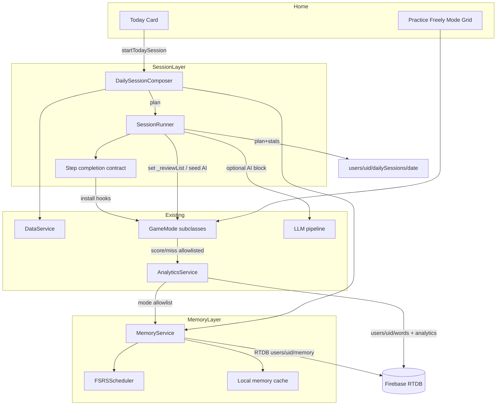

# VocabMaster: Memory Engine + Daily Session

| Field | Value |
|-------|--------|
| **Title** | Memory Engine + Daily Session (product foundation) |
| **Author** | VocabMaster design (AI-assisted) |
| **Date** | 2026-07-16 |
| **Status** | **Approved (owner decisions incorporated)** — rev 4 |
| **Audience** | Engineers implementing memory scheduling and the Today experience |
| **Related** | `docs/architecture.md`, `docs/medium-term-roadmap.md` (historical review queue), `docs/telemetry-feedback.md`, `public/js/analytics.js`, `public/js/data.js`, `public/js/adaptive.js`, `public/js/game_core.js`, `public/js/store.js`, `public/js/ui_home.js` |

---

## Product Thesis

> **VocabMaster is the AI-native language practice OS built on a polyglot vocabulary graph — with a real memory engine and a daily path that routes you through the right mode for each word.**

Today the product is a high-quality **mode buffet**: eleven practice instruments (Flashcards through Word Context), a mature AI pipeline (critic, RTDB caches, dual transport), and ~6k multi-language vocab items under `/vocab`. What it lacks is the product spine that turns “I can practice anywhere” into “I know what to practice **today**, and the system remembers what I know.”

This design introduces that spine in two complementary systems:

1. **Memory Engine** — per-user, per-word scheduling state (FSRS-inspired) that turns graded attempts into a due date, not just a c/w counter.
2. **Daily Session composer** — Home’s primary CTA becomes **Today**: a finite session of *new + due* items, with existing game modes used as *instruments* the composer plays, not as the only way to discover work.

Success is measured by retention and completion, not feature count.

### Success metrics (realistic for personal → go-to product)

| Metric | Definition | v1 target | How measured |
|--------|------------|-----------|--------------|
| **Session completion rate** | Daily sessions started that reach `status: 'completed'` | ≥ 70% of starts | **`users/{uid}/dailySessions/{yyyy-mm-dd}.stats`** (canonical path; not under `analytics/`) |
| **D1 return** | User who completed a Today session returns and starts another within 24–48h | Track first; target ≥ 40% once multi-user | `dailySessions` timestamps + streak |
| **Words retained @7d** | Of words with `introducedAt` set, fraction with ≥1 later success (rating ≥ Good) at due ≥7d | Track; aim ≥ 60% after warm-up | Memory state transitions |
| **Due backlog health** | Of due cards in filter at session start, % answered same local day | ≥ 80% when user opens app and finishes session | plan stats `dueCleared` vs `dueAtStart` |
| **Mode coverage** | Fraction of plan steps that are not pure Quiz | ≥ 40% non-quiz steps over a week | `dailySessions.plan` logs |

These are product metrics for a single primary user first, then early adopters. No third-party analytics required for v1.

**Canonical session record path:** `users/{uid}/dailySessions/{yyyy-mm-dd}` holds plan, cursor, status, and stats. Per-mode analytics sessions under `users/{uid}/analytics/sessions/{id}` continue for free-play and for each drill mode launched *inside* a Daily Session (see §3.1). There is **no** `users/{uid}/analytics/dailySessions/` path.

---

## Overview

**Problem.** VocabMaster records attempts (`users/{uid}/words/{wordId}` → `{ c, w, last, modes }`) and offers Smart Review as “most-missed → temporary `_reviewList` → Quiz only.” `adaptive.js` is accuracy bins only. Docs mention “SRS intervals,” but no stability/difficulty/due model exists. Home presents a mode grid, so daily practice depends on user willpower and mode choice, not scheduling science. Additionally, Smart Review is partially broken today: `GameMode` builds `this.list` from `getFilteredList()` and only falls back to `activeList` when empty, so `_reviewList` is often ignored.

**Solution.**

- Add a **MemoryService** that maintains card state per `(uid, wordId)` using an FSRS-4.5-compatible scheduler (pure JS, no npm).
- Map **allowlisted** mode outcomes to review quality ratings (not a blanket hook on every `recordAttempt`).
- Compose a **Daily Session** plan with an explicit **step completion contract** so finite plans work against modes that currently loop forever via `nav` modulo.
- Redesign Home so **Today** is primary; mode grid becomes **Practice freely**.

Incremental PRs keep all eleven modes working at every step.

---

## Background & Motivation

### Current state (code truth)

| Area | Path / shape | Limitation |
|------|----------------|------------|
| Attempt logging | `AnalyticsService.recordAttempt` → buffer → `_buildFlushUpdates` | Aggregates only: `c`, `w`, `last`, `modes/{mode}/{c,w}` |
| Smart Review | `DataService.getReviewWords` / `startReviewSession` / `_reviewList` | Most-missed + `selectWordsForReview`; Quiz-only via `launchSmartReview` |
| Adaptive | `adaptive.js` (~40 lines) | easy/medium/hard from accuracy rate; no time component |
| Home | `main.js` `goHome()` | Daily Score card + mode sections + Smart Review button at bottom |
| Learning loop | `learning_loop.js` IndexedDB | AI prompt evolution telemetry; **not** spaced repetition |
| Identity | Anonymous Firebase UID (primary) | Progress already keyed by `users/{uid}` — correct foundation |
| Scope | `getFilteredList()` level/tag + presets | Must remain the universe for new/due selection |
| List wipe mid-game | `store.js` `saveSettings`/`applyPresetSettings`; `ui_home.js` tag/level handlers | Reassign `game.list = getFilteredList()`, wiping review scope |
| Match state | `game_match.js` restores `app.store.matchState` | Session Match can show stale free-play cards |
| Match miss | `game_match.js` ~222 bare `recordAttempt(..., false)` | Bypasses `miss()` — session `onGraded` and consistent scoring need PR1 fix |
| Story scoring | `game_story_ui.js` bare `score(15)`/`miss()` | Resolves wordId from `this.list[this.i]`, not `storyWords` |
| Flashcards | `game_flashcard.js` | Never calls `score`/`miss` — presentation only today |
| Dictation pass bar | `game_dictation.js` | `similarity >= 0.8` → correct |

### Pain points

1. **No forgetting curve** — a word missed yesterday and a word missed six months ago rank similarly if `w` is high.
2. **No “due today” concept** — users cannot answer “what should I do now?”
3. **Smart Review is a dead-end UX** — one mode, no session boundary, no new-word introduction policy; list scoping incomplete.
4. **AI modes ignore memory** — Story `_pickWords` is random within filter; Grammar/Context don’t prefer due items by default.
5. **Docs overclaim SRS** — `docs/telemetry-feedback.md` mentions SRS intervals; implementation does not.

### Why now

- Analytics plumbing and auth UID identity are production-ready.
- Mode surface is rich enough that a composer can schedule *variety* without inventing new content types.
- AI caches (stories, grammar) make contextualization feasible without always blocking on generation.

---

## Goals & Non-Goals

### Goals

1. **Real memory engine** with due dates, stability, and difficulty per word (v1: single skill card).
2. **Daily Session** as Home primary path: start → mixed activities → complete → scheduler update, with a **finite step completion contract**.
3. **Preserve** free practice mode grid, stats modal, score/streak, analytics c/w history.
4. **Offline-friendly** APK/PWA: local cache of memory state; flush when RTDB available.
5. **Filter-aware** new/due selection via `getFilteredList()` + preset target language presence.
6. **AI modes as instruments** — Story/Grammar/Context seeded by session word set (best-effort cache).
7. **Incremental rollout** — each PR reviewable; no big-bang rewrite of game modes.
8. **Safe analytics→memory hook** via mode allowlist so Story/Grammar cannot poison cards.

### Non-Goals (this design phase / v1)

- Full curriculum graph / lesson trees / CEFR pathway productization.
- Social features, multi-tenant SaaS, accounts beyond existing anon + Google.
- Monetization, subscriptions, paywalled content.
- Bundler/webpack rewrite of the multi-script architecture.
- Bulk new content types or replacing the polyglot vocab graph.
- Multi-skill independent schedules as **required** v1 — design leaves a hook only.
- Server-side FSRS computation.
- Replacing Learning Loop IndexedDB or critic pipeline.
- Perfect Story RTDB cache matching by seed word set.
- Per-mode FSRS for Story/Grammar/Chat in v1 (out of allowlist).

---

## Proposed Design

### High-level architecture



### Component responsibilities

| Component | New/extend | Responsibility |
|-----------|------------|----------------|
| `MemoryService` (`public/js/memory.js`) | **New** | Load/cache/persist; `review` / `introduce`; due/new queries; migrate |
| `FSRSScheduler` (`public/js/fsrs.js`) | **New** | Pure `initCard`, `schedule(card, rating, now)` |
| `DailySessionService` (`public/js/daily_session.js`) | **New** | Compose plan; SessionRunner; step contract; RTDB `dailySessions` |
| `AnalyticsService` | Extend | Optional 4th arg; **allowlisted** side-effect to memory |
| `DataService` | Extend | Memory-aware `getReviewWords`; `_reviewList` semantics unchanged |
| `GameMode` / store / ui_home | Extend | Honor `_reviewList`; session controller hooks; don’t wipe scoped list |
| `main.js` | Extend | Init services + noops; Today CTA; flag |
| `adaptive.js` | Deprecate gradually | Fallback until memory has data |

---

## 1. Memory Engine

### 1.1 Algorithm choice: FSRS-4.5 (client-side), not SM-2

| Criterion | SM-2 | FSRS-4.5 (chosen) | Hybrid |
|-----------|------|-------------------|--------|
| Implementation size | Small | Medium (~150–250 LOC pure JS) | Larger |
| Uses difficulty + stability | Partial (EF only) | Yes | Yes |
| Research / community | Classic | Anki FSRS default trajectory | — |
| Works with binary correct/incorrect | Yes (map to grades) | Yes | Yes |
| Per-card personalization without ML train | Weak | Good defaults; optional later params | — |

**Decision:** Implement **FSRS-4.5 formulas** with published default parameters, vendored as plain functions — **not** an npm import. Do not train personal weights in v1.

**Reference fidelity (PR2):** Pin implementation notes to a specific open reference — prefer **[open-spaced-repetition/ts-fsrs](https://github.com/open-spaced-repetition/ts-fsrs)** (FSRS-4.5 / FSRS-5 family) or the equivalent **fsrs.js** package algorithms. PR2 must:

1. Name the reference version/commit or paper revision used for formulas.
2. Include **golden-vector unit tests** for a handful of rating sequences (e.g. New→Good, New→Again→Good, Review→Hard, Review→Easy) with expected stability/due within documented tolerances.
3. Document **intentional simplifications** for v1:
   - No personal parameter training / optimizer.
   - No full Anki same-day review fuzz (optional tiny jitter later).
   - Learning-step short intervals only when **not** inside an active Daily Session reinsert path (see §1.6).
   - Max interval cap 180 days.

**Why not SM-2 as primary:** multi-mode history + stability model. SM-2 remains emergency fallback if card state is corrupt (`source` reset).

### 1.2 Card / skill model (v1: single skill)

**v1 unit of memory:** one card per `(user, wordId)` — **not** per `(wordId, targetLang)`. This matches analytics (`users/.../words/{wordId}` has no language key). Polyglot items share one schedule; changing `presetTarget` does not fork cards.

```ts
// Conceptual — plain objects in JS
type MemoryCard = {
  wordId: number;
  stability: number;      // days
  difficulty: number;     // 1..10 FSRS D
  elapsedDays: number;
  scheduledDays: number;
  reps: number;
  lapses: number;
  state: 'new' | 'learning' | 'review' | 'relearning';
  lastReview: number | null;  // ms epoch; null until first graded review
  due: number;                // ms epoch
  introducedAt: number | null; // first surface in session/plan (may precede first review)
  lastRating: 1 | 2 | 3 | 4 | null;
  lastMode: string | null;
  // Session Again hold (persisted so pause/process death can finalize later)
  sessionHold?: boolean;      // true while Daily Session owns re-show; exclude from due counts
  sessionHoldAt?: number;     // ms when hold was set
  sessionHoldRating?: 1;      // last in-session Again (only rating that holds)
  source: 'fsrs' | 'migrated' | 'bootstrap';
  version: 1;
};
```

**Multi-skill hook (not v1):** future `users/{uid}/memory/{wordId}/skills/{skill}`.

### 1.3 Mode → quality rating map + allowlist

FSRS ratings: **1 Again, 2 Hard, 3 Good, 4 Easy**.

#### Auto-memory mode allowlist (v1) — Key Decision

**Only these modes** may call `memory.review` via the analytics hook when `recordAttempt` fires without `meta.skipMemory`:

| Mode key | Auto-memory | Notes |
|----------|-------------|-------|
| `quiz` | Yes | |
| `tf` | Yes | |
| `match` | Yes | Success: `score(10, wordId)`. **Today miss path bypasses `miss()`** — bare `recordAttempt` in `game_match.js` ~222. PR1 must route misses through `this.miss(wordId)` (see §2.4.2 / PR1) |
| `sentences` | Yes | |
| `dictation` | Yes | Rating from similarity bands (§1.3.1) in PR9; binary until then |
| `voice` | Yes | Binary until optional Hard |
| `flash` | **No** auto | Flash never grades today; free flips must not inflate FSRS. Session Flash is presentation-only (see §2.3) |
| `story` | **No** | Bare `score(15)`/`miss()` use wrong `this.list[this.i]` (`game_story_ui.js`) |
| `grammar` | **No** | End-of-set `score(10 * correct)` uses default list index |
| `context` | **No** v1 | Could pass wordId later; out of allowlist until verified |
| `chat` | **No** | Too noisy |

```js
const MEMORY_AUTO_MODES = new Set([
  'quiz', 'tf', 'match', 'sentences', 'dictation', 'voice'
]);

// analytics.js — end of recordAttempt
recordAttempt(wordId, mode, isCorrect, meta) {
  this.buffer.push({ wordId, mode, correct: isCorrect, ts: Date.now() });
  // ... session counters, flush threshold ...

  if (!window.MEMORY_ENGINE_ENABLED || !app.memory || wordId == null) return;
  if (meta && meta.skipMemory) return;
  if (meta && meta.applyMemory === false) return;
  // SessionRunner owns memory.review while a Daily Session step is active
  // (avoids double-apply; see §2.4.2 onGraded). Free-play uses this hook.
  if (app.dailySession && app.dailySession._ownsMemoryReviews) return;

  // Require allowlist OR explicit applyMemory/rating from trusted caller
  const explicit = meta && (meta.applyMemory === true || meta.rating != null);
  if (!explicit && !MEMORY_AUTO_MODES.has(mode)) return;

  const rating = (meta && meta.rating) || (isCorrect ? 3 : 1);
  app.memory.review(wordId, rating, mode, Date.now());
}
```

**Critical:** Analytics c/w flush always runs for all modes. Memory is a **side effect** only when allowlisted or explicit (or session `onGraded`). Do **not** ship a blanket `memory.review` on every attempt without allowlist/session rules.

**Product implication (Key Decision):** All graded attempts in **allowlisted** modes update memory whether inside **or outside** Daily Session (Anki-like). Free-play uses PR3b hook; in-session uses controller `onGraded` → `review` with PR3b skipped via `_ownsMemoryReviews`. Free-play Quiz can clear/push due dates and change Home “12 due” mid-day. Today counts recompute from cache on `goHome`.

#### 1.3.1 Dictation rating bands (align with existing code)

Current correctness bar: `similarity >= 0.8` in `game_dictation.js`.

| Similarity `s` | `isCorrect` (existing) | FSRS rating (PR9) |
|----------------|------------------------|-------------------|
| `s >= 0.95` | true | **4 Easy** |
| `0.8 <= s < 0.95` | true | **3 Good** |
| `0.5 <= s < 0.8` | false (today miss) | **2 Hard** if we still record a soft attempt; else keep miss→Again until product wants partial credit |
| `s < 0.5` | false | **1 Again** |

v1 until PR9: keep binary via existing score/miss → Good/Again only. PR9 maps Easy when `s >= 0.95` and passes `{ rating }` on `recordAttempt`.

### 1.4 Where state lives

#### RTDB

```
users/{uid}/memory/{wordId} = MemoryCard
users/{uid}/memoryMeta = {
  schemaVersion: 1,
  migrationStatus: 'pending' | 'done' | 'failed',
  migratedAt, migratedCards, lastSync, lastError?
}
users/{uid}/dailySessions/{yyyy-mm-dd} = {
  status: 'active' | 'completed' | 'abandoned',
  plan,              // { steps: PlanStep[] }
  cursor,            // step index
  stepMeta: {        // pause/continue
    resolvedWordIds: number[],
    reinsertQueue: number[],
    reinsertCounts: { [wordId: string]: number }
  },
  startedAt, completedAt,
  stats: { correct, incorrect, newIntroduced, dueCleared, dueAtStart }
}
// Note: sessionHold flags live on memory/{wordId} cards (not only stepMeta)
```

**Rules:** Existing broad owner RW (`users/$uid` read/write when `$uid === auth.uid`). **No rules file change required for v1.** Same as `words/`: no `.validate` on shape — intentional; optional future validate for `schemaVersion`/field types. Cross-user reads denied by uid scope. **Test case:** `deleteUserAccount` (`data.js` removes `users/{uid}`) must wipe `memory`, `memoryMeta`, and `dailySessions`.

**Do not** overwrite `users/{uid}/words/{wordId}` c/w aggregates.

#### Local cache

- In-memory `Map` wordId → card.
- `localStorage`: `vm_memory_cache_v1`, `vm_memory_dirty_v1`.
- On review: update Map immediately; queue RTDB `update()`; retry on failure.
- **Default load strategy:** after auth, load entire `users/{uid}/memory` once (only **attempted/migrated** cards exist — not all 6k vocab). Filter due/new client-side against `getFilteredList()`. RTDB cannot index by `due`; full download of touched cards is OK at personal scale. Prefer not to invent per-due queries.

Approx: ~120 bytes/card × hundreds typical; worst case ~720 KB if many migrated.

### 1.5 Query API

```js
class MemoryService {
  async load() {}
  getCard(wordId) {}
  ensureCard(wordId) {}                    // state 'new', no introducedAt yet
  introduce(wordId, now) {}                // set introducedAt if null; does NOT schedule
  review(wordId, rating, mode, now) {}     // FSRS schedule + mark dirty; may set sessionHold
  /** Clear all sessionHold cards: set real due from hold (or last Good if cleared by later grade). Call on complete/abandon/pause-finalize policy. */
  finalizeSessionHolds(now) {}
  /** Single-card variant used by finalizeSessionHolds loop. */
  finalizeSessionRating(wordId, now) {}
  getDueCards(now, { limit, filterFn }) {} // MUST exclude sessionHold === true
  getNewCandidates(list, { limit }) {}     // never introduced (introducedAt == null) and no graded card / state new
  countDue(now, filterFn) {}               // excludes sessionHold
  countNew(list) {}
  bootstrapFromWordStats(wordStats) {}
  maybeMigrate() {}                        // no-op offline; retries later
  flush() {}
  resetAllKeepAnalytics() {}               // admin/dev
}
```

**`introduce(wordId)` vs `review`:**

| Call | When | Effect |
|------|------|--------|
| `introduce` | SessionRunner when a **new** plan word is first shown (any mode, including presentation-only Flash) | Sets `introducedAt`; card may stay `state: 'new'` until first grade |
| `review` | Allowlisted graded attempt | Updates stability/difficulty/due; if `introducedAt` null, set it too |

A word is a **new candidate** iff `introducedAt == null` and (no card or `state === 'new'` with no successful graduation). Migrated cards always have `introducedAt` set.

**Filter:** `filterFn` from filtered list ids. Prefer items with text for `prefs.presetTarget`.

### 1.6 FSRS scheduling + Again single source of truth

Use FSRS-4.5 steps with default params from the pinned reference.

**`MEMORY_CONFIG` (v1 constants):**

```js
const MEMORY_CONFIG = {
  maxIntervalDays: 180,
  // Free-practice / outside Daily Session learning shortcuts:
  againDueMsOutsideSession: 10 * 60 * 1000,  // 10 min
  hardDueMsOutsideSession: 10 * 60 * 1000,
  // Inside active Daily Session — runner owns re-show; FSRS due is deferred:
  sessionAgainPolicy: 'reinsert', // not short-due
  reinsertMaxPerWordPerSession: 1,
  // After session ends, if last rating was Again and no final Good:
  postSessionAgainDueMs: 10 * 60 * 1000,
  requestRetention: 0.9, // if used by formula port
};
```

#### Single source of truth for Again (Key Decision)

While `app.dailySession && app.dailySession.isActive`:

1. `memory.review(wordId, Again, ...)` **updates** difficulty/lapses/reps/state as FSRS requires, and sets on the **persisted** card:
   - `sessionHold: true`
   - `sessionHoldAt: now`
   - `sessionHoldRating: 1`
   - **does not** advance `due` to a short learning interval (leave prior `due` or keep last scheduled due; `getDueCards` / `countDue` **exclude** `sessionHold === true` so Home “due” does not flicker).
2. **SessionRunner** is the only component that re-shows the card: append to reinsert queue, at most `reinsertMaxPerWordPerSession` (1).
3. A later in-session **Good/Hard/Easy** on the same word: clear `sessionHold` / `sessionHoldAt` / `sessionHoldRating` and set real `due` immediately.
4. **`finalizeSessionHolds(now)`** (on **complete** / **abandon** only — **not** on pause; see pause table): for every card with `sessionHold === true`, call `finalizeSessionRating(wordId, now)` → clear hold fields, set `due = now + postSessionAgainDueMs`, mark dirty, flush.

Outside Daily Session (free practice): Again uses normal FSRS short learning interval (`againDueMsOutsideSession` / formula), no reinsert queue, never sets `sessionHold`.

**Do not** both set `due=now+1min` **and** reinsert — that double-schedules.

Hard/Good/Easy always set real `due` immediately (even mid-session); those words leave the step’s pending set when graded.

#### Pause / process-death persistence for holds

| Event | Behavior |
|-------|----------|
| `review(Again)` mid-session | Persist `sessionHold*` on card via normal dirty → RTDB/localStorage flush (same as any card write) |
| `pause()` (user → Home) | (1) Persist plan cursor + `resolvedWordIds` / `reinsertQueue` on `dailySessions/{date}` + localStorage. (2) **Do not** call `finalizeSessionHolds` yet — holds remain so Continue can reinsert. (3) Ensure dirty cards flushed so hold flags survive process death. |
| `continue()` | Reload cards; reinsert queue from plan meta + any `sessionHold` wordIds still in incomplete step; do not double-count. |
| `complete()` / `abandon()` | Always `finalizeSessionHolds(now)` then flush. |
| App kill mid-session without pause | On next `memory.load()`, cards may still have `sessionHold: true`. If no active plan for today (`status !== 'active'`), **orphan-hold recovery**: `finalizeSessionHolds(now)` once at load. If plan still `active`, leave holds for Continue. |

### 1.7 Migration from existing `c` / `w` / `last`

Goal: do not wipe history; avoid day-one “100+ due” overwhelm.

```js
const MIGRATE_CONFIG = {
  maxBootstrapCards: 200,     // only top-N by activity (c+w), not all history
  staggerDays: 7,             // spread initial due across next 7 days
  // Virtual review: high-accuracy cards treated as reviewed "now" for due calc
  virtualReviewIfAccuracyGte: 0.8,
  virtualReviewMinTotal: 5,
};

function bootstrapCardFromStats(wordId, { c = 0, w = 0, last = 0 }, now, staggerIndex, staggerTotal) {
  const total = c + w;
  if (total === 0) return initNewCard(wordId);

  const accuracy = c / total;
  let difficulty = Math.min(10, Math.max(1, 5 + (0.5 - accuracy) * 6));

  let stability = 1;
  if (accuracy >= 0.8 && total >= 5) stability = 14;
  else if (accuracy >= 0.6 && total >= 3) stability = 5;
  else if (accuracy >= 0.4) stability = 2;

  const lastReview = last || now;
  let due;
  if (accuracy >= MIGRATE_CONFIG.virtualReviewIfAccuracyGte
      && total >= MIGRATE_CONFIG.virtualReviewMinTotal) {
    // Virtual review today: not all easy words dump into due pile
    due = now + stability * 86400000;
  } else {
    // Natural due from last, then stagger so mass-due is spread
    const natural = lastReview + stability * 86400000;
    const staggerMs = (staggerIndex % MIGRATE_CONFIG.staggerDays) * 86400000;
    // hash-like stagger from wordId for stability across re-runs
    const idStagger = (Math.abs(wordId) % MIGRATE_CONFIG.staggerDays) * 86400000;
    due = Math.max(natural, now) + idStagger;
    // If already overdue (natural < now), still stagger from now so not all due day 0
    if (natural <= now) due = now + idStagger;
  }

  const isDue = due <= now;
  return {
    wordId, stability, difficulty,
    elapsedDays: 0, scheduledDays: stability,
    reps: total, lapses: w,
    state: 'review',
    lastReview, due,
    introducedAt: lastReview,
    lastRating: null, lastMode: null,
    source: 'migrated', version: 1
  };
}
```

**Migration policy:**

1. `migrationStatus: 'pending'` while running; `'done'` or `'failed'`.
2. Bootstrap **top `maxBootstrapCards` by (c+w)** only (activity-ranked). Older long-tail stats remain analytics-only until the user touches those words again (then `ensureCard` + optional light bootstrap from that row).
3. **Stagger** overdue cards across `staggerDays` using `wordId % staggerDays`.
4. **Virtual review today** for high-accuracy high-volume cards so they are not immediately due.
5. Chunked RTDB `update` of 100.
6. **Idempotent:** never overwrite `source: 'fsrs'` cards with live reviews; if `migrationStatus === 'done'`, no-op.
7. **`maybeMigrate` offline:** if no network / `getWordStats` fails, leave `migrationStatus: 'pending'`, return; retry on next online `load()`. Today can still introduce **new** from `data.list` without migrated cards.

Fix: `state` is always `'review'` for migrated practiced words (no no-op ternary).

### 1.8 Offline behavior

| Scenario | Behavior |
|----------|----------|
| RTDB down, local cache warm | Compose from cache; dirty queue; flush later |
| First install offline, empty vocab | Same as today: no list |
| `maybeMigrate` offline | No-op; retry next online load |
| Analytics buffer | Unchanged `vm_analytics_buffer` |
| Multi-device | LWW per wordId; plan Continue prefers RTDB when online (§2.6) |

### 1.9 Relationship to `adaptive.js` and Smart Review

- **Phase A:** `getReviewWords` prefers `memory.getDueCards`; fallback most-missed if memory empty.
- **Phase B:** `launchSmartReview` = mini due-only Quiz (or redirect Today review-only).
- **Phase C:** `selectWordsForReview` proxy to retrievability sort or delete.

Update unit tests: `tests/unit/collections_review.test.js` (and any review-related specs) when `getReviewWords` changes.

---

## 2. Daily Session Composer

### 2.1 Product behavior

Home **primary CTA**: **Start today’s session** / **Continue**.

Secondary: **Practice freely** — the **11 game modes** (mode grid).  
**Legacy Smart Review button:** kept only through intermediate PRs (PR1–PR4/PR6); **removed once Today is default** (PR10 / cleanup PR). “Preserve modes” means free-practice instruments stay — not the most-missed-only queue UX forever.

**Session intensity (owner decision):** differentiated learning speed. Pref `sessionIntensity: 'casual' | 'cram'`. **Default = casual.** User-selectable in Settings (simple control, not admin-only).

### 2.2 Session composition defaults

```js
/** Intensity presets — compose() resolves active defaults from prefs.sessionIntensity */
const SESSION_INTENSITY_PRESETS = {
  casual: {
    targetTotal: 15,
    maxNew: 5,
    maxDue: 12,
    preferDueRatio: 0.7,
    includeAiBlock: true,
    aiBlock: 'story',
    aiWordCount: 4,
    reinsertLapses: true,
    estimatedMinutes: 8,
    backlogCopy: 'catch_up_cap'
  },
  cram: {
    targetTotal: 25,
    maxNew: 8,
    maxDue: 20,
    preferDueRatio: 0.75,
    includeAiBlock: true,
    aiBlock: 'story',
    aiWordCount: 4,
    reinsertLapses: true,
    estimatedMinutes: 15,
    backlogCopy: 'catch_up_cap'
  }
};

// Runtime defaults for compose/buildPlan = preset for current intensity
function getSessionDefaults(prefs) {
  const key = (prefs && prefs.sessionIntensity) === 'cram' ? 'cram' : 'casual';
  return { ...SESSION_INTENSITY_PRESETS[key] };
}

// Back-compat alias used in prose/tests: SESSION_DEFAULTS === casual preset
const SESSION_DEFAULTS = SESSION_INTENSITY_PRESETS.casual;
```

**User-facing copy** for intensity (Settings): e.g. “Session pace: **Relaxed** / **Exam prep**” (or “Casual” / “Cram”) — **no FSRS jargon**. Home estimated minutes / due·new counts come from the active preset.

**Composition algorithm (selection):**

1. `pool = getFilteredList()`.
2. `d = getSessionDefaults(app.store.prefs)`.
3. `due = memory.getDueCards(now, { filter, limit: d.maxDue })` — lowest retrievability first (stable tie-break: lower `wordId`).
4. `newItems = memory.getNewCandidates(pool, { limit: d.maxNew })` — lowest `id` among candidates with target lang text.
5. No “study ahead” in v1.
6. `steps = buildPlan(newItems, due, d)` — **deterministic** (§2.2.1).
7. Persist: **`users/{uid}/dailySessions/{yyyy-mm-dd}`** + `localStorage vm_daily_session_v1` (include `intensity` used for the plan).

#### 2.2.1 Deterministic `buildPlan` (v1 locked)

```js
/**
 * @param {Vocab[]} newItems  // length ≤ maxNew, stable order
 * @param {Vocab[]} due       // length ≤ maxDue, retrievability order
 * @param {typeof SESSION_DEFAULTS} d
 * @returns {PlanStep[]}
 */
function buildPlan(newItems, due, d) {
  const steps = [];
  const newIds = newItems.map(w => w.id);
  const dueIds = due.map(w => w.id);

  // --- New segment: Flash present (if any new) then Quiz for same new ids ---
  if (newIds.length > 0) {
    steps.push({ type: 'present', mode: 'flash', wordIds: newIds.slice(), purpose: 'new' });
    steps.push({ type: 'drill', mode: 'quiz', wordIds: newIds.slice(), purpose: 'new' });
  }

  // --- Due segment: Quiz 70% then TF 30% (by count, ceil quiz) ---
  // Not merged with new Quiz — separate steps so purpose/metrics stay clean.
  if (dueIds.length > 0) {
    const nQuiz = Math.ceil(dueIds.length * 0.7); // 70/30
    const nTf = dueIds.length - nQuiz;
    const quizDue = dueIds.slice(0, nQuiz);
    const tfDue = dueIds.slice(nQuiz); // remainder = ~30%
    if (quizDue.length) {
      steps.push({ type: 'drill', mode: 'quiz', wordIds: quizDue, purpose: 'review' });
    }
    if (tfDue.length) {
      steps.push({ type: 'drill', mode: 'tf', wordIds: tfDue, purpose: 'review' });
    }
  }

  // --- Listening spice (v1 default OFF in buildPlan; enable only if d.includeDictation) ---
  // if (d.includeDictation) { take up to 2 from end of dueIds not already... } — skip v1

  // --- AI block: first min(aiWordCount, due+new) ids preferring due then new ---
  if (d.includeAiBlock && d.aiBlock === 'story') {
    const seed = [...dueIds, ...newIds].slice(0, d.aiWordCount);
    if (seed.length > 0) {
      steps.push({ type: 'ai', mode: 'story', wordIds: seed });
    }
  }

  steps.push({ type: 'complete' });
  return steps;
}
```

**Worked example:** 5 new + 10 due (ids `N1..N5`, `D1..D10` in selection order):

| # | type | mode | wordIds | purpose |
|---|------|------|---------|---------|
| 1 | present | flash | N1–N5 | new |
| 2 | drill | quiz | N1–N5 | new |
| 3 | drill | quiz | D1–D7 | review (`ceil(10*0.7)=7`) |
| 4 | drill | tf | D8–D10 | review (remainder 3) |
| 5 | ai | story | D1–D4 | seed (due first, `aiWordCount=4`) |
| 6 | complete | — | — | — |

**Empty cases:** 0 new → skip steps 1–2. 0 due → skip 3–4. 0 both → empty drills; still may no-op to complete (UI: “No words due — adjust filters”). AI seed empty → skip AI step.

**Unit-test golden:** `buildPlan` for (5,10), (0,12), (5,0), (3,1) must match the rules above (exact wordId partitioning).

**v1 does not** put Match or Voice in auto plans. Dictation spice off unless pref later.

### 2.3 Plan step types + new-word policy

```js
type PlanStep =
  | { type: 'drill'; mode: 'quiz'|'tf'|'match'|'sentences'|'dictation'; wordIds: number[]; purpose: 'new'|'review' }
  | { type: 'present'; mode: 'flash'; wordIds: number[]; purpose: 'new' }  // no grades
  | { type: 'ai'; mode: 'story'|'grammar'|'context'; wordIds: number[] }
  | { type: 'complete' };
```

**v1 instrument policy:**

| Segment | Modes | Memory effect |
|---------|-------|----------------|
| New words first exposure | **present/Flash** (optional, 1 pass) then **Quiz** | Flash: `introduce` only; Quiz: `introduce` if needed + `review` on grade |
| Due reviews | Quiz / TF 70/30 | `review` via allowlist |
| Listening spice | Dictation 0–2 | allowlist |
| AI block | Story (or skip if offline) | **no** auto-memory v1; seeds only |

**Key Decision — Flash:**

- **Free-practice Flash:** never auto-FSRS (not in allowlist; no score/miss).
- **Session Flash:** presentation-only step; SessionRunner calls `memory.introduce(wordId)` when each card is shown; **does not** call `review`. Scheduling starts on the following Quiz step for those wordIds.
- If we omit Flash for brevity, new words go straight to Quiz; still `introduce` on first show.

**Do not require Voice** in auto session v1.

### 2.4 Step completion contract (implementation-critical)

Game modes today **never end**: `GameMode.nav` uses modulo wrap (`game_core.js`); `waitAndNav` always advances; Match rebuilds boards; Story/Grammar have their own loops. SessionRunner **must** impose a finite contract.

#### 2.4.1 Definitions

| Term | Meaning |
|------|---------|
| **Step word set** | `plan.steps[i].wordIds` (ordered) |
| **Pending set** | wordIds not yet **resolved** this step |
| **Resolved** | For drill: wordId received ≥1 allowlisted grade (score or miss) this step. For present/Flash: wordId was shown (`introduce` called). For AI: step-specific end condition below |
| **Step complete** | `pending` empty (after optional one-time Again reinserts processed) |

#### 2.4.2 Install / uninstall (while step active)

```js
// Pseudocode — SessionRunner.startStep(step)
app.data.startSpecificReview(wordsFromIds(step.wordIds)); // sets _reviewList
// Clear match free-play state when launching match
if (step.mode === 'match') app.store.matchState = null;

const game = launchMode(step.mode); // existing constructors
app.dailySession.attachController(game, {
  wordIds: step.wordIds,
  purpose: step.purpose,
  mode: step.mode,
  type: step.type
});
```

**Controller responsibilities (prefer small helper on GameMode, not permanent monkey-patch):**

1. On construct after list set: if session controller present, **disable infinite wrap** for session where needed.
   - Simpler v1 approach: **don’t rely on nav for completion**. Track grades via wrap of `score`/`miss`:

```js
const origScore = game.score.bind(game);
game.score = (pts, wordId) => {
  origScore(pts, wordId); // → recordAttempt(..., true) inside score
  const id = wordId != null ? wordId : game.list[game.i]?.id;
  if (id != null) sessionController.onGraded(id, true);
};
const origMiss = game.miss.bind(game);
game.miss = (wordId) => {
  origMiss(wordId); // → recordAttempt(..., false)
  const id = wordId != null ? wordId : game.list[game.i]?.id;
  if (id != null) sessionController.onGraded(id, false);
};
```

**Match incorrect path (required fix — prefer option a):** Today `game_match.js` on failed pair does **not** call `miss()`:

```js
// game_match.js ~222 (current)
if (app.analytics) app.analytics.recordAttempt(parseInt(match), 'match', false);
```

That bypasses the session `miss` wrap → **`onGraded` never fires on Match misses**.

**PR1 mandatory Match fix:**

```js
// Replace bare recordAttempt with:
this.miss(parseInt(match));
// Optionally also miss the selected card's word if distinct:
// this.miss(parseInt(this.sel.match));
```

Use the **target pair wordId** (`match`) consistently with success `score(10, parseInt(match))`. After this, free-play Match misses also go through `miss()` → analytics once (today double-path risk avoided by removing direct `recordAttempt`). **Do not** also call `recordAttempt` in Match after `miss()`.

Fallback (only if Match step ships before PR1 fix): session controller could patch analytics — **rejected** for v1; fix the game instead.

2. `onGraded(wordId, correct)`:
   - Mark resolved for step completion (first grade wins for pending; further grades still allowed).
   - **Session-path memory dual-call (required for sessionHold without depending only on PR3b timing):** when `MEMORY_ENGINE_ENABLED` and `app.memory.review`:
     ```js
     const rating = correct ? 3 : 1;
     // meta.skipMemory on the analytics path is NOT used here — score/miss already
     // invoked recordAttempt. To avoid double FSRS apply when PR3b is live:
     //   review() must be idempotent for same (wordId, rating, now-bucket)
     // OR controller calls review only when !PR3b — prefer single writer:
     // KEY: while dailySession.isActive, PR3b allowlist hook uses meta from
     // score/miss unchanged, BUT review() is the sole FSRS entry.
     // Implementation choice LOCKED for v1:
     //   - attachController sets a session flag app.dailySession._ownsMemoryReviews = true
     //   - PR3b hook: if app.dailySession?._ownsMemoryReviews, skip (controller will review)
     //   - onGraded: app.memory.review(wordId, rating, mode, Date.now())
     // Free-play (no session): PR3b hook applies as normal.
     ```
   - If Again (`!correct`) and `reinsertLapses` and reinsert count &lt; 1: add wordId once to `reinsertQueue`.
   - Call `maybeFinishStep()`.

3. `maybeFinishStep()`:
   - If all original wordIds resolved and reinsertQueue empty → `finishStep()`.
   - If all original resolved and reinsertQueue non-empty → set `_reviewList` to reinsert words only, reset pending to reinsert set, clear reinsertQueue into pending, continue **same** GameMode instance or restart mode once.

4. **Presentation (Flash) step:**
   - On each `update`/`render` for index i: `memory.introduce(list[i].id)`.
   - Track shown ids; when all shown and user hits Next on last (or auto after N), `finishStep()`.
   - Override `nav`: on forward from last card → `finishStep` instead of wrap.

5. **`finishStep()`:**
   - Do **not** call `endReviewSession()` yet if more steps remain (would clear `_reviewList` too early).
   - `game.destroy()` (ends **per-mode** analytics session — see §3.1).
   - Set `_reviewList` for **next** step’s words (or clear if next is AI with seeds only).
   - Advance `cursor`; persist plan; launch next step.
   - On last step → `complete()`.

6. **User leaves to Home mid-step:** `pause()` — save cursor + pending resolved set + reinsertQueue on `dailySessions/{date}`; flush dirty memory (including `sessionHold` flags); `destroy` game; **do not** finalize holds; keep `_reviewList` null until Continue.

#### 2.4.3 Mode-specific completion

| Mode | Done when | Notes |
|------|-----------|-------|
| quiz, tf, sentences, dictation, voice | Each `wordId` graded once (+ optional 1 reinsert pass) | List length = step wordIds; prefer linear order not random prefs during session (`*Random` force false while controller active) |
| match | Each wordId **successfully matched once** (via `score(wordId)`); incorrect attempts call `miss(wordId)` for analytics/memory/reinsert but **do not** alone complete the step | Clear `matchState` on start; **PR1: miss via `this.miss` not bare recordAttempt**; after all ids matched once → finish (do **not** `startNewGame` infinite board — session controller blocks board reset) |
| flash (present) | Each wordId shown once | introduce only |
| story (AI) | User finishes **all comprehension questions** for the generated/cached story **or** taps Skip AI | No memory.review; timeout optional |
| grammar / context (AI) | One exercise set completed for seed word(s) or Skip | No memory.review v1 |

#### 2.4.4 Sequence (multi-step)

```mermaid
sequenceDiagram
  participant R as SessionRunner
  participant D as DataService
  participant G as GameMode
  participant A as Analytics
  participant M as Memory

  R->>D: startSpecificReview(step1.words)
  R->>G: new Quiz; attachController
  G->>A: startSession('quiz')
  loop until step complete
    G->>A: score/miss → recordAttempt
    Note over A: if dailySession._ownsMemoryReviews, PR3b skips memory
    G->>R: onGraded
    R->>M: review (session path; may set sessionHold)
  end
  R->>G: destroy → endSession('quiz')
  Note over D: _reviewList NOT cleared yet
  R->>D: startSpecificReview(step2.words)
  R->>G: new TF; attachController
  G->>A: startSession('tf')
  R->>G: destroy
  R->>D: endReviewSession
  R->>M: finalizeSessionHolds
  R->>R: status completed; write dailySessions stats
```

#### 2.4.5 Acceptance criteria (PR5)

- Compose a plan with **3 Quiz-only wordIds**.
- Start session → answer all three (mix correct/incorrect) → **auto-advance to complete** without user pressing Home.
- `_reviewList` length === 3 during step; after complete, `_reviewList` null.
- Again once → word reappears once, then step can complete.

### 2.5 Plugging modes without rewrite + list scoping completeness

| Mechanism | File | Use |
|-----------|------|-----|
| `_reviewList` | `data.js` | Scope practice list |
| Constructor list | `game_core.js` | Prefer `_reviewList` when set |
| Settings/filter list reassign | `store.js`, `ui_home.js` | Must not expand past `_reviewList` when set |
| Match state | `game_match.js` / store | Clear when session/review Match starts |
| Story seeds | `game_story.js` | `sessionSeedWordIds` / PR8 |
| score/miss | `game_core.js` | Controller wraps for completion |

**Recommended constructor fix:**

```js
// game_core.js
this.list = (app.data._reviewList && app.data._reviewList.length)
  ? app.data._reviewList
  : app.data.getFilteredList();
```

**Settings / filter handlers** (`store.js` ~103–131, `ui_home.js` ~66–171):

```js
function assignGameList(game) {
  if (app.data._reviewList && app.data._reviewList.length) {
    // Keep session/review scope; optional: intersect with new filter
    game.list = app.data._reviewList;
    return;
  }
  game.list = app.data.getFilteredList();
  if (game.list.length === 0) game.list = app.data.activeList;
}
```

**Match:** when starting review/session Match, `app.store.matchState = null` before `new Match`.

**Story:** PR1 does not fix `_pickWords`; Smart Review of Story remains non-goals until PR8. PR1 acceptance = **Quiz** list length after `startReviewSession`.

### 2.6 Session lifecycle + Continue

```
idle → active → paused → completed | abandoned
```

- **Continue source of truth:** When online, prefer **`users/{uid}/dailySessions/{date}`** plan+cursor + step meta (`resolvedWordIds`, `reinsertQueue`); merge/overlay `localStorage vm_daily_session_v1` only if RTDB missing or older. When offline, localStorage only; flush plan up on reconnect.
- **paused:** user Home mid-session — persist plan meta; **flush** `sessionHold` cards; **do not** finalize holds (see §1.6 pause table).
- **completed:** summary; `finalizeSessionHolds(now)`; write stats on canonical path.
- **abandoned:** status after 24h incomplete or explicit; `finalizeSessionHolds(now)`.

### 2.7 Cold start

| Condition | Behavior |
|-----------|----------|
| No memory, no stats | New-only plan; intro copy |
| Stats exist, migrate pending/offline | Defer migrate; new-only or most-missed fallback for review until migrate done |
| Filters empty | Toast + settings |
| AI offline | Skip AI step |
| due count &gt; maxDue | Session takes maxDue; Home: “12 due now · +28 later” |

---

## 3. Integration with Existing Systems

### 3.1 Analytics: outer vs per-mode sessions (Key Decision)

**Decision (option 2 + completion record):** Keep **per-mode** `analytics.startSession(mode)` / `endSession()` as each GameMode does today. Do **not** suppress them during Daily Session. Do **not** invent a synthetic `mode: 'daily'` analytics session for funnel in v1.

**Completion / funnel** lives only on:

```
users/{uid}/dailySessions/{yyyy-mm-dd}
```

Streak continues to update on first analytics flush of the day (any mode) — Daily Session drills still produce attempts, so streak works without outer session.

Optional later: append a lightweight analytics session `{ mode: 'daily_summary', ... }` on complete — not required v1.

| Keep | Evolve |
|------|--------|
| recordAttempt buffer + c/w | 4th arg meta; allowlist memory hook |
| lifetime/daily/mode sessions | Unchanged semantics |
| Stats modal | Unchanged |
| getMostMissedWords | Stats UI only |

### 3.2 Learning Loop

Orthogonal. SessionRunner may `learningLoop.startSession('daily', ...)` for AI telemetry only.

### 3.3 Filters / presets

Unchanged roles. Composer snapshots filter at compose time; mid-session filter changes do not rewrite active plan (and handlers do not expand `_reviewList`).

### 3.4 AI modes seeding

| Mode | Seed | Cache |
|------|------|-------|
| Story | `sessionSeedWordIds` → `_pickWords` prefers | **v1:** generate or first available cache; **best-effort** prefer cache entries whose `vocabIds` intersect seed set; never block on perfect match |
| Grammar / Context | Start on seed word id | Existing RTDB cache by vocabId |
| Chat | Not in auto plan v1 | — |

Real AI only (cloud proxy web / local+retry APK).

### 3.5 Auth

Anon UID primary. Memory under same uid. Account delete wipes subtree (test).

### 3.6 Dual APK assets + script order

All new scripts under `public/js/`; `index.html` + `npm run sync:android` every PR that adds files.

**Recommended `index.html` order:**

```html
<script src="js/analytics.js?v=..." defer></script>
<script src="js/adaptive.js?v=..." defer></script>
<script src="js/fsrs.js?v=..." defer></script>          <!-- PR2: after analytics -->
<script src="js/memory.js?v=..." defer></script>        <!-- PR3a: after fsrs -->
<!-- ... llm stack ... -->
<script src="js/learning_loop.js?v=..." defer></script>
<script src="js/game_core.js?v=..." defer></script>
<!-- ... all game_*.js ... -->
<script src="js/daily_session.js?v=..." defer></script> <!-- PR5: after game classes; constructors only at start() -->
<script src="js/main.js?v=..." defer></script>
```

`daily_session.js` must **not** call `new Quiz` at parse time. Runtime `start()` is after all scripts load — OK.

Expose `window.MemoryService`, `window.DailySessionService`, `window.FSRS` (or pure functions on `window`). Init assigns `app.memory` / `app.dailySession`.

**Noop stubs** (`main.js` `initService` pattern): if memory/dailySession init fails, register stubs with methods:  
**memory:** `load`, `maybeMigrate`, `review`, `introduce`, `finalizeSessionHolds`, `finalizeSessionRating`, `getDueCards`, `getNewCandidates`, `countDue`, `countNew`, `flush`, `resetAllKeepAnalytics`  
**dailySession:** `compose`, `start`, `continue`, `getProgress`, `isActive`, `pause`, `complete`, `abandon`, `attachController` — matching analytics stub discipline.

### 3.7 Cloud proxy

Unchanged. Do not remove proxy path.

---

## 4. UX Surfaces

### 4.1 Home wireframe

```
┌─────────────────────────────────────┐
│  Daily Score (existing, tappable)   │
├─────────────────────────────────────┤
│  ● AI Online (existing indicator)   │
├─────────────────────────────────────┤
│  TODAY                              │
│  12 due · 5 new · ~8 min            │
│  (+28 due later if backlog)         │
│  ┌───────────────────────────────┐  │
│  │     Start session  / Continue │  │
│  └───────────────────────────────┘  │
│  Streak: 🔥 4  ·  Yesterday: done   │
├─────────────────────────────────────┤
│  Practice freely              ▾     │
│  [mode grids — 11 instruments]      │
│  (Smart Review: interim only;       │
│   removed after Today is default)   │
├─────────────────────────────────────┤
│  Tag filter (existing)              │
└─────────────────────────────────────┘
```

Flag off → legacy Home (no Today card).  
After PR10 cleanup: no Smart Review control; Practice freely = mode grid only.

### 4.5 User-facing vs admin-only surfaces (owner decision)

| Audience | Surfaces | Content |
|----------|----------|---------|
| **All users** | Home Today, session progress, Settings intensity, complete summary | “Today”, due/new counts, “spaced repetition” / “review schedule” if needed, **Relaxed / Exam prep** — **never** “FSRS”, formula params, or migration internals |
| **Admin only** (`auth.userRole === 'admin'` or email `kevinkicho@gmail.com`, same as Developer tab / `notes.isAdmin`) | Settings → Developer (or Memory debug) | FSRS name/version pin, golden-test refs, `migrationStatus`, reset memory (keep c/w), dirty queue flush, `MEMORY_CONFIG`, per-review schedule logs, force migrate |

### 4.2–4.4 In-session / complete / empty

- Progress: `Today · 7/15` + mode chip (PR7).
- Complete: accuracy, new introduced, due cleared; confetti optional.
- Empty due: “Learn 5 new?”
- Backlog: cap copy “+N left for later” (v1 never auto-expands past `maxDue`).

---

## 5. API / Interface Changes

### 5.1 App init

```js
initService('analytics', () => new AnalyticsService(), false);
initService('memory', () => new MemoryService(), false);
initService('dailySession', () => new DailySessionService(), false);
// after auth + data.load:
if (app.memory.load) await app.memory.load();
if (app.memory.maybeMigrate) await app.memory.maybeMigrate();
```

### 5.2 Analytics hook

See §1.3 allowlist implementation — **not** unconditional.

### 5.3 DataService

```js
async getReviewWords(count = 10) {
  if (window.MEMORY_ENGINE_ENABLED && app.memory) {
    const due = app.memory.getDueCards(Date.now(), {
      limit: count,
      filterFn: id => this._idInFiltered(id)
    });
    if (due.length) {
      return due.map(c => this.list.find(v => v.id === c.wordId)).filter(Boolean);
    }
  }
  // existing most-missed + adaptive fallback
}
```

### 5.4 DailySessionService

```js
class DailySessionService {
  get isActive() {}
  /** When true, PR3b analytics hook skips memory.review; controller onGraded calls it. */
  _ownsMemoryReviews: false
  compose(options) {}       // selection + buildPlan → steps
  buildPlan(newItems, due, defaults) {} // pure, unit-tested
  start() {}
  continue() {}
  getProgress() {} // { stepIndex, stepsTotal, resolvedInStep, pendingInStep, plan }
  attachController(game, stepMeta) {} // sets _ownsMemoryReviews true for step
  pause() {}                  // persist plan; flush holds; do not finalize
  complete() {}               // finalizeSessionHolds
  abandon() {}                // finalizeSessionHolds
}
```

### 5.5 Config / prefs

- `window.MEMORY_ENGINE_ENABLED` (default false until PR10; then true)
- **User prefs** (`preferences_registry.js` / store):
  - `sessionIntensity`: `'casual' | 'cram'` — **default `'casual'`** — Settings UI (user-facing)
  - Optional later: override maxNew/maxDue only if product wants fine control; v1 uses intensity presets only
- **Admin-only UI** (not prefs required): memory reset, show FSRS debug, force migrate — gated like existing Developer section

---

## 6. Data Model Changes

### 6.1 Canonical RTDB paths

```
users/{uid}/memory/{wordId}
users/{uid}/memoryMeta
users/{uid}/dailySessions/{yyyy-mm-dd}   // ONLY place for Today plan/stats
```

**Not used:** `users/{uid}/analytics/dailySessions/`.

### 6.2 Unchanged

`words/*`, `analytics/*` (lifetime/daily/sessions/streak), `weekly/*`, `/vocab`, stories, grammar_exercises.

### 6.3 Migration strategy

See §1.7. Flag rollback leaves RTDB data; Home legacy when flag off. Half-migrated: `migrationStatus: 'pending'|'failed'` allows retry; never set `schemaVersion: 1` until chunk writes succeed.

### 6.4 localStorage

| Key | Purpose |
|-----|---------|
| `vm_memory_cache_v1` | Card snapshot |
| `vm_memory_dirty_v1` | Pending writes |
| `vm_daily_session_v1` | Offline plan mirror |

---

## Alternatives Considered

### A1. SM-2 only

Pros: small. Cons: weaker history use. **Verdict:** emergency fallback only.

### A2. Server-side scheduler

Pros: multi-device. Cons: offline APK; overkill. **Verdict:** reject v1.

### A3. Multi-skill from day one

**Verdict:** defer.

### A4. Anki grade buttons everywhere

**Verdict:** reject; modes stay instruments.

### A5. Purely local memory

**Verdict:** cache only; RTDB remains source of truth.

### A6. Queue-only Smart Review / interval ladder without FSRS (roadmap-style)

Ship “Today” UX with simple due = last + fixed intervals (or most-missed only), swap FSRS later.

- **Pros:** Smaller PR2; faster Home CTA.  
- **Cons:** Re-implements thin medium-term review queue; retention goal (“real memory engine”) fails; double migration when FSRS lands.  
- **Verdict:** Reject as primary. Today without a stability model is a UX shell on the same Smart Review weakness. FSRS pure module (PR2) is isolated and testable before Home.

---

## Security & Privacy Considerations

| Topic | Handling |
|-------|----------|
| Authz | Existing `users/$uid` owner RW — memory + dailySessions included |
| Validation | No `.validate` v1 (same as words/); optional later |
| Vocab | Admin write only; memory never writes vocab |
| PII | wordIds + floats only |
| Delete account | `users/{uid}` remove — **test** memory wipe |
| Cross-user | Denied by rules |
| API keys | Unchanged |

---

## Observability

| Signal | Where | Use |
|--------|-------|-----|
| `L('[Memory]…')` | Console | **Rate-limited / `?debug=1` only** for per-review schedule dumps |
| Dirty flush failures | Always log | Retry |
| `dailySessions/{date}.stats` | RTDB | Completion rate |
| Per-mode analytics sessions | Existing | Free + in-session drills |
| `memoryMeta.migrationStatus` | RTDB | Ops (surface in **admin** panel only) |
| Admin: Reset memory keep c/w | Developer / Memory panel | Support — **not** normal user Settings |

Latency: `compose` &lt; 50ms warm; `review` &lt; 1ms + async flush; Home counts from cache.

---

## Rollout Plan

1. Flag `MEMORY_ENGINE_ENABLED` default false until dogfood; PR10 default true.
2. PR chain below — memory before Home; intensity pref with Today (PR6b).
3. Dogfood 7 days; inspect due curve and migration stagger (**admin** tools).
4. Rollback: flag off → no memory.review, legacy Home; RTDB data retained.
5. APK script sync each PR adding files.
6. Migrate reverse: admin “Reset memory” deletes `memory` + `memoryMeta`, keeps `words`.
7. After Today solid: **PR10 removes Smart Review** button / most-missed-only entry UX; free-practice modes remain.

---

## Risks

| Risk | Severity | Mitigation |
|------|----------|------------|
| Infinite GameMode vs finite session | High | §2.4 step completion contract; PR5 acceptance |
| Story/Grammar wordId poison | High | Mode allowlist; no auto-memory |
| Flash introduces without schedule | Med | introduce + Quiz grades |
| GameMode / store / filter wipe list | High | PR1 full scope |
| Migration mass-due | High | top-N + stagger + virtual review |
| Again double-schedule | High | sessionHold + runner reinsert only |
| Match stale state | Med | clear matchState |
| AI cache mismatch | Low | best-effort; generate OK |
| localStorage quota | Low | subset cache |
| Script const boundaries | Med | window/app only + noops |
| APK asset drift | Med | sync checklist |

---

## Key Decisions

| # | Decision | Rationale |
|---|----------|-----------|
| 1 | **FSRS-4.5 client-side** with pinned reference + golden tests | Fits no-bundler; better than SM-2 for history |
| 2 | **Single skill per wordId** (not per lang) | Matches analytics shape; one polyglot graph node |
| 3 | **Separate `memory/` from `words/` c/w** | Preserve stats modal |
| 4 | **Binary → Again/Good** default; richer optional | Existing score/miss |
| 5 | **Mode allowlist** for auto-memory; Story/Grammar/Chat/Flash/Context out | Prevents wrong wordId poison (`game_story_ui` bare score) |
| 6 | **Daily Session primary CTA** | Product spine |
| 7 | **Modes as instruments** + **step completion contract** | Finite plans vs infinite nav |
| 8 | **PR1 full list scoping** (constructor + store + ui_home + matchState + Match `miss()`) | Smart Review + session Match completion hooks work |
| 8b | **In-session memory writer = SessionRunner `onGraded`**; PR3b skips when `_ownsMemoryReviews` | Avoid double FSRS; sessionHold always set from session path |
| 8c | **`buildPlan` deterministic** Flash→Quiz new, Quiz 70%/TF 30% due, AI seed due-first | Testable compose; same inputs → same steps |
| 9 | **Bootstrap migrate top-N + stagger + virtual review** | Avoid day-one due explosion |
| 10 | **Again: runner reinsert + sessionHold; finalize on end** | Single source of truth mid-session |
| 11 | **Canonical `users/{uid}/dailySessions/{date}`** | Plan + stats; not under analytics/ |
| 12 | **Keep per-mode analytics sessions; no outer `mode:'daily'` required** | Less invasive; funnel on dailySessions |
| 13 | **Flash free-practice never FSRS; session Flash = introduce only** | No flip inflation; Quiz schedules new words |
| 14 | **`introduce()` API separate from `review()`** | Surfacing ≠ grading |
| 15 | **Continue prefers RTDB plan when online** | Cross-device; localStorage offline mirror |
| 16 | **All allowlisted free-play grades update same memory engine** | Anki-like consistency |
| 17 | **Offline dirty queue like analytics** | APK/PWA |
| 18 | **Anon UID identity** | Existing scores model |
| 19 | **AI block optional; best-effort cache** | Offline + sparse seed keys |
| 20 | **Feature flag rollback** | Safe merge |
| 21 | **Learning Loop orthogonal** | Prompt quality ≠ retention |
| 22 | **No server FSRS v1** | Scale unjustified |
| 23 | **Session intensity: `casual` (default) + `cram` user pref** | Owner: differentiate speed; not one-size. Casual ≈ 15/5/12; cram ≈ 25/8/20 |
| 24 | **Backlog: hard cap maxDue per intensity; show +N later** | No urgent mega-session v1 |
| 25 | **User copy = plain language; FSRS/engineering = admin-only** | Same admin gate as Developer / `notes.isAdmin` |
| 26 | **Remove Smart Review + most-missed-only queue UX after Today solid** | Production-backed; cleanliness over forever-legacy. Keep 11 free-practice modes. PR1–PR4 still improve interim review |

---

## Open Questions

(Only residuals; owner OQs 1 / 4 / 5 resolved 2026-07-16.)

1. ~~**Persona / session length**~~ → **Resolved:** intensity pref `casual` \| `cram`; default casual (KD23).  
2. **Timezone edge cases** near midnight for session date key vs due ms — local `_getTodayKey` for path; due absolute ms. *(implementation default locked)*  
3. **100+ due backlog:** hard cap only for now, or later “Urgent 30”? *(provisional: hard cap + copy; intensity already scales maxDue)*  
4. ~~**Product messaging**~~ → **Resolved:** user-facing generic “spaced repetition” / Today; FSRS and engine details admin-only (KD25).  
5. ~~**Smart Review deprecation**~~ → **Resolved:** deprecate and **remove** once Today is default (PR10/cleanup); interim PR1–PR4 keep path working (KD26).  
6. **Context mode allowlist** once wordId on score is verified safe.

*Also resolved earlier into Key Decisions:* Flash counting (KD13), per-wordId unit (KD2), cross-device Continue (KD15), allowlist (KD5), completion contract (KD7), free-play updates memory (KD16).

---

## References

- `public/js/analytics.js` — `recordAttempt`, `_buildFlushUpdates`, `getMostMissedWords`, streak  
- `public/js/data.js` — `_reviewList`, `getReviewWords`, `startReviewSession`, `startSpecificReview`, `deleteUserAccount`  
- `public/js/adaptive.js` — accuracy bins  
- `public/js/game_core.js` — list init L7–22; `nav` modulo; `score`/`miss` wordId default  
- `public/js/store.js` — `game.list = getFilteredList()` on settings/preset  
- `public/js/ui_home.js` — tag/level reassign `game.list`  
- `public/js/game_match.js` — `matchState` restore  
- `public/js/game_story_ui.js` — bare `score(15)` / `miss()`  
- `public/js/game_flashcard.js` — no score/miss  
- `public/js/game_dictation.js` — `similarity >= 0.8`  
- `public/js/main.js` — `goHome`, `launchSmartReview`, `initService` noops  
- `database.rules.json` — `users/$uid` owner RW, no field validate  
- `docs/architecture.md`, `docs/telemetry-feedback.md`, `docs/medium-term-roadmap.md`  
- open-spaced-repetition / ts-fsrs (FSRS-4.5 family) — pin version in PR2  

---

## PR Plan

Incremental; modes playable after every PR. Each PR that adds scripts: `index.html` + APK sync.

### PR1 — List scoping for review/session (complete)

- **Title:** Honor `_reviewList` in GameMode, store, filters; clear Match state; Match miss via `miss()`  
- **Files:** `game_core.js`, `store.js`, `ui_home.js`, `game_match.js`, `tests/unit/*` review list assertions; note in architecture  
- **Dependencies:** None  
- **Changes:** Constructor prefers `_reviewList`; settings/tag/level handlers use `assignGameList` that keeps `_reviewList`; clear `matchState` when starting Match under review/session; **replace Match fail path bare `recordAttempt` with `this.miss(parseInt(match))`** so session controllers and analytics stay consistent; e2e/unit: after `startReviewSession`, Quiz `game.list.length` equals review count. **Does not** fix Story `_pickWords`.

### PR2 — Pure FSRS module + golden tests

- **Title:** Add `fsrs.js` FSRS-4.5 helpers with reference pin + golden vectors  
- **Files:** `public/js/fsrs.js`, `index.html`, `tests/unit/fsrs.test.js`  
- **Dependencies:** None  
- **Changes:** Pure schedule/init; document simplifications; `MEMORY_CONFIG` interval constants that don’t depend on session (session policy lives in memory/daily_session).

### PR3a — MemoryService persist + migrate (no analytics hook)

- **Title:** MemoryService load/save/dirty/localStorage + staggered migration  
- **Files:** `memory.js`, `main.js` init + noop methods, `index.html`, APK sync  
- **Dependencies:** PR2  
- **Changes:** RTDB `memory`/`memoryMeta`; `introduce`/`review` API including **`sessionHold` fields** and **`finalizeSessionHolds` / `finalizeSessionRating`**; `getDueCards` excludes holds; orphan-hold recovery on load; `maybeMigrate` offline no-op; flag reads but **no** analytics wiring yet. Dev reset memory optional.

### PR3b — Allowlisted analytics → memory hook

- **Title:** Wire recordAttempt to memory with mode allowlist + session skip  
- **Files:** `analytics.js`, flag docs  
- **Dependencies:** PR3a  
- **Changes:** §1.3 allowlist; optional meta; **skip hook when `app.dailySession._ownsMemoryReviews`** (session controller is sole `review` writer); free-play Quiz updates due. Still no Home redesign.

### PR4 — Memory-aware getReviewWords

- **Title:** Prefer FSRS due cards in Smart Review (interim)  
- **Files:** `data.js`, `main.js` copy; `tests/unit/collections_review.test.js` (or equivalent)  
- **Dependencies:** PR3a (PR3b optional but recommended)  
- **Changes:** Due-first; fallback most-missed; update unit tests. **Keep** `launchSmartReview` working for dogfood until PR10 cleanup removes the button.

### PR5 — DailySessionService + step completion (Quiz-first)

- **Title:** Daily session compose/runner with finite Quiz step contract  
- **Files:** `daily_session.js`, `index.html` (after game_*.js), `main.js` init/noops, RTDB `dailySessions`; unit tests for `buildPlan` golden shapes  
- **Dependencies:** **PR1, PR3a, PR3b, PR4** (PR3b required so free-play vs session dual-writer contract and skip flag exist; session path calls `memory.review` from `onGraded` with `_ownsMemoryReviews`)  
- **Changes:** `compose` + locked `buildPlan` using `getSessionDefaults(prefs)`; attachController; score/miss wrap; `onGraded` → `memory.review` (sessionHold on Again); reinsert; pause persists holds without finalize; complete/abandon → `finalizeSessionHolds`; temporary debug button or console `app.dailySession.start()`.  
- **Acceptance:** 3-word Quiz-only plan completes without Home; Again reinserts once then completes; after complete, no card left with `sessionHold: true`; progress API works. Multi-mode plans can be coded but Quiz-only is the merge bar.

### PR6 — Home Today card

- **Title:** Home primary CTA Today / Continue  
- **Files:** `main.js` `goHome`; optional `ui_home.js`  
- **Dependencies:** PR5  
- **Changes:** Counts from memory; Start/Continue; Practice freely secondary; flag-off legacy layout. Smart Review may remain visible as interim secondary until PR10.

### PR6b — Session intensity user pref (can ship with PR6 or PR7)

- **Title:** User-facing session pace: Casual vs Exam prep  
- **Files:** `preferences_registry.js`, `settings_html.js` / `ui_settings.js`, `daily_session.js` (`getSessionDefaults`), store save  
- **Dependencies:** PR5  
- **Changes:** Pref `sessionIntensity: 'casual' | 'cram'` default `'casual'`; simple Settings control with **plain labels** (no FSRS); `compose()` uses intensity presets. Home estimated minutes / max due·new reflect selection.

### PR7 — Progress chrome + complete summary

- **Title:** In-session progress bar and completion screen  
- **Files:** `daily_session.js`, `main.js`  
- **Dependencies:** PR6  
- **Changes:** UI only; stats already on `dailySessions`; user-facing copy only.

### PR8 — Multi-mode plan + AI step end

- **Title:** TF/present Flash/Dictation steps + Story seed + AI step completion  
- **Files:** `daily_session.js` composer; `game_story.js` `_pickWords`; optional grammar/context seed; AI skip  
- **Dependencies:** PR5 (PR6 nice-to-have)  
- **Changes:** Best-effort story cache intersect; AI step ends on questions complete or Skip; still no Story auto-memory.

### PR9 — Dictation (and optional Voice) richer ratings

- **Title:** Map dictation similarity to Easy/Good using existing 0.8 bar  
- **Files:** `game_dictation.js`, optional `game_voice.js`  
- **Dependencies:** PR3b  
- **Changes:** `s >= 0.95` → Easy; `>= 0.8` → Good; pass `{ rating }` on recordAttempt.

### PR9b — Admin-only Memory / FSRS debug panel

- **Title:** Admin Memory panel (Developer section)  
- **Files:** `ui_settings.js` (or ui_llm Developer tab pattern), `memory.js` hooks  
- **Dependencies:** PR3a  
- **Changes:** Visible only when `app.auth.userRole === 'admin'` (or email admin). Show: FSRS reference/version, `migrationStatus`, card counts, dirty queue size, “Reset memory (keep c/w)”, force migrate, optional `?debug=1` schedule dumps. **No** equivalent controls for non-admin users.

### PR10 — Docs + enable default + legacy Smart Review removal

- **Title:** Docs; MEMORY_ENGINE_ENABLED default true; remove Smart Review UX  
- **Files:** `docs/*`, README blurb, flag default; `main.js` (remove Smart Review button + `launchSmartReview` or thin-wrap to Today); optional dead-code prune of most-missed-only home CTA  
- **Dependencies:** PR6–PR8 dogfood; Today solid as primary path  
- **Changes:** Fix SRS claim in telemetry doc; document paths; confirm deleteUserAccount test note; **remove legacy Smart Review button and obsolete most-missed-only review entry UX**; users go through **Today**. Keep `getReviewWords` memory-aware for any internal callers if needed, or fold into session compose only. **Do not remove the 11 free-practice game modes.**

---

## Owner decisions (2026-07-16)

Final product decisions incorporated as **Approved rev 4** (no further debate):

1. **Session intensity:** Not casual-only or cram-only. Provide **`sessionIntensity: 'casual' | 'cram'`** (user-facing Settings). **Default = casual** (~15 total / 5 new / 12 due). **Cram** ≈ 25 / 8 new / 20 due. Compose uses `getSessionDefaults(prefs)`.
2. **Smart Review cleanup:** App is production-stage and backed up. Once Today is solid, **deprecate and remove** Smart Review button and most-missed-only queue UX (PR10). Still ship PR1–PR4 so intermediate review works. **Preserve** free-practice of all 11 modes; do **not** preserve legacy queue UX forever out of caution alone.
3. **Messaging split:** User-facing = Today / due·new / “spaced repetition” / intensity labels only. **FSRS name, migration, reset, dirty queue, algorithm params, golden refs** = **admin-only** UI (`auth.userRole === 'admin'` / admin email), same pattern as Developer section.

---

*End of design document (rev 4 — Approved, owner decisions incorporated).*
