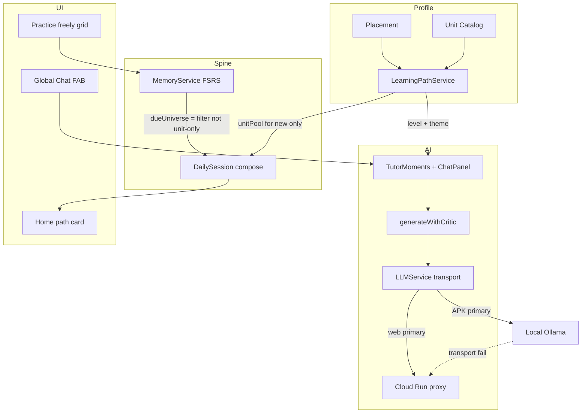
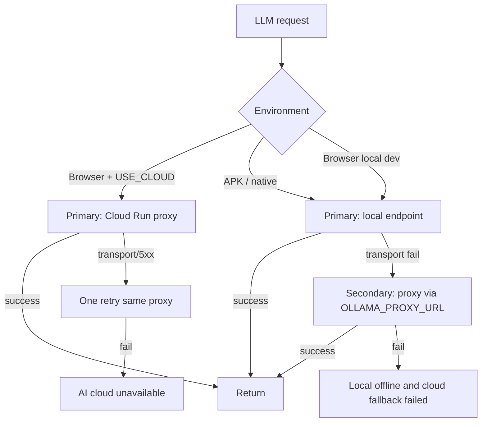

# VocabMaster: Tiered Learning + AI Engagement + Global Chat FAB

| Field | Value |
|-------|--------|
| **Title** | Tiered Learning Path · AI Engagement · Secure AI Transport · Global Chat FAB |
| **Author** | VocabMaster design (AI-assisted) |
| **Date** | 2026-07-16 |
| **Status** | **Implemented on main** (rev 2 design + follow-ups landed 2026-07-17) |
| **Revision** | 2 + follow-ups |
| **Audience** | Senior engineers implementing curriculum path, engagement, proxy hardening, and always-on tutor chat |
| **Branch policy** | **main only** — incremental, reviewable commits/PRs; preserve Today + memory |
| **Related** | `docs/memory-engine-daily-session.md` (rev 4 Approved), `docs/architecture.md`, `docs/web-ai-parity-proxy-implementation.md`, `docs/telemetry-feedback.md`, `AGENTS.md` |
| **Primary code** | `public/js/config.js` (`LEVEL_CONFIG`), `public/js/daily_session.js`, `public/js/memory.js`, `public/js/game_chat.js`, `public/js/llm/llm_service.js`, `public/js/main.js` (`goHome`, `#fab-container`), `functions/src/server.ts` (Cloud Run entry; not `index.ts`), `scripts/sync-env.js` |
| **Deploy truth** | AI proxy runs as **Cloud Run** image (`functions/Dockerfile` → `lib/server.js`, URL `*.run.app`). PR1 docs must not assume `firebase deploy --only functions` alone. |

### Revision history

| Rev | Date | Notes |
|-----|------|-------|
| 1 | 2026-07-16 | Initial draft |
| 2 | 2026-07-16 | Dual-universe Today compose; placement FSRS isolation; path no empty→full expand; ChatPanel keyguard + `syncVisibility`; proxy Admin/Cloud Run; `OLLAMA_PROXY_URL` wiring; soft migration; pool scopes; engagement increments |

---

## Product Thesis (extended)

> **VocabMaster is the AI-native language practice OS on a polyglot vocabulary graph — with memory, a daily path, a tiered curriculum spine, and an always-available AI tutor.**

**Already shipped on main (do not regress):**

| System | Location | Role |
|--------|----------|------|
| Memory engine (FSRS) | `public/js/fsrs.js`, `public/js/memory.js` | Per-word due/stability; `MEMORY_ENGINE_ENABLED` default **true** |
| Daily Session / Today | `public/js/daily_session.js` | Finite plan: new + due → mixed modes |
| 11 free-practice modes | `game_*.js` including `game_chat.js` | Instruments + free play |
| AI transport | Cloud Run proxy (web) + local Ollama (APK) | `llm_service.js` + `functions/src/server.ts` |
| Level tags | `LEVEL_CONFIG` + `levelFilter` / `tagFilter` | Filter universe, not ordered curriculum |

This design productizes the **curriculum spine** the memory doc intentionally deferred (“Full curriculum graph / lesson trees / CEFR pathway productization” was a non-goal of memory v1). Memory answers *when*; path answers *what next in the syllabus*; Today composes both.

---

## Overview

Four coherent parts, one product upgrade:

| Part | Name | One-liner |
|------|------|-----------|
| **A** | Tiered learning path | Learner profile + placement + ordered units within JLPT/HSK/TOPIK/CEFR; Today = **unit news + multi-pass due (wide universe)** |
| **B** | AI engagement | Tutor moments, path-seeded generation, adaptive Chat scenarios, narrative celebration — critic-aware, cache-first |
| **C** | AI transport | Server-side Ollama Cloud key from `.env`; fallback order; proxy auth/rate-limit/allowlist; never ship key to `public/` or APK |
| **D** | Global Chat FAB | Always-accessible tutor via `#fab-container`; full Chat Practice **or** non-destructive mini sheet with mid-game context |



---

## Background & Motivation

### Code truth (2026-07-16)

| Area | Current behavior | Gap |
|------|------------------|-----|
| Levels | `LEVEL_CONFIG.groups` (JLPT N5–N1, HSK1–6, TOPIK1–6, CEFR A1–C2) + colors | Multi-select **filter chips**, not ordered units or progress |
| Filtering | `DataService.getFilteredList()` — `levelFilter` + `tagFilter` on vocab `tags`; **empty filter returns full `this.list`** (`data.js` ~168) | Silent expand footgun for path pools |
| Learner identity | `presetSource` / `presetTarget` (prefs); `chatLevel` / `chatScenario` separate | No single “I am studying JLPT N4 toward exam date” profile |
| Today | `DailySessionService.compose()` → due from `memory.getDueCards` + new from `getNewCandidates` over **one pool** (filter-limited `wordId` set) | Single-pool swap to unit-only would **drop** outside-unit overdue |
| Memory auto modes | `MEMORY_AUTO_MODES` includes `'quiz'`; `score`/`miss` → `recordAttempt` without default `applyMemory:false` | Naive Quiz reuse for placement poisons FSRS |
| Session complete | Stats card + confetti (`celebration.play`); replaces `#app-view` without `goHome` | No narrative; FAB remount not triggered |
| Chat | Full `Chat extends GameMode`; `GameMode.bindKeys` on `document` | Mode grid only; `app.launch` destroys current game |
| FAB shell | `#fab-container` fixed `bottom-6 right-6 z-30`; **cleared** every `goHome()` | Unused product surface |
| Web AI | Browser + `OLLAMA_USE_CLOUD` → POST proxy; `LLMService` **hardcodes** proxy URL, ignores `window.OLLAMA_PROXY_URL` | Proxy: open CORS `*`, **no Firebase auth**, **no rate limit**, **no path allowlist**; `functions/package.json` has express only (no Admin) |
| Client keys | `scripts/sync-env.js` can embed `window.OLLAMA_API_KEY` into `public/js/ollama_config.js` | **Risk:** key in web assets / APK if sync ships key |
| Fallback | Comment in `llm_service.js`: “No model detection, no fallback chain” | APK local-only path; no documented secondary on fail |
| Proxy deploy | Cloud Run (`server.ts` → `lib/server.js`); older docs say `functions/src/index.ts` | Doc drift for implementers |

### Pain points

1. **Filter ≠ curriculum** — Selecting N5 shows all N5 words at once; no sequence, mastery gate, or “next unlock.”
2. **Today ignores syllabus** — Due backlog can dominate; new intros are filter-wide, not unit-scoped — **but due must stay wide**.
3. **AI feels bolted on** — Strong modes (Story/Grammar/Chat) but weak post-miss coaching and path-aware scenarios.
4. **Chat is a mode, not a tutor** — Cannot ask “why was that wrong?” without leaving Quiz mid-session.
5. **Proxy is production but soft** — Web depends on Cloud Run; audit gaps are ship-blockers for growth.
6. **Key hygiene** — `.env` is correct for secrets; client-generated config must **never** include `OLLAMA_API_KEY`.

### Why now

- Memory + Today spine is live; path can **compose on top** without replacing FSRS.
- `LEVEL_CONFIG` + vocab tags already encode frameworks.
- Chat prompt surface (`_buildPrompt`, scenarios, levels) is ready for unit theme injection and a bilingual sheet fork.
- Proxy exists; hardening is incremental on `functions/src/server.ts` + Cloud Run redeploy.
- `#fab-container` is already in `index.html` — UX shell waiting for a product.

---

## Goals & Non-Goals

### Goals

1. **Learner path** as primary *new-word* scope: framework + current tier + ordered units + progress %; filters secondary for free play advanced.
2. **Light placement** → starting tier; **soft banner**, not hard gate for existing users; skippable.
3. **Today dual-universe composition**: new from active unit; due from **wide filter/legacy universe** with multi-pass unit→tier→rest prioritization (never abandon FSRS backlog).
4. **AI engagement** that deepens learning without gimmick spam or blocking nav.
5. **Secure AI transport**: server-side key only; explicit fallback; proxy auth + rate limit + path allowlist; client consumes `OLLAMA_PROXY_URL`.
6. **Global Chat FAB**: mini tutor sheet non-destructive to `GameMode` / Daily Session; keyguard; `syncVisibility` owner.
7. **Incremental main-branch PRs**; APK asset sync on **every** PR that ships `public/` UI.
8. **explainLang** remains `presetSource` via `_getExplainLang()` — no separate explain-language pref.

### Non-Goals (this design phase)

- Full adaptive AI curriculum graph with server-side unit generation for all languages at once.
- Social / multiplayer classrooms.
- Monetization / paywalled tiers.
- Bundler migration.
- Replacing FSRS or rewriting Daily Session lifecycle (hold/finalize/pause unchanged).
- Shipping Ollama API keys in client bundles.
- Replacing Learning Loop IndexedDB or forcing critic on every micro-tip.
- Perfect thematic auto-tagging of vocab (themes live in **catalog only**).
- Multi-instance distributed rate limiting for Cloud Run scale-out (document follow-up; personal scale OK).

---

## Proposed Design

### High-level component map

| Component | New / extend | File(s) | Responsibility |
|-----------|--------------|---------|----------------|
| `LearningPathService` | **New** | `public/js/learning_path.js` | Profile, units, progress, unlock, migration; `getComposePool(scope)` |
| Unit catalog | **New** | `public/js/path_catalog.js` (+ optional RTDB seed) | Ordered units; themeTags **catalog-only**; word membership + snapshots |
| Placement | **New** | `public/js/placement.js` + light UI | Mode key `'placement'`; never FSRS |
| `DailySessionService.compose` | Extend | `daily_session.js` | **Dual-universe** + multi-pass due (see A.4) |
| `DataService` | Extend | `data.js` | **`getPracticeList()` only** (no `getPathPool` alias); path pools never empty→full |
| Tutor moments | **New** | `public/js/tutor_moments.js` + `llm_prompts.js` builders | Post-miss, wrap-up, coach tip |
| `ChatPanel` | **Extract** | `public/js/chat_panel.js` | Shared engine; sheet + full Chat |
| Global FAB | **New** | `public/js/chat_fab.js` | Mount, **`syncVisibility`**, a11y, keyguard orchestration |
| LLM transport | Extend | `llm_service.js` | Fallback; **`OLLAMA_PROXY_URL`**; proxy auth header; no client cloud key |
| Proxy | Harden | `functions/src/server.ts` + Admin SDK dep | Auth, rate limit, path allowlist; Cloud Run deploy |
| Prefs | Extend | `preferences_registry.js` | Path + FAB + tutor prefs |
| Engagement metrics | Extend | RTDB `users/{uid}/engagement/` | Atomic increments |

```mermaid
sequenceDiagram
  participant U as User
  participant Home as goHome UI
  participant LP as LearningPathService
  participant DS as DailySession
  participant Mem as MemoryService
  participant FAB as ChatFAB
  participant Panel as ChatPanel
  participant LLM as LLMService
  participant Game as Host GameMode

  U->>Home: Open app
  Home->>LP: load profile + unit progress
  Home->>FAB: syncVisibility home
  Home-->>U: Path card + Today CTA
  U->>DS: Start Today
  DS->>LP: unitPool for new
  DS->>Mem: multi-pass due over dueUniverse filter
  DS->>DS: compose dual-universe plan
  U->>Game: Mid-Quiz
  U->>FAB: Tap tutor FAB
  FAB->>Game: unbindKeys / keyguard on
  Note over DS,Game: Overlay only — GameMode + Daily Session NOT paused; not destroyed
  FAB->>Panel: open sheet + inject context outside app-view
  Panel->>LLM: stream if capacity else AI busy
  LLM-->>Panel: reply
  U->>FAB: Close sheet
  FAB->>Game: rebindKeys / keyguard off
  Note over Game: app.game.i and Daily Session cursor unchanged
```

---

# Part A — Level-based / Tiered Learning

## A.1 Learner profile

**Canonical path:** `users/{uid}/learningPath/profile`

```js
// LearningPathProfile
{
  schemaVersion: 1,
  knownLang: 'en',          // mirrors prefs.presetSource; explainLang still from presetSource only
  targetLang: 'ja',         // mirrors prefs.presetTarget
  framework: 'jlpt',        // LEVEL_CONFIG.groups[].key
  currentTier: 'N4',        // level code within framework
  targetTier: 'N2',         // optional exam goal
  goalType: 'exam' | 'general' | 'travel' | 'custom',
  examDate: null,           // optional ISO date string
  placement: {
    status: 'skipped' | 'completed' | 'pending',
    suggestedTier: 'N4',
    confidence: 0.72,       // 0–1
    completedAt: null
  },
  activeUnitId: 'jlpt-n4-u03',
  pathMode: 'guided' | 'free',  // free = legacy filter-first practice lists
  // Multi-level study habit preserved for dueUniverse / advanced filters
  legacyLevelFilter: ['all'],   // copy of prefs.levelFilter at migrate; used in dueUniverse
  freePlayScope: 'unit',        // 'unit' | 'unitAndPriorUnlocked' | 'allFiltered'
  updatedAt: 0
}
```

**Client service API (`window.LearningPathService`):**

```js
// public/js/learning_path.js — critical interface
class LearningPathService {
  async load(uid) {}
  getProfile() {}
  async setFrameworkAndTier(framework, tier, opts) {}
  getActiveUnit() {}
  getUnitProgress(unitId) {}          // { mastered, total, pct, unlocked, completed }
  getPathProgress() {}                // tier-level % and next unlock
  getActiveUnitWordIds() {}           // ordered ids for unit (from snapshot if present)
  /**
   * Path word lists — NEVER empty→full-list expand.
   * @param {'unit'|'unitAndPriorUnlocked'|'tier'|'allFiltered'} scope
   * @returns {Array} vocab items (may be empty)
   */
  getComposePool(scope) {}
  shouldConstrainFreePlay() {}        // guided && freePlayScope !== 'allFiltered'
  async recordUnitActivity(wordId, outcome) {}
  async maybeUnlockNext() {}
  migrateFromPrefs(prefs) {}          // soft defaults for existing users (A.7)
}
```

**Sync with presets:** On `applyPresetSettings` / preset change, update `knownLang`/`targetLang` on profile. **`explainLang` continues to flow only from `presetSource`** (`llm_roles.js` `_getExplainLang`).

**Default framework by target language** (provisional):

| `presetTarget` | Default framework | Default start tier |
|----------------|-------------------|--------------------|
| `ja`, `ja_furi`, `ja_roma` | `jlpt` | `N5` |
| `zh`, `zh_pin` | `hsk` | `HSK1` |
| `ko`, `ko_roma` | `topik` | `TOPIK1` |
| else | `cefr` | `A1` |

## A.2 Placement — FSRS isolation contract (mandatory)

**Goal:** Assign `currentTier` without a 40-minute exam and **without writing memory cards**.

### Enforceable contract (both required)

| Control | Requirement |
|---------|-------------|
| **Mode key** | Placement runs as `this.key === 'placement'` (dedicated shell or Quiz subclass). **`'placement'` is NOT in `MEMORY_AUTO_MODES`.** |
| **Meta flag** | Every `score` / `miss` / `recordAttempt` path during placement passes `meta: { applyMemory: false }`. |
| **No introduce** | Placement **must not** call `memory.introduce` or `ensureCard` with review intent. |
| **Opt-in only** | “Count these toward memory” is a separate confirmed toggle; default **off**. If on, use normal quiz mode after placement completes — never silent. |

**Why both mode key + meta:** `GameMode.score`/`miss` always call `analytics.recordAttempt(wId, this.key, …)` (`game_core.js`). `MEMORY_AUTO_MODES` includes `'quiz'`. A naive reuse of Quiz with placement words **will** write FSRS unless the mode is non-allowlisted **and** `applyMemory: false` is forced at the call site (defense in depth if someone reuses quiz chrome).

**Daily Session note:** `_ownsMemoryReviews` does not protect free-play placement — placement is outside Daily Session.

**Acceptance test (PR6):** After placement quiz of N items, for each placement `wordId`: memory card absent **or** `reps`/`stability`/`due` unchanged from pre-placement snapshot.

### UX flow (soft, not hard gate)

1. **New users** (`pathMigratedAt` absent and no prior `words`/`memory` activity): may see placement banner + optional flow; can Skip → `status: 'skipped'`, tier = framework floor.
2. **Existing users** (see A.7): migrate profile data with `placement.status = 'skipped'` (or soft `pending` banner only) — **never block Today** on first launch after upgrade.
3. Light quiz: 8–12 items from mid-band of default framework.
4. Score bands → suggested tier (deterministic table).
5. Optional AI assist if online (one short prompt); not required.
6. User confirms or picks manually → `placement.status = 'completed'`, set `currentTier` + first unlocked unit.

**Implementation shape:** `PlacementSession` builds a fixed list (like `_reviewList`) and renders minimal quiz UI **or** instantiates a `PlacementQuiz` class that extends GameMode with `key = 'placement'` and overrides score/miss to force `applyMemory: false`. Prefer dedicated class over monkey-patching Quiz.

## A.3 Units / path

### Catalog shape

```js
// path_catalog.js — static v1; optional RTDB override later
{
  id: 'jlpt-n4-u03',
  framework: 'jlpt',
  tier: 'N4',
  index: 3,                    // 1-based order within tier
  title: 'Travel & directions',
  // themeTags are CATALOG-ONLY — not present on vocab item.tags (those are N5/HSK/…/frequency).
  // Chat scenario mapping reads catalog themeTags / chatScenarioDefault only.
  themeTags: ['travel', 'directions'],
  select: {
    type: 'tagTierSlice',      // tags include tier; stable sort by id; slice [start, end)
    tierTag: 'N4',
    start: 80,
    end: 120
  },
  wordIds: null,               // optional explicit curated list
  unlock: {
    prevUnitRequired: true,
    minMasteryPct: 0.7,
    minIntroduced: 0.8
  },
  chatScenarioDefault: 'travel'
}
```

**v1 unit sizing:** ~40 words target (30–50 tunable). Auto-generate `ceil(W / unitSize)` units per tier when no curated entry.

**Stable membership (required):** On first unlock of a unit, persist resolved `wordIds` snapshot under `users/{uid}/learningPath/units/{unitId}.wordIds` (and local cache). Progress and compose use the **snapshot**, not live re-slice, so corpus re-tagging / re-ids do not desync progress. Catalog slice is only the seed for first resolution. Hand-curate N5 U1–U3 (and equivalents) themes as planned.

**Unlock rules:**

| Rule | Behavior |
|------|----------|
| First unit of tier | Always unlocked after profile create / placement |
| Next unit | Unlocked when previous `completed === true` **or** force-unlock in Settings |
| Next tier | When ≥80% units in current tier completed **or** manual tier change |
| `pathMode: 'free'` | Unlock ignored for **filtering** (user can practice any filter); unit UI still shows locks as informational |

**Unit completion:**

```js
unitProgress = {
  unitId,
  wordIds: [],           // frozen snapshot
  introduced: number,
  total: number,
  mastered: number,
  pct: number,
  completed: boolean,
  unlocked: boolean,
  completedAt: null
}
```

**Mastery v1:** `introducedAt` set and (`reps >= 2` with low recent lapses) **or** `stability >= 7`. Constants in `PATH_CONFIG`.

### Progress %

- **Unit bar:** `introduced / total` primary; secondary “strong” for mastered.
- **Tier bar:** `completedUnits / totalUnits` (or average pct).
- **Path card:** “N4 · Unit 3 — Travel · 42%” + next unlock label.

## A.4 Integration with Memory + Today — dual-universe compose (critical)

### Invariant

> **Today must never drop overdue FSRS cards solely because they are outside the active unit.**  
> New intros are unit-scoped. Due selection uses a **wider universe** than the unit pool.

### Dual-universe definition

| Universe | Source | Used for |
|----------|--------|----------|
| **`unitPool`** | Snapshot wordIds of active unit ∩ `data.list` (target lang present) | `getNewCandidates` only; AI seed preference |
| **`dueUniverse`** | `getFilteredListStrict()` using `legacyLevelFilter` / current `levelFilter`+`tagFilter` — **not** unit-only. Multi-select levels remain in this universe. | All due queries |
| **`tierSet`** | wordIds in `dueUniverse` whose tags include `currentTier` | Mid priority due bucket |

**`getPracticeList()` is NOT the sole due universe for Today.** It is for free-play list assignment (see A.7 call-site table). Compose implements the algorithm below directly.

### Multi-pass due algorithm (locked)

`MemoryService.getDueCards` sorts by `due` then `wordId`, then slices `limit` once. **Unit-first prioritization cannot use a single `filterFn` + `limit:maxDue`.** Use multi-pass with remaining capacity:

```js
// Pseudocode — DailySessionService.compose (guided path)
function composeGuided(options) {
  const d = getSessionDefaults(prefs);
  const maxDue = d.maxDue;
  const maxNew = d.maxNew;

  const unitPool = learningPath.getComposePool('unit'); // may be []
  const dueUniverseList = data.getFilteredListStrict(); // never expand empty→full; see A.7
  const dueUniverseIds = new Set(dueUniverseList.map(w => Number(w.id)));
  const unitIds = new Set(unitPool.map(w => Number(w.id)));
  const tierIds = new Set(
    dueUniverseList.filter(w => (w.tags || []).includes(profile.currentTier))
      .map(w => Number(w.id))
  );

  // NEW: unit only
  let newItems = memory.getNewCandidates(unitPool, { limit: maxNew }) || [];
  if (newItems.length > maxNew) newItems = newItems.slice(0, maxNew);

  // DUE: multi-pass fill to maxDue (prefer earliest due within each bucket via getDueCards order)
  const dueCards = [];
  const taken = new Set();

  function takeDue(filterFn, remaining) {
    if (remaining <= 0) return;
    const batch = memory.getDueCards(now, {
      limit: remaining,
      filterFn: (card) => {
        if (!card || taken.has(Number(card.wordId))) return false;
        if (!dueUniverseIds.has(Number(card.wordId))) return false;
        return filterFn(card);
      }
    }) || [];
    for (const c of batch) {
      taken.add(Number(c.wordId));
      dueCards.push(mapCardToVocab(c));
    }
  }

  takeDue(card => unitIds.has(Number(card.wordId)), maxDue - dueCards.length);           // pass 1: unit
  takeDue(card => tierIds.has(Number(card.wordId)) && !unitIds.has(Number(card.wordId)),
          maxDue - dueCards.length);                                                     // pass 2: tier rest
  takeDue(() => true, maxDue - dueCards.length);                                        // pass 3: rest of dueUniverse

  // Cap invariant
  // dueCards.length <= maxDue

  // If unit exhausted (no new, no unit due) but dueCards non-empty → due-only plan (OK)
  // If everything empty → empty-plan toast (existing) + “open Path / adjust filters”

  const steps = buildPlan(newItems, dueCards, d);
  return { steps, newItems, due: dueCards, defaults: d, intensity, meta: { unitId, framework, tier, pathMode } };
}
```

**When `pathMode === 'free'`:** preserve today’s single-pool behavior: pool = `getFilteredListStrict()` (or legacy `getFilteredList` with documented expand — prefer strict), new + due both from that pool.

**AI block seed:** prefer unit wordIds ∩ (due∪new), fill from dueCards if short.

**Empty plan toast:** keep current copy; append “or open Path to change unit” when guided.

### Golden tests (PR4 — required)

| # | Setup | Expect |
|---|--------|--------|
| G1 | Unit has 0 due, 5 outside-unit due in filter, maxDue≥5 | Plan `dueIds` include those 5 (capped); `newIds` only from unit |
| G2 | Unit has 3 due, tier has 10 more, global has 20, maxDue=5 | 3 unit due + 2 tier due; no non-tier until unit+tier fill |
| G3 | Unit complete (0 new eligible), 0 due anywhere | empty-plan / toast; no silent full-list |
| G4 | `plan.meta` absent on old persisted plan | Resume still works; ignore unknown fields |
| G5 | maxDue=0 edge | no due steps |

### `plan.meta` (additive only)

```js
plan.meta = {
  unitId: 'jlpt-n4-u03',
  framework: 'jlpt',
  tier: 'N4',
  pathMode: 'guided'
}
```

- Persist whole `plan` as today (`payload.plan`).
- **Resume must not require `meta`** — ignore unknown plan fields on load.
- Do **not** change top-level `dailySessions/{date}` keys.
- Do **not** change FSRS formulas, session hold, pause/finalize contracts.

### Free practice pools (`getComposePool` scopes)

| Scope | Definition | Default use |
|-------|------------|-------------|
| `'unit'` | Active unit snapshot only | Guided free play default (`freePlayScope: 'unit'`) |
| `'unitAndPriorUnlocked'` | Active unit + prior unlocked units in tier | Optional “review path so far” |
| `'tier'` | All words in currentTier within filter | Rare; Settings |
| `'allFiltered'` | Same as `getFilteredListStrict()` | Toggle “Practice all filtered”; `pathMode: 'free'` |

**Guided free play default = active unit only.** Explicit home/settings toggle **“Practice all filtered”** sets `freePlayScope: 'allFiltered'` (or temporary session override) and uses filter chips. Unlock gates still control *path progression UI*; they do not inject locked unit words into `'unit'` scope.

## A.5 UI

| Surface | Behavior |
|---------|----------|
| **Home path card** | Framework badge (`LEVEL_CONFIG.colors[tier]`), unit title, progress, “Continue unit” / Today CTA |
| **Today CTA** | Primary; subtitle “Unit 3 · 6 due · 3 new” (due may include outside-unit) |
| **Placement** | Soft banner; never blocks Today for migrated existing users |
| **Unit detail** | Word count, unlock condition, theme, practice unit only |
| **Next unlock** | Locked card + requirement text |
| **Settings → Learning path** | Framework, tier, goal, pathMode, freePlayScope, redo placement |
| **Level/tag chips** | Advanced filters accordion; power-user; feed `dueUniverse` / `allFiltered` |

CSS: `var(--p-*)` / `var(--n-*)`; no `/opacity` on custom colors.

## A.6 RTDB schema

```
users/{uid}/learningPath/
  profile
  units/{unitId}          // unitProgress + wordIds snapshot
  events/{pushId}         // optional; cap last 50 client-side
users/{uid}/engagement/
  daily/{yyyy-mm-dd}      // counters (atomic increments)
  coachTips/{yyyy-mm-dd}
```

**Local cache:** `localStorage vm_learning_path_v1` — dirty/flush like memory.

**Rules:** Existing owner RW — no rules change v1.

**Account delete:** `deleteUserAccount` wipes `users/{uid}` — test must cover `learningPath`, `engagement`, `memory`, `dailySessions`.

### Engagement write strategy

- Prefer RTDB **`transaction`** or `ServerValue.increment(1)` per counter field.
- Offline: queue deltas in localStorage; flush merge on reconnect (last-write-wins on tip text OK; counters sum deltas).
- Multi-tab: increments avoid full-doc clobber races.

## A.7 Migration from `levelFilter` / `tagFilter` — soft for existing users

### Product policy

| User class | `pathMode` | Placement | Behavior day 1 after upgrade |
|------------|------------|-----------|------------------------------|
| **Brand-new** (no word stats / memory / prior prefs activity) | `guided` | Soft banner or optional flow; Skip OK | Path card + unit new; due wide |
| **Existing** (any prior use) | **`free`** initially **or** `guided` with `placement.status = 'skipped'` | **Not a hard gate** | Today works exactly as before until user opts into Guided |
| Soak before defaulting existing → guided | — | — | Metric: ≥3 completed Today sessions post-upgrade **or** explicit “Try guided path” CTA; then recommend guided |

**Idempotent:** `learningPath/profile.schemaVersion` present → skip migrate. Set `prefs.pathMigratedAt`.

### Field mapping

| Existing state | Migration |
|----------------|-----------|
| any existing user | Copy `levelFilter` → `legacyLevelFilter`; `pathMode: 'free'` **or** guided+placement skipped (implement **free** as safer default) |
| `levelFilter: ['N4']` | Seed `framework`/`currentTier` from tag; still `pathMode: 'free'` until opt-in |
| `levelFilter: ['N5','N4']` | `currentTier` = highest selected (e.g. N4); **keep full multi in `legacyLevelFilter` for dueUniverse** |
| `levelFilter: ['all']` | Framework/tier from `presetTarget` defaults; free mode |
| `tagFilter` non-all | Preserve prefs; secondary |
| `chatLevel` matches tier | Optional seed for `currentTier` when filter is all |

### `getPracticeList()` — single canonical name

**Do not introduce `getPathPool`.** Only `DataService.getPracticeList()`.

```js
// data.js — free-play + any caller that wants “what list should this mode use?”
getPracticeList() {
  const lp = app.learningPath;
  if (lp && lp.shouldConstrainFreePlay && lp.shouldConstrainFreePlay()) {
    const scope = lp.getProfile().freePlayScope || 'unit';
    // Map freePlayScope → getComposePool scope
    return lp.getComposePool(scope === 'allFiltered' ? 'allFiltered' : scope);
  }
  return this.getFilteredListStrict();
}

/** Like getFilteredList but NEVER replaces empty with full corpus. */
getFilteredListStrict() {
  const list = /* same filter logic as getFilteredList without empty fallback */;
  return list; // may be length 0
}
```

### Invariant: no empty→full-list expand for path pools

| API | Empty behavior |
|-----|----------------|
| `getFilteredList()` | **Legacy** may still expand to full list for old free-play edge cases (document; prefer migrating callers off it) |
| `getFilteredListStrict()` | Returns `[]` if nothing matches |
| `getComposePool(scope)` | Returns `[]` if unit/snapshot empty — **never** `this.list` |
| `getPracticeList()` | Uses strict / compose pool — **never** silent full corpus |
| Free play empty unit | Toast: “Unit complete — unlock next or Practice all filtered” — do **not** assign full list |
| Today empty | Existing empty-plan path |

`GameMode` constructor fallbacks to `activeList`/full list when empty (`game_core.js`) must **not** apply when list was intentionally path-empty: set a flag `listSource: 'path'` and skip expand, or pass non-null empty array with `allowEmptyList: true` on the game instance.

### Call-site migration map (v1)

| Call site | File | v1 behavior |
|-----------|------|-------------|
| `DailySessionService.compose` | `daily_session.js` | Dual-universe algorithm (A.4) — **not** solely `getPracticeList()` for due |
| `assignGameList` | `game_core.js` | `getPracticeList()` |
| Filter chip handlers | `ui_home.js` | Update prefs; if game active and not session-scoped, reassign via `getPracticeList()` |
| `store.js` settings/preset | `store.js` | Same; don’t wipe `_reviewList` |
| Story `_pickWords` | `game_story.js` | `getPracticeList()` when free; session seed when Today AI step |
| `getReviewWords` | `data.js` | Stay filter/memory due-aware; **dueUniverse** semantics if path guided (wide) |
| Free-play mode constructors | `game_*.js` via GameMode | `getPracticeList()` |
| Placement | `placement.js` | Fixed placement list only |

## A.8 Relationship to collections / tag chips

| Mechanism | Role |
|-----------|------|
| **Learning path** | Primary “what am I studying” for guided new words + UI |
| **levelFilter / tag chips** | Secondary; power-user; **dueUniverse** + `allFiltered` free play |
| **Collections** (roadmap) | Optional packs later — do not block path v1 |

---

# Part B — AI Engagement

## B.1 Tutor moments

| Moment | Trigger | Content | Latency budget |
|--------|---------|---------|----------------|
| **Post-miss micro-explain** | After miss in allowlisted drill when AI available | 1–2 sentences **knownLang** + 1 target example | ≤ **8s** or skip; never block `waitAndNav` |
| **Session wrap-up narrative** | `complete` / `showCompleteSummary` | 3–5 sentences; unit + accuracy + 1 weak word | Offline template if no AI |
| **Coach tip of the day** | Home / once per local day | Unit theme or top lapse | Prefetch; RTDB day key |

**Transport rules:**

```js
// tutor_moments.js
// Use app.llm.generate with short prompts from llm_prompts.js (buildMissExplainPrompt, etc.)
// timeout: 8000; NO generateWithCritic; skip if !app.llm.available
// If LLM queue busy (Today Story/Grammar in flight): show nothing or "AI busy" — do not stack
// Cancel on goHome / next card via AbortController
```

- Pref `tutorMomentsEnabled` default **true**.
- Throttle post-miss: max 1 explain per step word.
- Do **not** reuse heavy `getGrammarExplanation` GRAMMAR/USAGE/EXAMPLE for post-miss if it exceeds budget — dedicated short schema (`missExplain`: 2–3 fields) in validator **critic-off** list (like `grammarExplanation`).

## B.2 Contextual generation (path-seeded)

| Mode | Seed | Extra |
|------|------|-------|
| Story | Unit + due seed ids | Unit title/theme in system prompt |
| Grammar | Prefer unit word | Level = `currentTier` default |
| Word Context | Unit weak word | Theme hint |
| Sentences | Unit examples | — |

Wire default `chatLevel` from path `currentTier` when guided (manual override remains).

## B.3 Adaptive scenario Chat

Map **catalog** `chatScenarioDefault` / `themeTags` → `chatScenario` (not vocab tags):

| Catalog themeTags | scenario |
|-------------------|----------|
| travel, hotel, directions | `travel` |
| food, restaurant | `restaurant` |
| work, office | `business` |
| hobby, free time | `hobby` |
| default | `daily` |

Session-only override unless “Remember for this unit.”

## B.4 Celebration / narrative

Keep confetti; pair with plain-language path progress + streak (`users/{uid}/analytics/streak`). No XP economy v1.

## B.5 Quality: critic pipeline policy

| Content type | Critic? | Notes |
|--------------|---------|-------|
| Story, Grammar multi-item, long Chat format | **Yes** | Existing |
| Cloze / grammarExplanation / **missExplain** | **No** | Latency |
| Session narrative / coach tip | **No** | Cache 24h tip |
| FAB mini chat presentation | Existing Chat format path | Bilingual system prompt **fork** for sheet |

**Queue contention:** `_maxConcurrent = 2`. During Today AI block, tutor moments and FAB should detect busy queue / in-flight generate and show **“AI busy”** rather than enqueueing competing long work. Never cancel session AI without user intent; tutor moments are cancelable.

## B.6 Engagement metrics

`users/{uid}/engagement/daily/{yyyy-mm-dd}`:

```js
{
  sessionCompleted: 0,
  sessionStarted: 0,
  chatTurns: 0,
  chatTurnsFromFab: 0,
  chatTurnsFromMode: 0,
  unitCompletedIds: [],
  tutorExplainsShown: 0,
  coachTipShown: 0,
  fabOpens: 0
}
```

Write with **increment/transaction** (A.6). Targets unchanged from rev 1.

---

# Part C — AI Transport: Ollama Cloud key from `.env` as fallback

## C.1 Principles

1. **`OLLAMA_API_KEY` never ships** to `public/`, Hosting, or APK assets.
2. Prefer **extending Cloud Run proxy** over client-held keys.
3. Clear **fallback order** and **user-facing errors**.
4. Node scripts load `.env` via dotenv / parse — keys on machine or CI secrets only.
5. Client **must** read `window.OLLAMA_PROXY_URL` (generated or default).

## C.2 Current vs target

| Context | Today | Target |
|---------|-------|--------|
| Web | Proxy when `OLLAMA_USE_CLOUD`; URL often hardcoded in `LLMService` | Proxy via `window.OLLAMA_PROXY_URL \|\| defaultRunAppUrl`; **no** client key |
| APK | Local first | Local → proxy on transport fail; proxy URL from config; **no** client key |
| Node | env | dotenv / `process.env` only |
| `sync-env.js` | Can write `OLLAMA_API_KEY` (+ ZEN keys) | **Ban all secret emission** |

### `scripts/sync-env.js` contract (PR1)

**Allowed:**

```js
window.OLLAMA_ENDPOINT = "http://127.0.0.1:11434";
window.OLLAMA_USE_CLOUD = true|false;
window.OLLAMA_PROXY_URL = "https://….run.app";  // from .env OLLAMA_PROXY_URL
window.OLLAMA_MODEL = "…";  // optional public model name
```

**Forbidden:** `window.OLLAMA_API_KEY`, `window.ZEN_API_KEY`, any bearer secret.

CI / secret scan: fail if `OLLAMA_API_KEY` appears under `public/` or `android/**/assets/`.

### Client proxy URL wiring (PR2)

```js
// llm_service.js constructor + loadPrefs
const DEFAULT_PROXY = 'https://ollama-proxy-1020976660084.us-central1.run.app';
this.proxyUrl = window.OLLAMA_PROXY_URL || DEFAULT_PROXY;
// when useProxy: this.apiKey = null always
// attach Authorization: Bearer <firebase idToken> on proxy POSTs
// on 401: getIdToken(true) once and retry once
```

## C.3 Fallback order



| Error class | Secondary? | UX |
|-------------|------------|-----|
| Network / timeout / status 0 | Yes (APK) | Connection failed |
| HTTP 502/503 | One retry | Cloud AI busy |
| HTTP 401/403 | Refresh token once | Auth issue |
| HTTP 429 | Backoff; no spin | Too many AI requests |
| Validate/model | No | Generation failed |

APK secondary is **always** project proxy — never direct `api.ollama.com` with a client key.

## C.4 Proxy requirements (Cloud Run)

**Entrypoint:** `functions/src/server.ts` compiled to `lib/server.js`, deployed via **Cloud Run** (Dockerfile). Update `docs/web-ai-parity-proxy-implementation.md` + AGENTS proxy path (was `index.ts`) in PR1/PR12.

| Control | Requirement |
|---------|-------------|
| API key | `process.env.OLLAMA_API_KEY` server only |
| Auth | Firebase ID token verify via **firebase-admin** (new dependency + service account / ADC on Cloud Run) |
| Dual-mode flag | `PROXY_AUTH_REQUIRED=false` initially → `true` after client ships token (staged) |
| Rate limit | Per uid (and IP fallback); **in-memory OK for personal single-instance scale**; document multi-instance follow-up (Redis/Memorystore) |
| Path allowlist | **Land first (safest):** only `/api/tags`, `/api/generate` |
| CORS | Allow Hosting origin + localhost dev; APK secondary may use proxy from WebView — include app origins carefully; avoid permanent open `*` once auth is on |
| Body size | Cap e.g. 256KB |
| Logging | uid hash, path, status, latency — no full prompts in prod by default |

**PR1 checklist order:** (1) path allowlist (2) body cap (3) Admin init + dual-mode auth (4) per-instance rate limit (5) CORS tighten (6) deploy docs for Cloud Run.

## C.5 Node / pregenerate

`require('dotenv').config()` or env parse; `--cloud` uses proxy or server-side key in CI — never write keys into `public/js`.

## C.6 Web vs APK matrix

| | Web | APK |
|--|-----|-----|
| Primary | Cloud proxy (`OLLAMA_PROXY_URL`) | Local Ollama |
| Secondary | One retry same proxy | Cloud proxy |
| Key | Cloud Run env | Cloud Run env |
| Streaming | Proxy NDJSON | Local stream; non-stream if Capacitor HttpProxy |

**Do not delete** proxy URL, `useCloud` branch, or Cloud Run service.

---

# Part D — Global Chat FAB (always-accessible tutor)

## D.1 FAB UX + `syncVisibility` owner

**Mount:** `#fab-container` in `index.html`.

| Property | Value |
|----------|--------|
| Position | Bottom-right; `pointer-events-auto` on control |
| z-index | FAB control `z-40`; **sheet overlay `z-[60]`** (above settings `z-50`, below profile/stats `z-[80]`); tooltips remain `z-[9999]` |
| Size | 56×56; `ph-chat-circle-text` |
| a11y | `aria-label="Open AI tutor chat"` |

**Hide when:** pref off; sheet open (or show close); full Chat mode; **any modal** (settings/stats/profile) — opening settings **closes sheet**; mic active (dim/disable); placement full-screen.

**Provisional:** Visible during free-play + Today drills except full Chat + modals.

### `ChatFAB.syncVisibility(context)` — single owner

Call from:

| Call site | Why |
|-----------|-----|
| End of `goHome` rAF (after clearing fab container) | Remount home FAB |
| `app.launch` / `launchGameMode` after game starts | Ensure FAB present mid-game |
| `showCompleteSummary` | Summary replaces `#app-view` without goHome — FAB must show for reflection |
| `dismissSummary` / return home | Resync |
| Modal open/close (`app.modal`, stats, profile) | Hide/show |
| Sheet open/close | Toggle control |
| Init after auth+services | First mount if user never hits goHome edge case |

Do **not** only patch `goHome`.

## D.2 Chat modes

| Mode | UX | Lifecycle |
|------|----|-----------|
| **Full Chat Practice** | `new Chat('chat')` via grid or FAB long-press | `app.launch` — destroys current game |
| **Mini tutor sheet** | Bottom sheet ~55–70vh; dim backdrop; mount **portal outside `#app-view`** (under `#fab-container` or `#chat-sheet-root`) | Does **not** `game.destroy()`; does **not** replace `app.game` |

## D.3 Context injection

```js
ChatPanel.open({
  mode: 'sheet',
  bilingual: true,  // default sheet
  context: {
    source: 'fab',
    gameMode: app.game && app.game.key,
    word, lastMiss, storySnippet,
    unitId, tier, scenarioHint,
    knownLang, targetLang
  }
})
```

**Provisional:** Sheet = bilingual tutor (explain in knownLang); full Chat = immersive target-lang partner (existing `_buildPrompt`). **Fork system prompt** — not a single flag on the immersive prompt alone.

## D.4 State: GameMode + Today + audio + keys

| Concern | Policy |
|---------|--------|
| `app.game` | Unchanged; `app.game.i` unchanged on open/close |
| Daily Session cursor | Unchanged; **do not pause** by default (overlay only) |
| **Keyguard** | On sheet open: if `app.game` and `unbindKeys`, call it **or** set `ChatFAB.isOpen` and guard `GameMode.handleKey` / `bindKeys` handler to no-op when open. On close: `bindKeys` restore. Prevents arrow/space/enter stealing while typing in tutor. |
| Escape | Sheet captures Escape first → closes sheet; does not goHome. Browser back: close sheet if open before other handlers. |
| Audio | `app.audio.cancel()` when sheet opens if TTS playing |
| Mic / Voice | FAB disabled while host `_speechActive` / Voice listening |
| History | Sheet does not `pushState` |
| Destroy | Close aborts panel controllers only; **never** host `GameMode.destroy` |
| Concurrent LLM | If queue saturated / session AI streaming, show “AI busy” on send; don’t cancel Today AI |

## D.5 Extract boundary: `ChatPanel` vs `Chat extends GameMode`

| Moves to `chat_panel.js` | Stays on `Chat` (GameMode shell) |
|--------------------------|----------------------------------|
| messages[], turn, busy, maxHistory, memories[] | Full-screen layout chrome in `#app-view` |
| streamGenerate loop, abortController | Level badge **popover** placement in header (can call panel.setLevel) |
| `_buildPrompt` / bilingual `_buildTutorPrompt` | `super` / GameMode list/nav (mostly unused in chat) |
| `_formatPresentation`, memory marker parse/save | `destroy()` → panel.dispose + optional transcript save |
| transcript load/save helpers | Mode registration `key: 'chat'` |
| STT toggle (optional in sheet) | Long-press trash clear UI wiring |
| renderMessages into provided root | |

**PR9 acceptance (full Chat parity checklist):** stream + cancel; memory marker; transcript load/save; level popover; STT; opening greeting; markdown/HTML units; no behavior change when `window.CHAT_PANEL_EXTRACT !== false`.

**PR9 safety:** Land extract with e2e Chat smoke in same PR; optional `window.CHAT_PANEL_EXTRACT` default true with one-commit revert path.

**PR10 acceptance:** Open/close FAB sheet mid-Quiz leaves `app.game.i` and Daily Session cursor unchanged; host keys rebound; no `app.launch`.

Cross-script: `window.ChatPanel`, `window.ChatFAB` only.

## D.6 Prefs

| Key | Default | Notes |
|-----|---------|-------|
| `chatFabEnabled` | `true` | |
| `chatFabDefaultScenario` | `'auto'` | from path unit catalog |
| `chatFabBilingual` | `true` | sheet |
| Level | path `currentTier` else `chatLevel` | |

## D.7 Analytics

`fabOpens`, `chatTurnsFromFab` vs `chatTurnsFromMode` via engagement increments.

---

## API / Interface Changes

### New globals

```js
window.LearningPathService
window.PathCatalog
window.TutorMoments
window.ChatPanel
window.ChatFAB
window.PATH_CONFIG
```

### Extended methods

| API | Change |
|-----|--------|
| `DataService.getPracticeList()` | Canonical free-play list |
| `DataService.getFilteredListStrict()` | No empty→full expand |
| `DailySessionService.compose` | Dual-universe + multi-pass due; optional `plan.meta` |
| `LLMService` | `proxyUrl` from `OLLAMA_PROXY_URL`; fallback; ID token; `apiKey` null on proxy |
| `GameMode` keyguard hooks | Respect `ChatFAB.isOpen` / unbindKeys |
| `ChatFAB.syncVisibility` | Owner for remount |
| Prefs registry | Path, FAB, tutor, freePlayScope |

### Script load order

`path_catalog.js` → `learning_path.js` → `tutor_moments.js` → `chat_panel.js` → `game_chat.js` → `chat_fab.js` (after memory/daily_session).

**APK:** `npm run sync:android` (or documented copy) on **every** PR touching `public/` UI — not only final polish.

---

## Data Model Changes

| Path | Purpose |
|------|---------|
| `users/{uid}/learningPath/profile` | Profile + legacyLevelFilter + freePlayScope |
| `users/{uid}/learningPath/units/{unitId}` | Progress + **wordIds snapshot** |
| `users/{uid}/engagement/daily/{date}` | Counters (increment) |
| `users/{uid}/engagement/coachTips/{date}` | Tip cache |
| `plan.meta` inside dailySessions plan | Optional unit metadata |
| localStorage `vm_learning_path_v1` | Offline path |

**Unchanged:** memory cards, words c/w, hold/finalize, top-level dailySessions keys.

---

## Alternatives Considered

### 1) Path as “smart levelFilter only”
Rejected — no ordered curriculum.

### 2) Server-side curriculum engine
Rejected for v1 — static catalog + snapshots.

### 3) Client-held Ollama API key
Rejected — theft + CORS; proxy mandatory for web.

### 4) FAB only opens full Chat GameMode
Rejected as sole mode — destroys mid-session.

### 5) Pause Today whenever FAB opens
**Deferred** — default overlay only (sequence diagram aligned in rev 2).

### 6) Single-pool Today with unit-only `getPracticeList`
**Rejected** — abandons overdue FSRS cards (review Issue 1).

---

## Security & Privacy

| Risk | Severity | Mitigation |
|------|----------|------------|
| API key in client bundle | **Critical** | sync-env ban; CI scan; rotate if leaked |
| Open proxy abuse | **High** | Allowlist → auth → rate limit; Admin SDK |
| Placement FSRS poison | **High** | Mode `'placement'` + `applyMemory:false`; test |
| Path empty→full expand | **High** | Strict pools; no silent corpus |
| Prompt injection via FAB context | **Medium** | Sanitize; length caps |
| Multi-instance rate limit weak | **Medium** | Document personal scale; follow-up store |
| Engagement clobber | **Low** | Increments/transactions |

---

## Observability

| Signal | Where |
|--------|-------|
| `[LearningPath]` migrate/unlock | `L()` |
| `[DailySession] compose dual-universe` counts | `L()` unit/tier/rest due sizes |
| `[LLM] fallback` / proxy 401 refresh | `L()` |
| Proxy metrics | Cloud Run logs |
| Engagement | RTDB increments |

---

## Rollout Plan

1. **PR1** Proxy allowlist + sync-env ban + Admin dual-mode + Cloud Run deploy docs.
2. **PR2** LLM `OLLAMA_PROXY_URL` + APK fallback + ID token.
3. **PR3** Path service headless + soft migrate + snapshots.
4. **PR4** Dual-universe compose + golden tests (stub units OK).
5. **PR5** Path card + freePlayScope toggle + Settings.
6. **PR6** Placement isolation contract + tests.
7. **PR7–8** Tutor moments (wrap-up/tip then post-miss).
8. **PR9** ChatPanel extract + e2e smoke (+ extract flag).
9. **PR10–11** FAB + `syncVisibility` + path scenarios.
10. **PR12** Docs (architecture, AGENTS proxy path, web-ai-parity) + polish.

Flags:

```js
window.PATH_ENABLED = true;           // after soft migrate; existing stay free until opt-in
window.CHAT_FAB_ENABLED = true;
window.TUTOR_MOMENTS_ENABLED = true;
window.CHAT_PANEL_EXTRACT = true;     // PR9 rollback handle
// Proxy: PROXY_AUTH_REQUIRED env on Cloud Run
```

**Soak before forcing existing users to guided:** ≥3 completed Today sessions **or** explicit CTA; track opt-in rate.

---

## Risks

| Risk | Severity | Mitigation |
|------|----------|------------|
| Unit-only pool drops due | **Critical** | Dual-universe A.4 + G1 test |
| Placement poisons FSRS | **Critical** | Dual isolation + acceptance test |
| Empty path expands to full list | **High** | Strict pools invariant |
| ChatPanel extract regression | **High** | Parity checklist + e2e + flag |
| Proxy auth break web AI | **High** | Dual-mode auth flag |
| FAB keys fight host game | **High** | Keyguard D.4 |
| Soft migrate ignored → user shock | **Medium** | Default existing to free |
| Concurrent LLM / 429 | **Medium** | AI busy UX; cancel only tutor |
| APK desync | **Medium** | sync every public UI PR |
| Multi-instance rate limit | **Low** v1 | Document |

---

## Open Questions

| # | Question | Provisional default |
|---|----------|---------------------|
| 1 | Default framework per language? | A.1 table |
| 2 | FAB always visible in games? | **Yes**, except full Chat + modals |
| 3 | Mini sheet bilingual? | **Yes** |
| 4 | Pause Today on FAB? | **No** |
| 5 | Placement → FSRS? | **No** (hard contract A.2) |
| 6 | Unit size? | **40** |
| 7 | Force guided for existing? | **No** — free until opt-in / soak |
| 8 | Curated vs auto-slice? | Auto-slice + snapshot; hand-curate first units |
| 9 | Proxy auth for anon? | Staged dual-mode → **yes** + rate limits |
| 10 | Coach tip frequency? | **1 / local day** |
| 11 | Path vs chips? | Chips = Advanced filters |
| 12 | Zen provider? | Out of scope without proxy mediation |
| 13 | Existing migrate pathMode? | **`free`** safer default |

---

## Key Decisions

1. **Path primary for new words UI; due universe stays wide (filter/legacy).** Dual-universe compose is non-negotiable.
2. **Multi-pass due fill (unit → tier → rest) to `maxDue`** — not a single limited getDueCards call.
3. **`getPracticeList` is the only free-play list API**; Today due does not solely use it.
4. **Path/compose pools never empty→full-list expand.**
5. **Placement = mode `'placement'` + `applyMemory: false`; no introduce; test-enforced.**
6. **Existing users soft-migrate to `pathMode: 'free'` (or guided + placement skipped); placement is not a hard gate.**
7. **Units snapshot `wordIds` on first unlock; themeTags are catalog-only.**
8. **Guided free play default = active unit; “Practice all filtered” is explicit.**
9. **AI tips: short prompts, critic off, ≤8s, non-blocking; AI busy if queue full.**
10. **`OLLAMA_API_KEY` server/Node only; sync-env ban; client uses `OLLAMA_PROXY_URL`.**
11. **Proxy: Cloud Run `server.ts`; Admin SDK; allowlist first; dual-mode auth; in-memory RL OK personal scale.**
12. **Extract `ChatPanel`; FAB sheet non-destructive; keyguard; `syncVisibility` multi-surface; sheet z-[60].**
13. **explainLang stays `presetSource`.**
14. **Ship on main thin PRs; APK sync every public UI PR; preserve Today + memory contracts.**
15. **`plan.meta` optional; resume never requires it.**

---

## PR Plan (incremental on **main**)

| PR | Title | Scope | Acceptance |
|----|-------|-------|------------|
| **PR1** | Proxy harden + env hygiene | `server.ts` allowlist + body cap; Admin + dual-mode auth; per-instance RL; **ban keys in sync-env**; emit `OLLAMA_PROXY_URL` only; Cloud Run deploy notes; fix docs `index.ts`→`server.ts` | Reject non-allowlisted paths; no key in generated config; web AI works with auth off then on |
| **PR2** | LLM transport | Consume `OLLAMA_PROXY_URL`; ID token + 401 refresh; APK local→proxy; errors | Kill local → proxy or clear toast; `apiKey` null on proxy |
| **PR3** | Path service headless | catalog, snapshots, soft migrate, `getComposePool` scopes, strict empty | Unit tests migrate + unlock; existing → free |
| **PR4** | Dual-universe compose | A.4 algorithm + golden G1–G5; `plan.meta` optional | Outside-unit due appears; unit-only new; empty unit ≠ full list |
| **PR5** | Path UI + freePlayScope | Home card, settings, call-site `getPracticeList` | Toggle practice all filtered |
| **PR6** | Placement | Mode + applyMemory false; acceptance memory unchanged | |
| **PR7** | Tutor wrap-up + tip | prompts + hooks; critic off | |
| **PR8** | Post-miss explain | non-blocking ≤8s; AI busy policy | |
| **PR9** | ChatPanel extract | Boundary D.5; e2e Chat smoke; extract flag | Full parity checklist |
| **PR10** | Chat FAB | sheet portal, keyguard, `syncVisibility` all sites, z-[60] | Mid-Quiz open/close preserves index/cursor |
| **PR11** | Path→Chat scenario/level | catalog themes | |
| **PR12** | Docs + polish | architecture, AGENTS, web-ai-parity; any remaining asset sync | |

**Parallelism:** PR1→PR2 ∥ PR3→PR4→PR5→PR6; PR7→PR8; PR9→PR10→PR11; PR12 last.  
**Guards:** No FAB before ChatPanel; no compose without path service; APK sync on any public UI PR.

---

## References

- `docs/memory-engine-daily-session.md` — FSRS, Today, holds
- `docs/architecture.md` — LLM pipeline, critic, auth
- `docs/web-ai-parity-proxy-implementation.md` — proxy (update entrypoint to `server.ts`)
- `public/js/config.js` — `LEVEL_CONFIG`
- `public/js/daily_session.js` — `compose`, `buildPlan`
- `public/js/memory.js` — `getDueCards`, `getNewCandidates`
- `public/js/data.js` — `getFilteredList` empty fallback
- `public/js/game_core.js` — keys, score/miss, list fallback
- `public/js/game_chat.js` — scenarios, prompts
- `public/js/llm/llm_service.js` — transport
- `public/js/analytics.js` — `MEMORY_AUTO_MODES`, `applyMemory`
- `functions/src/server.ts` — Cloud Run proxy
- `scripts/sync-env.js` — config generation
- `AGENTS.md` — window.*, APK assets, explainLang, proxy sanctity

---

## Success metrics (product)

| Metric | Definition | v1 |
|--------|------------|-----|
| Due backlog honor | Guided sessions still schedule outside-unit due when present | G1 test green; manual check |
| Path opt-in | Existing users who switch to guided | Track |
| Unit completion / week | | ≥1 active learner |
| FAB utility | turns / opens | ≥1.5 |
| AI reliability | Clear errors; no hang | |
| Security | Client keys | **Zero** |
| Placement purity | Memory unchanged after placement | Automated test |

---

*End of design document (rev 2).*
